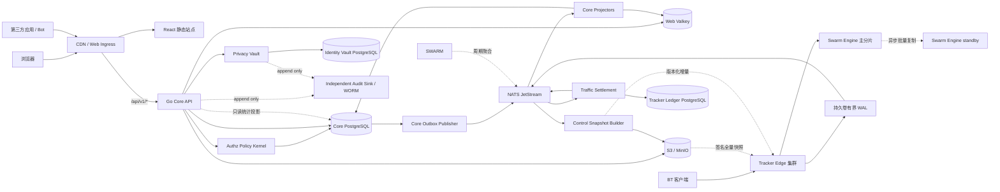
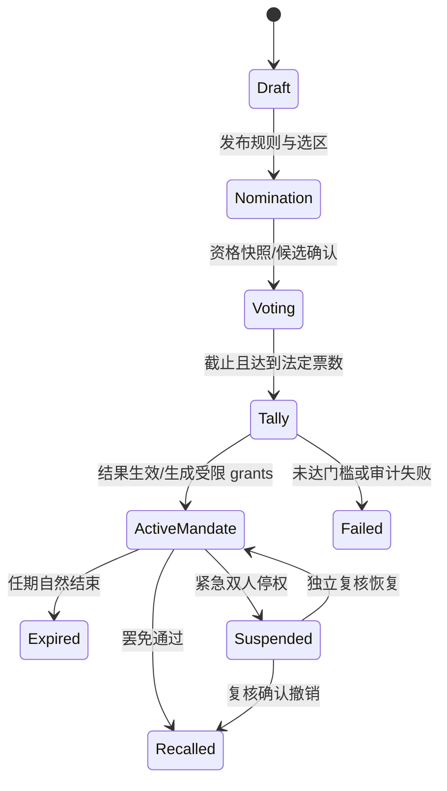
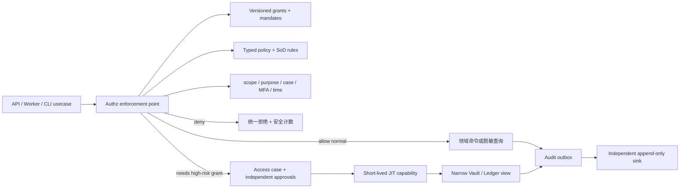
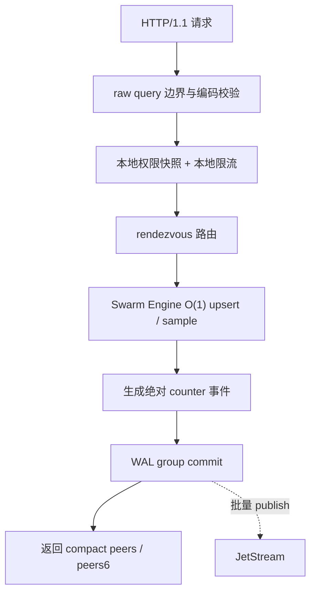

# PeerGo

> 一套从零设计的现代 Private Tracker 平台。旧 PtYes 只提供功能清单、用户与种子的只读数据导出，以及旧 `.torrent` 兼容信息；不作为新版代码、目录、API、表结构、缓存或 Tracker 架构的参考实现。
>
> 最新补充：本人已发布种子的基础资料、内容与截图附件集候选审核、安全撤回申请、种子举报处置和 RSS/个人订阅已形成可运行纵切；新上传与截图限制也已改为不可变、定时生效的政策版本。

## 结论先行

新版采用“React Web + Go 主站模块化单体 + 独立 Tracker Edge/Swarm 数据面 + 可靠异步结算”的全新架构。

1. 新版不复用旧后端、旧前端、旧 API DTO、旧 ORM model、旧任务框架或旧缓存 key。
2. 旧系统只用于确认“有哪些功能”，并离线导出用户主数据、种子元数据、原始 `.torrent` 文件和获准的当前用户状态；收藏与邀请关系按快照迁入，后宫/邀请奖励只保留已包含在期初魔力值中的历史合计，不重复入账。评论、公告和 Tracker 行为流水等社区/事件历史仍不迁移，导入数据映射到全新 schema。
3. 新 Web 与受授权第三方客户端共用主站同源的 `/api/v1` 契约；不为旧网页/API 保留永久兼容层，也不复制一套 Partner API。
4. 已经存在于用户 BT 客户端中的 `/tracker/{passkey}/announce|scrape` 路径必须长期兼容，否则用户需要重新下载种子。
5. Tracker 与网站使用不同域名、进程、节点池、容量配额和数据库；Tracker 洪峰不会占用网站资源。
6. Peer 热状态保存在专用 Swarm Engine 的分片内存中，announce 热路径不访问 PostgreSQL，也不依赖 Valkey/Redis。
7. Tracker 使用独立 Ledger PostgreSQL，但只由异步 Settlement 写入；它不保存实时 Peer 列表。
8. 上传/下载量通过持久化 WAL、JetStream 和幂等账本结算，不直接相信或累加一次客户端请求。
9. 网站只读取异步投影的 swarm 统计；统计可以短暂过期，种子页和动态圈不能因此卡住。
10. 首版全部使用 Go；Core API 统一使用 Chi，Tracker 保持原生 `net/http` 热路径。协议契约保持语言无关，只有真实压测证明 Go Swarm Engine 是瓶颈时才考虑替换为 Rust。
11. “职位、任期、角色、权限”分离：技术运维、副站长或民选代理站长都不会因为头衔自动获得全站权限。
12. 普通成员和未获授权的 staff 不能查看他人邮箱；具有 `user.account.read` 的用户管理员可查看完整邮箱。IP、passkey、Tracker 凭据和批量敏感导出仍不进入普通后台。
13. 采用 monorepo，但按服务级 `go.mod` 和领域 owner 隔离；Core API/Worker/Projector 是独立部署、同一份领域代码，避免多人开发再次产生重复 service/model。

### 当前可运行首版

仓库目前已经形成用户、种子、审核、Tracker、结算、经济、社区和后台设置的可运行首版；本节同时明确已经接通的纵切与仍刻意保留在首版之外的高级能力：

- `contracts/openapi/v1` 定义开放/邀请/关闭注册、本人邀请资格/一次性邀请码签发/历史与撤销、Web session、账户安全概览、本人设备会话管理、邮箱验证、密码找回请求与确认、TOTP 配置/轮换/停用、受限账户凭据复核/当前访问限制查询/一次申诉、已登录成员下载限制三来源查询与旧站/人工限制申诉、staff 统一账户与下载限制申诉队列及处置、受控 staff WebAuthn credential enrollment、staff elevation、独立 staff session、分 audience 的 capabilities、grant 撤权治理、分类管理、公告草稿/不可变修订历史/立即或预约发布/取消排期/撤回、公开公告分页与详情、版本化站点展示设置、授权后台账户管理、站点信息、带真实总数/offset 分页/标题或副标题范围/稳定排序/分类/当前公开优惠筛选的种子目录、带公开种子计数的启用分类、原始私有 v1 种子提交、稳定公开详情、独立文件分页、本人提交与审核反馈、元数据整改/重新送审、私有收藏分页/批量状态/幂等写入、种子审核站内通知分页/未读摘要/幂等已读状态、成员动态分页与本人幂等发布/编辑/墓碑删除、种子/公告/动态评论分页与本人发布/编辑/墓碑删除/举报、带显式 typed target 且无举报人身份的 staff 评论审核队列和有界处置、授权 staff 种子工作台与幂等下架/恢复、授权 `.torrent` 下载副本、带公开安全结算分段的本人流量账本、本人 H&R 汇总/状态筛选/不透明游标分页/单条申诉，以及 staff H&R 当前规则、纯计算预览、不可变修订时间线与申诉处理，并生成 Go strict server 与 TypeScript client 类型。
- OpenAPI 还包含 `PUT /api/v1/me/torrent-submissions/{torrent_id}/metadata`：已验证成员只能修订自己仍处于已发布状态种子的分类、标题和副标题；请求必须携带期望版本、UUID 幂等键和有界修改说明。
- 种子举报使用独立于评论举报的强类型契约：成员只可举报他人当前公开种子，同一案件内每人一份不可变陈述，多名成员按种子聚合。后台投影不返回举报人身份，只允许“确认无违规关闭”或“临时下架”；确认下架以同一事务写入案件决定、`published -> disabled` 生命周期、去标识审计 outbox 与 Tracker 准入 outbox，不自动封禁上传者、退款、硬删 `.torrent`、图片、评论或账务证据。
- `services/core` 使用 Chi、pgx/v5 与 sqlc 读取 Core PostgreSQL；运行时不再回退到内存 fixture。
- `services/privacy-vault` 使用独立 database/owner 保存 Argon2id 密码摘要、规范化完整邮箱与 keyed identifier lookup；Core 平时只持有 opaque `credential_ref`，仅在 `user.account.read` 已授权的后台账户查询中按需向 Vault 批量读取完整邮箱，并且不把邮箱复制进 Core 数据库。注册先写不可登录的 provisional provision，Core pending user 持久化后才激活；邮箱验证与密码找回只保存 identifier HMAC、一次性 token SHA-256、状态与时间，不保存可回放 token。找回只命中已验证邮箱，30 分钟过期、2 分钟冷却且同一凭据只保留一条有效挑战；登录失败桶同样以 identifier HMAC 持久化，使存在和不存在的账号共用无枚举提示的有界退避。TOTP seed 使用带账户/记录 AAD 的 AES-256-GCM 密文保存，恢复码只保存 keyed HMAC；登录与敏感操作会原子消费新的 TOTP 时间步或单次恢复码，Vault 不向 Core 返回 seed、恢复码摘要或验证材料。
- Core Web session 使用 256-bit 随机 cookie，PostgreSQL 只保存 SHA-256 digest；Cookie 为 HttpOnly/SameSite，写请求同时校验 Origin/Referer 与 session-bound CSRF token。`/account/security` 只读取与 token digest 无关的随机会话 UUID、创建/五分钟合并的最近活动/过期时间，不采集或返回 IP、完整 user-agent 或设备指纹；用户可撤销单个或除当前浏览器外的全部会话，关联 staff 子会话与去标识审计事件在同一事务处理。密码恢复完成后，Core 在同一事务更新幂等恢复投影、撤销目标账户全部 Web/staff 会话并写入审计 outbox；不会顺带关闭 TOTP。启用或停用 TOTP 会保留当前浏览器、撤销该账户其余 Web/staff 会话并同事务记录审计，恢复码轮换不撤销会话；所有敏感命令都要求当前密码与已配置的第二因素。
- `services/core/internal/modules/authz` 提供 typed permission catalog、默认拒绝 policy、有限期 mandate/grant、scope/本人关系/上下文约束，并在启动时校验 Go catalog 与 PostgreSQL 不发生漂移。
- `services/core/internal/modules/workgroups` 已建立转种组、种审组和保种组三种固定业务工作组，不提供可随意填写的权限字符串。种审组开放成员自助申请，并在提交时固化等级、计入上传、账号年龄、邮箱验证及下载限制资格证据；后台可审批申请，或按数字用户 ID 直接授予、暂停、恢复和结束三类成员资格。申请决定与成员状态分别保留不可覆盖的转换历史，三种资格均已接入实际业务：有效转种组成员上传时仍执行全部 bencode、分类、对象完整性与安全校验，但可在上传事务后凭精确成员转换证据受控直发；种审组采用 PtYes 的 3 人起投、`3:0` 通过、`0:3/1:2` 驳回、`2:1` 等待第 4 票、`3:1` 通过、`2:2` 转 staff 终审规则，普通审核员只能看到总票数而不能跟票；保种组的 `traffic.download.charge_exempt` 由 Core outbox 可靠投递为 Settlement 不可变资格时间线，并按 announce 区间所属时刻切片结算为下载 0x，暂停、退组或恢复都不会改写既有账目。旧迁移中早于 outbox 建立的保种资格由统一 policy worker 启动时生成相同规范命令补投，不需要人工重加成员。三组另有按 UTC 自然月生效的不可变贡献政策：转种组统计可信直发数、种审组统计本人有效审核票、保种组统计已完成做种奖励证据中的有效秒数；首版目标分别为 2 个、20 票与累计 7 天，全部只观察、不自动暂停资格。拥有独立 `workgroup.contribution.policy.issue` 能力的 staff 可签发未来完整自然月目标；每版固化请求编号、签发人、理由和授权决定，不能覆盖当前月、回填历史或改写已有版本，并提供三组本月参与/达标汇总。本人和 staff 还能按成员读取最近 6/12 个自然月的同源历史投影：每月同时给出成员有效秒数、是否覆盖整月、贡献值、目标版本、证据完整度、评估状态与稳定原因码；本月、非整月成员或缺失/不连续证据不会被误判为未达标，只有已结束、整月有效且证据完整的周期才可能形成未达标结论。
- grant 管理首版只开放减权：提案人不能撤销自己，治理与安全两个职责域必须由不同账号复核，任一职责可拒绝，双批准后在同一事务撤销目标 grant、递增版本并写入业务审计 outbox；新建、扩权和修改 role/policy 尚未开放。
- 分类管理首版把分类作为 `catalog` 拥有的可引用业务对象，只开放稳定标识、显示名称、排序权重和启停状态。稳定标识不可修改，不提供硬删除；更新携带 `expected_version`，状态写入与 `catalog.category-change.recorded` 审计事件在同一 PostgreSQL 事务提交。相同排序权重合法并由稳定标识确定次序，避免为插入一个分类批量改写其他对象。
- “设置 / 站点与展示”首版继续扩展现有 `catalog.site_profile` typed singleton，不创建全局 key/value 表。首版只开放站点名称、公开说明、首页公告可见性和默认种子视图；读取返回 `version`、`effective_at`，更新必须携带 `expected_version` 与人工理由。行锁、版本递增和 `catalog.site-display-settings-change.recorded` 审计 outbox 同事务提交，审计载荷只保留设置前后摘要、授权证据和理由摘要。注册模式与成员邀请政策由独立的“设置 / 注册设置”页面统一管理，唯一数据源仍是 `identity.registration_policy`；开放、邀请、关闭三种模式，以及成员签发开关、1–90 天有效期、每人名额、最短注册天数和最低等级共用 `expected_version` 与 `identity.registration-policy-change.recorded` 审计 outbox，catalog 不保留第二份准入开关。成员还必须邮箱已验证且账户正常；成功邀请和仍有效的邀请码占用名额，过期或主动撤销的未使用邀请码会释放名额。邀请码使用 256-bit 随机值，数据库仅保存 SHA-256，明文只在签发成功响应中显示一次。
- “用户 / 账户”首版由 `identity` 提供授权列表与详情，以及临时账户访问限制的创建/解除命令：后台同时展示稳定递增数字 ID 与规范 UUID；迁移账户沿用 PtYes 数字 ID，原生 PeerGo 账户从迁移最大值继续分配。目录还返回用户名与完整邮箱、权限组、实际上传/下载、整数魔力值、等级、最近活跃、注册时间，并分别呈现邮箱验证、封禁、下载受限和 VIP 状态。VIP 只有在 `is_vip=true` 且未到期时才计入当前 VIP，永久和已过期记录仍保留；封禁、下载受限与未验证互不覆盖。旧 PtYes 恢复会把上述原始状态写入不可变迁移证据，再建立 PeerGo 当前状态投影；不会返回 `credential_ref`、IP、passkey、Tracker 凭据或账本明细。`identity.account_restrictions` 只允许 `account_access`；创建仅接受 `manual_review|security_incident`、最长 168 小时，并立即撤销目标的全部现有会话；解除仅接受 `review_completed|restriction_no_longer_needed`，不会恢复旧会话。两条命令分别由 `user.account.restrict` 与 `user.account.restriction.revoke` 控制，禁止处置本人，并同时校验账户/限制期望版本。独立的旧站／人工下载限制由 `user.downloadrestriction.restrict|revoke` 控制，后台可签发、修改理由或解除，只阻止新种子下载而不影响登录和继续做种；当前状态与最近 20 条变更证据分开呈现，迁入、管理员和申诉来源写入不可变时间线，每次操作同时校验用户版本和下载限制状态版本。它不会代替或误清长期分享率、H&R 等其他限制来源。无法登录的旧站封禁账户与临时受限账户可在 `/restrictions` 通过本人凭据查询原因和一次申诉；Privacy Vault 的专用校验允许验证已禁用凭据但不创建会话、不自动启用凭据，也不把密码/TOTP 写入 Core、日志或前端查询缓存。申诉不可变地绑定旧站禁用状态的 `administration_version` 或临时限制的精确 UUID/version；批准只解除该来源，驳回不改变账户，下载限制、分享率考核与 H&R 均不会被误清。可正常登录但被限制新下载的成员在 `/account/download-restriction` 查看旧站/人工、长期分享率和 H&R 三个独立来源；只有旧站/人工来源可在该页提交一次申诉，记录精确绑定 `identity.user_access_states.version`，批准只把这一来源置为已解除并递增版本。长期分享率和 H&R 仍进入各自页面与申诉流程。三类申诉复用同一不可变账户限制申诉证据和“用户管理”队列，已登录申诉不伪造 Vault 密码复核时间；后台仍由 `user.account.appeal.read|decide` 控制，禁用账户批准按 Vault 先恢复、Core 后激活的失败关闭顺序执行。
- 新人考核只在策略已经启用后，为完成注册的 PeerGo 原生账户冻结当时的规则版本、起始有效上传量和截止时间；12,327 个 PtYes/Rousi 迁移用户以及启用前已存在账户不会被追溯纳入。规则由 staff 在“设置 / 注册与访问”签发为未来生效的不可变版本，同时考察从注册起新增的有效上传量和完整做种证据秒数，两项目标均达到才通过。到期未达标只限制新的种子下载，不封禁账户、不阻止登录与继续做种；受限后仍持续累计可信证据，达标即自动恢复。沿用 PtYes/Rousi 的 VIP 语义：注册完成时有效的 VIP 不分配考核，考核中的账户获签 VIP 会写入来源明确的不可变豁免，之后到期或撤销也不会重新创建考核；捐赠、等级和工作组不自动豁免。人工豁免需要独立权限、理由和授权决定，并保留不可变证据。本人从 `/account/assessment` 读取安全进度，后台从“用户 / 新人考核”查看名单并执行有界豁免，不在前端重算状态，也不暴露内部 UUID、staff 身份或授权证据。
- 首版后台使用简单 `site_admin` 角色：服务器维护者显式运行 `make admin USERNAME=<现有用户名>` 后，该账号使用原有站点密码登录即可进入后台；服务端仍逐请求校验 typed permission、站点 scope 和当前 grant，`make admin-revoke` 后下一请求立即失效。现有 mandate/grant 只作为内部兼容实现，不要求站长手工签任期或拆分职责，也不会根据旧站等级、最小用户 ID 或用户名自动提权。
- WebAuthn staff elevation 与 credential enrollment 保留为可选增强，不再是首位管理员或日常后台登录的前置条件。选择启用时仍使用已实现的一次性 bootstrap ticket、AES-256-GCM credential record 和最长 15 分钟的独立 staff cookie；默认 `site_admin` 不需要登记通行密钥。
- `services/core/internal/modules/audit` 把授权 enforcement decision、grant 撤权状态变化、分类变更、公告草稿/发布状态变化、站点展示设置变更、注册准入策略变更、账户限制创建/解除、本人会话撤销、注册完成、邮箱验证完成、密码恢复完成、TOTP 启用/恢复码轮换/停用、种子审核决定、种子下架/恢复和评论举报案件处置以强类型事件写入 Core `audit.outbox`；种子生命周期事件只外发 numeric torrent ID、动作、版本、理由摘要、状态摘要和授权证据，不携带标题、对象位置或 Tracker 凭据。公告事件不携带标题、摘要、正文或原始理由，评论处置的新事件为支持种子/公告/动态 typed target 的 v3，v1/v2 只保留历史兼容。允许与拒绝都必须先持久化，业务变更与对应事件同事务提交，outbox 不可用时 fail closed。评论处置事件只包含显式目标种类及恰好一个目标标识、举报数量、版本/状态摘要以及审核员/作者伪名，举报人身份与人类填写的举报/处置正文不进入外发载荷。可编辑文本、账户处置理由与主体/目标会话标识只以摘要或轮换密钥伪名进入外发审计载荷。身份事件不携带用户名、显示名、邮箱、密码材料、credential ref、session token digest、TOTP seed、恢复码或一次性 token 摘要。独立 Core worker 以 lease、退避和至少一次语义投递。
- `services/audit-sink` 提供仅服务认证的写入接口，按 `event_id + payload hash` 幂等接收，并在响应成功前把事件 fsync 到带 SHA-256 哈希链的私有追加日志；启动时会验证保留历史的顺序、内容和链完整性。
- 举报确认下架复用既有种子生命周期审计契约，外发载荷只包含 numeric torrent ID、`report_disable` 动作、版本与理由摘要；案件、举报详情和举报人身份仍只保留在 Core。确认无违规的关闭决定保存在不可变案件决定表，且其授权决定继续由统一 authz 审计记录。
- `services/settlement` 已接通可靠消费与有界存储闭环：Tracker 新写入使用 `tracker.announce.v2`，每次进程启动生成 UUIDv7 producer epoch，WAL 按实际持久化顺序分配单调 producer sequence；旧 WAL/JetStream 中的 v1 仍可混合重放。Settlement 用一个 gap-free stream cursor 保证传输顺序，并以每个 producer epoch 一行的 cursor 取代“每条 announce 永久保存完整 JSON”的幂等表；v1 inbox 仅作迁移兼容。单实例按 stream sequence 拉取最多 64 条并在一个 PostgreSQL 事务内依次更新 cursor、session transition 和可选 raw interval，整批提交后才逐条 `DoubleAck`。counter 回退或 stopped 后重开会进入新 epoch，不生成负 delta；非递增事件时间仍为 `out_of_order` 且不移动可信 baseline。独立 storage-maintenance 只删除已经终态、超过保留期且无引用的高流量明细；30 天流量明细删除前会在同一结算事务累计到不可删除的 UTC 日汇总，H&R 义务与最终账务事实不进入清理范围。
- `services/settlement/internal/policy` 的无 SQL/网络策略内核继续独立存在：倍率使用整数基点，覆盖 PtYes 七类促销的语义对照、PeerGo 有利合并、个人免费/免费券、用户组/VIP/捐赠、发布者、勋章、Seedbox、超速惩罚和跨优惠边界的确定性分段。`ptyes-v1` 只作为行为对照 profile，`peergo-v1` 才用于新政策；两者均不可变且可测试。Tracker Ledger 现有 append-only policy timeline，revision 必须携带完整 canonical policy snapshot、精确生效时刻和可选 user/torrent/control-sequence scope。政策 worker 按 raw interval 的服务端时段切片，使用对应时刻唯一匹配的快照生成 immutable `credited_uploaded/charged_downloaded` header 与分段解释；无覆盖或等优先级歧义都会保留 work 等待人工处理，绝不会凭“当前优惠”或隐式 1× 回算。最终结果与 canonical `settlement.traffic.v1` outbox 在同一 Ledger 事务提交，dispatcher 获得 JetStream storage ACK 后才标记 published；Core 的独立 durable consumer 在自己的 inbox、immutable entry 和 user/user-torrent totals 同一事务提交后才 `DoubleAck`，重投只命中相同 payload hash 的幂等 fence。
- `services/core/internal/modules/promotions` 与独立 Settlement control API 已接通优惠签发闭环：后台只开放全站或单个已发布数字种子 ID，支持免费、2× 上传、2×/免费、50% 下载、2×/50% 和 30% 下载六类活动；每条命令包含精确 UTC 半开时间段、人工原因、canonical payload digest 与授权证据。Core 在同一事务写不可变 campaign、投递 outbox 和审计事件，独立 worker 以 lease/退避送入 Tracker Ledger 的不可变 `settlement.promotion_rules`；同作用域时间段禁止重叠，全站活动与已经付费的成员优惠禁止交叠，避免运营活动截断成员已经购买的完整时长。结算会在活动开始/结束边界拆分 announce interval，目录与后台只展示已经获得 Settlement 确认的同一规则，不拿“当前优惠”回算历史。`/staff/settings/promotions` 分别使用 `promotion.manage.read` 与 `promotion.schedule` 控制查看和签发，并显示时间线状态、来源、投递状态及失败重试次数；旧 `/staff/content/promotions` 只保留兼容跳转。
- 成员付费优惠与置顶复用同一个 `promotions` 域和整数魔力值账本，不另造订单、优惠或余额类型：后台追加不可变定价修订，默认沿用 PtYes 熟悉的六类优惠按天价格与置顶价格，单项最长 30 天。已验证邮箱且具有 `torrent.promotion.purchase.self` 的成员可在种子详情原子购买优惠、置顶或两者组合；Core 在 serializable 事务中重新核价、扣除整数魔力值、复制定价修订与单价、排定完整不重叠时段，并为优惠生成同一条可靠 Settlement outbox。相同订单 UUID 只允许相同买家与相同内容幂等重放，余额不足、种子未发布、功能停用或参数越界均不会留下半笔订单。置顶按订单时间窗实时计算，到期无需清理 worker；公开目录先排当前有效置顶，再应用用户选择的排序。用户可在 `/account/promotions` 查看自己的不可变购买记录，后台同页查看近期成员订单和定价。
- `services/core/internal/modules/economy` 已落地整数魔力值账本内核：成员账户和明确命名的系统发行/销毁账户通过 2–32 条 posting 组成总和为 0 的不可变交易，交易头携带业务幂等键、来源、可选政策版本和 canonical payload SHA-256。Repository 先按幂等键取得事务级 advisory lock，再按 account UUID 稳定顺序锁定余额；交易、posting、成员明细和余额投影同一 PostgreSQL 事务提交，deferred constraint trigger 在 commit 时复核 posting 数量、平衡、逐账户余额链和最终投影。魔力值只使用 `int64`；旧站负余额按期初证据保留但禁止扣款继续扩大，收入可以逐步修复。现有 12,327 条 Rousi 期初余额升级为 `system:migration:rousi` 对手分录。`economy/seedingreward` 已实现 PtYes/NexusPHP 年龄、体积、稀有度 `atan` 曲线的证据化版本：有效做种按秒折算，官种/实际供源与 VIP/勋章/等级加成都从明确基数相加，最终 round-half-up 为整数并受每小时硬上限约束。政策参数只用整数、秒、字节、milli-magic 和 basis points；`economy.seeding_reward_policy_revisions` 只允许按 UTC 整点向未来追加，保存 canonical snapshot digest、签发人与授权证据，更新、删除、回插都会被数据库拒绝。同一个纯函数同时服务按生效时刻或指定修订的预览及离线回放，报告包含总发行、零收益、封顶、P50/P95 和 canonical digest。`services/core/internal/modules/progression` 以私有 canonical decimal 类型和 PostgreSQL `numeric(38,20)` 提供唯一经验入账入口；每条运行时经验必须引用事先存在且在事件时刻已生效的不可变来源政策，按用户行锁串行更新经验/等级投影，并以不可变 `level_transitions` 记录经验导致的跨级。完整等级阶梯、做种魔力加成和额外计奖数量现由独立不可变时间线管理；staff 只能签发未来整点版本，服务端拒绝覆盖与倒序回插。独立 `progression-level-worker` 生效时在一个 serializable 事务内按全站现有经验重算当前等级，保存逐用户旧/新版本与旧/新等级证据；它不修改经验账本、不创建零经验流水，也不补发升级奖励。Core 做种奖励 worker 现按用户严格依次领取完整小时窗口，复制不可变种子元数据与窗口开始时的 VIP/勋章/等级权益快照，再调用同一个纯函数；计算证据、平衡魔力值交易、经验流水、等级投影和 work 完成状态在一个 serializable PostgreSQL 事务提交，任一环节失败均不产生半笔奖励。独立 `contribution-experience-worker` 将 Core 已提交的实际上传按整 GiB 过线、种子首次发布及完整 24 小时账号存续结算为真实经验流水；上传只读取隐私最小化后的 raw-upload 投影、不按优惠放大的 credited upload 奖励，旧站上传总量和迁移前账号年龄不会补发，零奖励政策也会推进游标或收据，后续改规则不能回算旧事件。PtYes Lv1–Lv9 的做种魔力/数量加成已转为有版本的整数政策数据；Rousi 勋章定义、持有、佩戴、有效期、工作组属性和站点叠加上限由独立 typed importer 迁入，并按旧站“普通勋章仅佩戴生效、工作组勋章有效即生效”的规则生成每个用户不可变权益 opening，VIP 同步取迁移状态，官种在 PeerGo 尚无签名模型时明确为 false。缺少奖励政策或权益版本会持续等待，重复异常达到阈值进入人工处理队列。管理后台现按“等级与魔力 / 运营监控”分类：做种奖励页使用魔力值、百分比、GB、周和分钟等业务单位完成预览与未来生效；经验与等级页可复制当前完整阶梯，调整经验门槛与两项做种权益，查看定时/已生效状态、当前用户分布和生效影响。`economy/membergift` 已接通成员间整数魔力值赠送：规则使用不可变时间线，管理员可配置开关、单笔上下限、每日总额和 0–50% 手续费；创建时按发送者串行锁定，在一个 PostgreSQL 事务中完成余额扣减、接收方入账、可选手续费入账与不可变收据，幂等重放不会重复扣款。`economy/contenttip` 复用同一套整数转账政策和账本基础设施，为已发布种子、可见动态与可见评论提供 typed 内容打赏；创建时在同一 serializable PostgreSQL 事务中完成作者解析、本人/账户状态/每日限额校验、扣款、作者入账、可选手续费、不可变收据和真实外键绑定。历史记录冻结目标标题并保留稳定目标标识，收款通知投影进入统一消息库；种子、动态、评论、本人账本历史与后台政策编辑均通过正式 OpenAPI 接入。发送者和接收者均须账户正常且邮箱已验证，用户只填写稳定数字 ID，UUID 仍留在内部。用户端“等级与魔力值”展示本人数字 ID、实时额度、费用预览、赠送和打赏记录；后台“魔力值使用规则”分别签发成员赠送与内容打赏修订并查看真实笔数。种子购买退款由专用购买域管理。Tracker、Worker 与任务异常页面只承担运行状态排查。
- `services/core/internal/modules/economy/torrentpurchase` 已接通种子购买与退款闭环：每个种子使用 `0–1,000,000` 的整数魔力值价格，购买时在同一 PostgreSQL 事务完成买家扣款、发布者收入、站点手续费和永久下载授权；收据固定引用购买当时的政策版本，后续修改价格或手续费不会回算历史。后台“种子规则”只呈现购买开关、手续费和修改说明，内部仍追加不可变政策版本；“种子管理”按种子版本设置价格并写不可变操作记录；“购买记录”可按用户、种子、来源与状态查询，并以独立权限执行退款。退款由站点账户按历史实付整数魔力值全额返还，不追回发布者已经获得的历史收入；返还账本、退款证据和下载权益撤销在一个 serializable PostgreSQL 事务提交，零价旧站权益只撤销而不生成零额账本交易。已退款记录保持不可变并允许用户之后重新购买，用户端 `/account/purchases` 仅展示当前有效权益。Rousi 购买数据继续只由三文件迁移流程中的 `torrent-purchases` 阶段导入，不需要第四个文件。
- H&R 是独立于优惠计费的切换后事实链：不可变 H&R policy timeline 明确规定模式、考察窗口、宽限期、做种时长和原始分享率门槛；worker 只从 PeerGo 上线后可信 announce 区间与完成跃迁生成 assessment/obligation，不读取旧 PtYes 完成、做种时长或 H&R 历史，也不从 freeleech 倍率推导豁免。每个完成跃迁始终入队并固化一次启用、豁免或关闭评估；普通 announce 区间只有在相同用户/种子存在待评估完成或有效义务时才入队，关闭 H&R 不再复制整条 Tracker 流。迁移前已经产生的无关队列由有界、可续跑 reconciler 标记为 `irrelevant_no_obligation`，保留原始区间且不伪造义务。义务版本与 canonical `settlement.hnr.v1` outbox 同事务提交，独立 stream/dispatcher/Core durable 将其投影到 `traffic` 只读模型；重复事件幂等，版本跳跃、终态倒退或相同 event ID 不同载荷均 fail closed。Core 现在以同一条下载限制谓词把超过宽限期且仍待补做的义务纳入限制：只拒绝新的 `.torrent` 下载和 `left > 0` 下载 announce，继续做种不受影响；最后一条待补做义务达标后自动恢复，不会误清旧站迁移、人工或长期分享率来源的限制。宽限开始、下载受限和达标三个事件由不可变义务事实幂等投影到本人消息，并由统一 policy worker 补扫。本人对每条待补做义务只可提交一次申诉；批准写入独立 Core 豁免覆盖并立即参与同一下载限制谓词，不篡改 Settlement 义务或误清其他限制，驳回只固化处理意见，处理前自然达标则自动关闭案件。`GET /api/v1/me/hit-and-runs` 只返回本人所需的种子、状态、时长、原始分享率、时间节点和本人申诉结果，不暴露 policy、Tracker session、客户端、IP、staff 身份或内部证据。
- `/staff/settings/ratio-hnr` 已把两套规则分区接入真实控制面：`hnr.policy.*` 继续管理 Settlement 的单种 H&R；`ratio.policy.read`、`ratio.policy.issue` 与 `ratio.assessment.manage` 管理 Core 的长期总分享率。长期规则保留 PtYes 熟悉的启用、下载量阈值、最低分享率、观察天数、到期限制线五项并固定 VIP 豁免；签发前按当前最终流量预览影响人数，版本至少提前五分钟生效。每条考核保存进入时上传/下载/分享率、规则版本、截止时间和追加式迁移记录，不从原因文本反解析状态，也不会用新规则回算旧考核。到期低于限制线只限制新下载，不封禁账户；Tracker 仍接受 `left=0` 的做种 announce，让用户可通过上传恢复。`GET /api/v1/me/ratio-watch` 与 `/account/ratio` 使用独立本人权限展示有效上传/下载、当前分享率、下载量门槛、最低目标、限制线、观察期、截止时间和恢复所需有效上传；不会暴露考核/规则 UUID、staff 身份、内部原因或迁移记录。PtYes 迁移或管理员手工下载限制与自动考核保持独立，用户页只区分限制来源类别，解除考核不会误清旧限制。
- `services/core/internal/modules/torrents` 已落地真实种子主链路的领域底座：BEP 3 v1 parser 从原对象截取 `info` 原始字节计算固定 20-byte hash，完整对象另存 SHA-256、长度、info span、parser version 和兼容标记；不会像旧实现那样补 `private/source` 后重编码。新上传严格拒绝非 canonical bencode、重复 key、`private != 1`、v2/hybrid/BEP 30、piece 数不一致、危险路径与 symlink；有限旧数据迁移另有显式兼容入口，可原样保留并标记无序字典、旧 UTF-8 alias、跨平台路径冲突、不规则 BEP 47 padding、受总路径预算约束的超长组件，以及 hybrid 中完整可验证的 v1 表示，纯 v2/Merkle 仍不进入 v1 Tracker。`InspectLegacyV1` 允许对缺 `private=1` 的旧对象完成 hash/文件对账，但该结果不能创建 live aggregate。`torrents.torrent_objects/torrents/torrent_files` 使用独立 schema、不可变对象/文件 trigger、可导入旧 numeric ID 和 `pending_review/published/rejected/disabled/deleted` 状态机；只有 `published` 能进入 Tracker allowlist 投影。后台工作台用 repeatable-read 快照按 numeric ID、标题、上传者、分类和状态查询全部生命周期；下架/恢复只允许 `published ↔ disabled`，恢复前还会确认分类启用且原始对象存在已验证位置。聚合版本、不可变命令、审计 outbox 与 Tracker eligibility outbox 在同一事务提交，下架不会删除原始 `.torrent`。对象存储现已把内容身份与物理位置分离，提供单机 Filesystem 与通用 S3-compatible adapter；S3 条件写和本地原子发布均禁止覆盖，写入及迁移按完整对象 SHA-256/长度验证。统一 `storage.migrations/storage.migration_items` 以四组强类型对象/位置外键同时覆盖 `.torrent`、截图原图、头像和 WebP 派生图，支持有限快照、lease 重试、逐对象回读验证、事务性读优先级切换、至少 24 小时保留、反向切换保护和独立人工清理批准；复制 worker 无权自动删除源副本。`POST /api/v1/torrents` 现已要求普通 Web session、session-bound CSRF、`torrent.submit`、已验证邮箱和 UUID 幂等键，并在同一幂等命令中持久化 Markdown 描述、MediaInfo、匿名发布、规范化的 IMDb/TMDB/豆瓣编号、按分类排序的受控属性以及“来源”至少选一组；`torrent_uploads` 先预留包含上述元数据的请求指纹和 info hash/对象身份，再执行不覆盖写入、完整回读校验和单事务对象/位置/聚合/文件/外部编号落库。新上传还可按顺序提交最多 6 张 JPEG/PNG/WebP 截图：Core 不信任文件名或浏览器 MIME，按文件头和真实解码尺寸执行 2 MiB/2500 万像素限制，随后保留内容寻址原图、已验证位置及首图封面顺序。独立 `image-derivative-worker` 用 libvips 生成缩略/展示/大图三档 WebP，剥离元数据、完整回读验证后才标记 ready；公开封面、截图和头像优先读取派生图，任务未完成或校验失败时安全回退原图。历史迁移保留原始 JPEG/PNG/WebP/动画 GIF，并使用独立 16 MiB 持久化信封，不会被 2 MiB 的新上传限制误拒。截图和派生图使用当前 active Filesystem/S3-compatible backend；迁移期间所有公开读取按首选 verified、其它 verified、retiring 源副本的顺序安全回退。响应丢失可用同一键恢复，失败 `.torrent` 对象只有在至少 24 小时后且数据库能证明由该尝试创建时才允许补偿删除。公开读取现拆成 `GET /api/v1/torrents/{torrent_id}` 稳定元数据、`/cover` 首张截图封面与 `/files` 不可变文件分页；封面只读取已发布聚合的 position 0 截图，复用本地/S3 注册表回退并按数据库中不可变长度与 SHA-256 完整校验，不向浏览器暴露 backend ID、object key、version ID 或存储凭据；文件页在只读 repeatable-read 事务中绑定发布可见性。`GET /api/v1/me/torrent-submissions` 使用独立 `torrent.submission.read.self`，只返回本人生命周期状态和最近审核反馈，不暴露审核员、授权或审计证据；`PUT /api/v1/me/torrent-submissions/{torrent_id}/resubmit` 只在最近驳回原因为 `metadata_incomplete` 时接受分类、标题、副标题和整改说明，原 `.torrent`、info hash、文件清单、对象位置与首次提交时间都不可替换。
- 已发布种子基础资料维护由独立 `torrent.metadata.update.self` 能力控制。服务端只接受分类、标题和副标题，重新校验已验证邮箱、本人所有权、`published` 状态、启用分类与聚合版本；聚合更新和不可变修订同事务提交，幂等重放绑定上传者、种子、旧版本、规范资料与说明。原 `.torrent`、info hash、文件树、对象位置和首次提交时间没有写入口。
- 已发布种子的简介、MediaInfo 与外部资料编号使用独立候选审核链：`torrent.content.change.submit.self` 只允许已验证成员为自己的 `published` 种子冻结一份候选，每个种子至多一份待审；请求同时保存公开基线、候选、规范编号与基线摘要，审核期间旧内容继续公开。拥有 `torrent.content.change.review` 的 staff 在种子管理页并排核对新旧快照，不能处理自己的提交；批准时只在同一事务切换简介、MediaInfo、外部编号和聚合版本，驳回不触碰线上内容。请求和审核决定均不可变且绑定幂等键、乐观版本与授权证据；`.torrent`、info hash、文件树、价格、优惠、Tracker、截图和对象位置不在这条命令面。本人发布投影只返回最近状态、时间和处理说明，不返回审核员、请求 UUID 或授权证据。截图修改已使用另一条独立不可变附件集候选/审核链；补图、删除和排序都在批准后原子切换，不复制 PtYes 直接删除旧文件的做法。
- 已发布种子撤回沿用 PtYes 熟悉的“申请后先停用”体验，但不沿用同步硬删除：`torrent.withdraw.request.self` 在同一事务把本人 `published` 聚合切到 `disabled`、写入不可变申请、审计 outbox 与 Tracker 禁用事件，公开详情和新下载立即关闭，原始 `.torrent`、截图、评论、账本、购买和审核证据全部保留。只有 `site_admin` 的独立 `torrent.withdraw.review` 可以处理，管理员不能审核自己的申请；批准写入 `deleted` 墓碑，驳回会在分类仍启用且对象存在已验证位置时恢复 `published`，两者都推进聚合版本和 Tracker 投影。存在任何未退款购买权益时批准会 fail closed，后台必须先通过购买记录逐项退款；不会由撤回域偷偷跨账本自动退款。本人发布页只显示最近申请状态与处理说明，后台种子管理集中展示待处理申请和有效购买数。
- `services/core/internal/modules/social` 已落地成员可见的纯文本动态首版，以及统一评论模型的 torrent、announcement、post 三种 typed target：动态正文、作者删除状态、幂等创建摘要与每次编辑修订都保存在独立表中，列表只暴露可见动态；`social.torrent_comment_threads`、`social.announcement_comment_threads`、`social.post_comment_threads` 分别以真实外键绑定业务对象，只有只读 projection 联合查询，不保存松散 `target_type + target_id`。公开列表只接受已发布或可见目标；发表评论、回复、编辑本人评论、墓碑删除和举报分别重新校验 Web session、CSRF 与 typed capability，父评论必须属于同一 typed thread。一个评论最多存在一个进行中审核案件，多名成员的不可变举报在案件内聚合；staff 投影不选择举报人 ID，明确返回目标种类/标题/对应标识，处置只允许“无违规关闭”或“隐藏单条评论”。审核员不能处理自己发表或举报的案件，处置同时锁定评论和案件、校验两个版本，并把案件状态、带 exactly-one 目标列的不可变决定、可选 `moderator_hidden` 修订/墓碑和 v4 外发审计事件在同一事务提交。评论保留不可变内部 numeric ID、公开 UUID、直接回复关系、原始创建请求正文摘要、单调版本和不可变修订历史；删除/隐藏不会破坏楼层或已有回复，同一创建/举报幂等键在对象后来变化后仍按最初请求事实判定。首版不解释旧 BBCode，动态只开放公开纯文本与统一评论；种子、动态和评论打赏已复用统一整数魔力值域，图片、关注、点赞、转发和投票仍未实现，前端不伪造这些数据。
- 公开做种概览已经形成独立读取边界：`GET /api/v1/torrents/{torrent_id}/swarm` 只读取 Core `catalog.torrent_swarm_stats` 的最近完整投影，返回做种、下载、完成、`observed_at/stale/confidence`；无快照是显式 `unavailable`，不会伪装成实时零值。Tracker 周期发布 canonical `tracker.swarm.snapshot.v1` 分片完整快照，Core 只在全部分片到齐且 source/epoch/sequence 单调时一次替换活动人数，部分快照绝不清零最后可信值。历史完成数独立消费带稳定 `completion_id` 的 durable announce 并以数据库 unique fence 只增一次，首次看见的 seeder 不反推完成事件；后续活动快照也不能覆盖累计完成数。当前边界只适用于一个拥有 `scope=all` 的单进程 Swarm Engine；多节点分片必须先增加显式聚合器，不能让多个局部快照直接竞争 Core singleton。
- 种子详情的管理用户列表沿用 Tracker 进程内 TTL 状态，不新增 peer 明细表：具备 `torrent.manage.read` 的后台会话经现有服务令牌通道最多读取 200 个连接，Core 仅即时解析用户目录并按用户合并；普通成员仍只读上述聚合投影。该视图不返回也不持久化 IP、端口、passkey、peer ID 或会话键，响应强制 `private, no-store`，因此不会让管理可见性变成持续膨胀的活动日志。

- 公开种子详情现在从真实迁移数据读取受控 facet、IMDb/豆瓣等外部编号、描述与 MediaInfo。`GET /api/v1/torrents/{torrent_id}` 在同一 repeatable-read 快照中绑定发布可见性、属性、编号和公开截图数量，并在 SQL 边界将匿名发布者脱敏为“匿名”；`/content` 独立按需返回最大 4 MiB 描述和 16 MiB MediaInfo，避免首屏元数据请求无条件携带大文本。`/cover` 与 `/screenshots/{position}` 同时服务 PeerGo 新上传截图和已迁移的 PtYes 种子图集；两者都通过已登记的本地/S3-compatible 位置回读，并用不可变长度与 SHA-256 完整校验，不暴露物理存储信息。确实缺失的旧 poster 才回退占位。`/related` 只用稳定 `resource_group_id` 返回同组其它已发布版本，并复用目录摘要与 swarm 新鲜度规则，不按标题猜测。Web 使用成熟 Markdown 渲染器、禁用 raw HTML，并丢弃未纳入结构化图集的旧正文图片节点，不会生成假封面或断链图。
- `services/core/internal/modules/review` 与 `trackercontrol` 已接通审核发布控制链：`torrent.review` 只通过 staff session 授予独立 `torrent_reviewer`，审核员不能决定自己的上传；通过/驳回都携带 UUID 幂等键、期望 aggregate 版本、稳定原因码和有界人工理由。决定、状态迁移、上传者站内通知、公开 catalog 投影、`review.torrent-review.recorded` 审计和通过事件 `tracker.torrent-eligibility.changed` 在一个 PostgreSQL 事务提交，任一写入失败全部回滚。元数据整改由独立普通 Web-session 权限控制，一条不可变 `review.torrent_resubmissions` 记录只响应一条驳回决定；资料更新、版本递增和 `rejected -> pending_review` 在同一事务提交，审核队列按本轮 `state_changed_at` 排序，不拿首次提交时间冒充重新送审时间。独立 `cmd/projector` 按全局 sequence 串行领取 outbox，只允许最早未完成事件推进 `tracker_control.torrent_allowlist_projection` 与连续 watermark；announce/scrape 不回调 Core。`contracts/snapshots/tracker-control/v3` 与共享 Go codec 使用唯一 numeric torrent ID：`cmd/snapshot-builder` 在 repeatable-read 事务读取 watermark、待投影数量和完整 allowlist，存在待投影事件时拒绝用旧状态刷新时间；随后使用 Core 独占的 Ed25519 私钥签名，并通过 fsync + atomic rename 发布本地文件。`services/tracker/internal/control` 只接收可轮换的公钥，完整验签、拒绝 sequence 回退/同序列分叉并构建不可变 map 后再原子切换；过期只让 readiness 失败，不清空当前视图。优惠倍率仍由版本化 Settlement policy 拥有，不复制到准入快照。当前仍只提供本地文件 publisher；分布式对象存储快照发布尚未实现。
- `services/core/internal/modules/notifications` 现以一个收件箱聚合七类强类型来源：`community.torrent_review_notifications` 只绑定不可变审核决定和该种子的上传者；`community.ratio_watch_notifications` 只绑定本人考核的进入观察、到期警告、下载受限、恢复达标或人工解除迁移；`community.ratio_watch_appeal_notifications` 只绑定本人分享率申诉的不可变驳回决定；`community.hnr_notifications` 只绑定本人 H&R 义务的宽限开始、下载受限和达标事件；`community.hnr_appeal_notifications` 只绑定本人 H&R 申诉的批准或驳回决定；`community.workgroup_contribution_notifications` 只绑定一条冻结贡献值、目标版本、证据状态与人工说明的不可变工作组提醒；`community.member_gift_notifications` 只绑定一条已经原子结算的成员赠送收据，并向接收方展示发送成员数字 ID、名称、精确到账整数和留言。七者都不接受任意来源类型、目标 ID 或 JSON payload；数据库触发器在业务事务内投影通知，并从既有不可变事实回填，不读取 PtYes 审核、考核、H&R 或通知数据。读取、单条/全部已读和收件箱归档复用同一组权限与 API，同时更新七种来源；状态时间只能从空值单调推进，源绑定不能修改或删除。用户 DTO 不返回审核员、staff 身份、授权决定、考核/义务 UUID、赠送收据/账本 UUID 或内部原因，只提供跳转种子、整改、`/account/ratio`、`/account/hnr`、本人工作组贡献页或魔力值账本所需的安全字段。
- 独立用户 Tracker 凭据与授权下载纵切已经落地：Privacy Vault 为每个 `credential_ref` 加密保存稳定的 32 位小写十六进制 passkey，并用独立共享密钥产生 lookup HMAC；Core 只保存 user/ref/HMAC/version 投影，普通后台、OpenAPI JSON、日志和前端状态均不承载原始 passkey。`GET /api/v1/torrents/{torrent_id}/download` 要求普通 Web session、已验证邮箱与 `torrent.download`，只读取已发布的真实 torrent aggregate；对象按 preferred、verified/retiring fallback 顺序完整读取并核对 SHA-256/长度，任何内容冲突都 fail closed。响应只在原始 `info` 字典外替换 `announce`/`announce-list`，逐字节保留原始 `info` 与 v1 info hash，默认写稳定 canonical Tracker origin，并以 `application/x-bittorrent`、attachment 和 `private, no-store` 返回。浏览器请求只包含 numeric torrent ID，不包含 passkey；用户的 `/tracker/{passkey}/announce` 地址不因种子 ID 统一而改变。
- Tracker 最小 HTTP announce 与可靠发布纵切已经接通：Core 另行构建并签名 `tracker-subject-control/v1` 当前准入快照，Tracker 只在本地用共享 lookup key 对 32 位路由 passkey 做 domain-separated HMAC，不保存或记录明文。原生 `net/http` handler 严格解析 raw query、返回 bencode compact IPv4/IPv6 peers，并把连接 socket 地址作为唯一 endpoint；请求提供的 `ip/ipv4/ipv6` 不会覆盖它。固定分片、容量上限、dense peer vector、有界抽样和预算式过期清理组成当前单进程 Swarm Engine。每个成功响应先进入私有 WAL 的 group commit；同批调用者都要等待共同 fsync 才能成功返回。WAL 写入的 `tracker.announce.v2` 除 UUIDv7 event ID、绝对 counter、可选 completion identity 和控制快照 sequence 外，还携带稳定 producer ID、每次启动唯一 epoch 和严格单调 sequence。独立 publisher 按序重放原始事件，只有取得 JetStream storage ACK 后才原子推进绑定 event ID 与 payload digest 的 checkpoint。进程崩溃最多导致同一稳定事件重放，不能越过未确认记录；完整 ACK 文件按 reset-checkpoint-before-truncate 顺序安全回收。Settlement 与 Core completion durable 各自消费该 stream，前者生成可靠流量账本，后者只投影真实完成跃迁。Swarm Engine 另以隐私安全的 info hash + seeders/leechers 完整快照进入独立 DiscardOld stream；快照不含 peer、用户或 endpoint。认证 scrape 已复用相同 passkey、控制快照、请求限流和动态 runtime policy，支持有界重复 `info_hash` 且禁止 full scrape；客户端族策略以及用户/地址 token bucket 也已经进入 announce/scrape 热路径。raw announce 与 scrape parser 均有 Go fuzz 门禁。Tracker 另在强制不同于公开数据端口的私网地址提供 Prometheus `/metrics`，只输出有界 action/result、地址族、已识别客户端族、事件类型、限流层级、延迟、active swarm/peer 与 WAL 容量/积压，不含 passkey、用户/种子 ID、IP、peer ID、完整 info hash 或 raw query；切换告警规则位于 `deploy/observability/tracker-alerts.yaml`。standby/rendezvous、热点分区、真实客户端二进制矩阵和峰值 loadgen 仍未接通。
- Seedbox 使用独立审核登记而不是允许成员直接填写共享 CIDR：成员在 `/account/seedbox` 只提交一个 IPv4/IPv6 主机地址、服务商、带宽和用途说明；staff 在 `/staff/settings/seedbox` 批准或驳回。批准会在同一 Core 事务中追加审核决定与绑定用户数字 ID 的不可变 Tracker 规则，拒绝写入宽网段、同用户重复地址和版本冲突。Tracker 采用最长前缀且用户专属优先的分类，只把 `standard|seedbox`、规则编号、政策序列、上传折算和可选速度阈值写入 announce 证据，不把原始地址传给 Settlement。Settlement 按 interval 所属时刻解析该证据，生成上传折算与脱敏超速观察；同一时刻有效的 VIP 时间线会免除盒子上传折算并把速度结果标记为 VIP 豁免。空客户端/盒子规则始终规范为 JSON 数组，快照发布继续拒绝同序列分叉。
- `/api/v1/me/capabilities` 与 `/api/v1/admin/me/capabilities` 分别只返回当前 Web/staff audience 可发现的有效 action、scope 和到期时间；staff capability gate 还会重新校验当前 staff session 固化的 authority。grant/mandate ID 不进入 DTO，前端能力发现也不能替代服务端逐请求鉴权。
- `apps/web` 使用 React 19.2.7、React Router 8.3.0 Framework Mode、TanStack Query 和 shadcn/ui，已接通按准入模式变化的 `/register`、登录及按需出现的第二因素挑战、会话恢复、退出、邮箱验证请求/确认、`/forgot-password`、`/reset-password`、公开 `/restrictions` 封禁记录查询与申诉、`/account/security` 安全概览/设备会话/TOTP 管理、`/account/download-restriction` 下载限制来源与旧站/人工申诉、我的权限、`/account/traffic` 本人流量账本、`/account/ratio` 长期分享率考核、`/account/hnr` 本人做种考察、`/account/promotions` 本人优惠/置顶购买记录、首页搜索、列表/海报切换、Rousi 风格的独立 `/torrents` 分类计数/搜索/优惠筛选/真实分页目录、真实 `/upload` 待审核种子提交、`/torrents/:torrentId` 公开详情/独立截图/文件分页/评论/举报及优惠/置顶购买、`/announcements/:announcementId` 公告详情/评论、`/account/submissions` 本人发布/审核反馈/有界整改/已发布内容修改/安全撤回、首页/详情收藏动作与 `/account/bookmarks` 本人收藏分页、`/notifications` 私有审核与长期分享率状态消息分页/服务端未读筛选/单调已读状态/可恢复的收件箱归档，以及独立权限控制的“联系管理员”反馈提交；分享率消息直接链接 `/account/ratio`，反馈正文进入专用支持表，不混入 typed 通知。访客侧栏和登录页都提供“封禁记录与申诉”入口；查询/提交不会把密码或 TOTP 放入 TanStack Query，登录成员的下载限制页面则按 capability 出现在侧栏和账户快捷菜单。账户访问与下载限制申诉共用 `/staff/users` 的紧凑队列而不另造设置页，队列明确标注账户封禁、临时访问限制或旧站/人工下载限制。流量统计、下载限制、分享率考核、H&R、本人收藏、本人发布、促销记录与消息按照当前 capability 同时出现在 Rousi 风格侧栏和账户快捷菜单，未授权入口不会暴露。已发布种子的授权下载动作也已接通；演示 slug 不会伪装成真实种子详情链接。上传页按 PtYes 实际源码与已登录 Rousi 页面复核了表单顺序和密度：分类属性由 Core 动态下发且保留每分类排序，“来源”在界面合并但提交仍使用规范化 facet ID；截图区支持 1–6 张真实文件、首图封面、预览、删除和拖拽排序，不发送 Base64，也没有只做视觉占位的按钮；描述编辑器会把旧站常见的文字型 BBCode 安全转换为 Markdown，旧式图片标记直接移除，截图仍必须进入结构化上传区。整改对话框只在服务端投影允许且本人拥有独立能力时出现，只使用 shadcn Dialog/Field/Select/Input/Textarea/Alert/Button/Spinner；界面明确原种子内容不被替换，成功后展示“等待复核”，不会把上轮驳回误写成当前状态。撤回入口使用独立高风险 capability 和 shadcn AlertDialog/Field/Textarea/Alert，明确提交后立即停用、批准仅写墓碑以及购买权益需先退款；后台撤回队列与种子工作台同页，不另造割裂设置页。统一评论保持 PtYes 熟悉的紧凑作者/时间/回复信息层级，但实现只使用一个 `features/social` 查询层和 `CommentThreadCard`，完全依赖生成契约、typed Query key、shadcn Field/Textarea/Avatar/Dialog/AlertDialog/Pagination 与本人 capability；直接回复链在桌面与移动端统一压平为一层缩进。公告正文与 `/staff/content/announcements` 的安全预览都按转义纯文本展示，旧 BBCode 不执行；公告后台把工作队列、草稿编辑、上线预览、不可变版本历史和立即/预约发布、取消排期、撤回收拢在“内容 / 公告”，不塞入设置目录。独立 `/staff` shell 默认使用 `site_admin` 原账号登录，通行密钥登记作为可选增强；“内容”下按种子管理、种子审核、公告、评论审核和分类组织，其中 `/staff/content/torrents` 复用 shadcn Table/ToggleGroup/Select/AlertDialog，按真实 numeric ID、上传者、分类、优惠、Tracker swarm 和生命周期展示紧凑工作台；只有 `torrent.lifecycle.update` 才显示下架/恢复入口，`torrent.withdraw.review` 另行控制撤回审核。评论案件处置明确区分并链接种子/公告目标。身份表单复用 shadcn Field/Card/Alert/Input/Button 组合，TOTP 管理继续复用 Dialog/InputOTP 并用 QR SVG 传递标准 `otpauth` URI，账户安全页复用 Card/Table/Badge/Skeleton/AlertDialog；下载限制页复用 Alert/Card/Badge/Empty/Dialog/Field/Textarea，流量页复用 Card/Table/Badge/Empty/Skeleton/Collapsible，H&R 页复用 Card/Table/Badge/Progress/ToggleGroup/Empty/Skeleton/Pagination，均只展示当前用户公开安全投影；种子详情、公告详情、本人发布、本人收藏、消息与评论复用 Card/Table/Badge/Alert/Empty/Skeleton/Pagination，私有查询状态均绑定当前 user ID。所有 HTTP DTO 均来自 OpenAPI；浏览器不解析或重编码 bencode，也不把 `.torrent` 转成 Base64/全局状态，用户名/邮箱/密码/邀请凭证不会复制到全局查询状态，TOTP seed 与恢复码只存在于当前敏感响应，Tracker passkey 不进入前端，一次性凭证只从 URL fragment 读取并立即从可见地址移除。staff 与用户写入口都只挂接已经实现且 capability 允许发现的能力。
- `/account/submissions` 复用整改对话框的分类、标题、副标题表单，已发布行按本人能力分别显示“修改资料”“修改内容”和“修改截图”；内容对话框读取当前真实简介、MediaInfo 与外部编号，截图对话框读取当前有序图集并支持删除、补图和调整封面/顺序。两类修改都先冻结候选，待审时继续展示原公开版本，批准后才原子切换；原始 `.torrent`、info hash 与文件树不变。修改说明、乐观版本、写入幂等键和实际上传政策版本均由生成契约提交，处理后本人只看到不含审核员身份的结果说明。后台 `/staff/content/torrents` 将内容与截图审核作为两个紧凑队列置于生命周期工作台上方，不混入站点设置。
- `/torrents/:torrentId` 的举报入口沿用 PtYes 熟悉的内容不符、侵权/规则、重复/垃圾和其他原因，并新增恶意文件/安全风险；入口由 `torrent.report.create.self` capability 控制，使用现有 shadcn Dialog/Field/Select/Textarea/Alert/Button/Spinner。后台举报队列与撤回、内容修改同处 `/staff/content/torrents`，不拆成设置项；可见购买权益数量只用于提醒后续永久处置必须显式退款，临时下架本身不会篡改权益。
- `/account/invitations` 已接通本人邀请资格、名额、签发、历史和未领取凭证撤销；入口按 capability 显示。注册链接使用 `/register?invite=...` 预填一次性凭证，注册页读取后立即清理地址栏；明文不进入 TanStack Query 缓存，关闭签发结果窗口后不可找回。邀请注册强制使用有效凭证；开放注册允许直接注册，也会对主动携带的有效凭证执行相同的原子校验、消费并保留直接邀请关系。上文的 URL fragment 约束适用于邮箱验证、密码找回等服务端发出的敏感链接；成员主动复制分享的邀请链接使用 query 是明确例外，但注册页不会让它继续留在可见地址中。PtYes/Rousi 迁移只继承用户与种子，不导入旧邀请历史、邀请树、连带处罚、旧魔力购买记录或旧邀请码；迁移用户可在 PeerGo 新政策下重新取得资格。
- `/workgroups` 已接通本人三类工作组状态、种审资格逐项说明、申请表、带目标/证据水位的当月进度、最近 6 个月贡献历史和本人任务/活动，种审成员从 `/review/queue` 进行独立投票；`/staff/workgroups` 把待审批申请、任务发布与逐人验收、三组本月汇总、当前与已排期目标、不可变目标历史、各组成员、成员最近 12 个月贡献证据、数字用户 ID 添加及资格暂停/恢复/结束集中在“用户 / 工作组管理”，staff 终审则留在 `/staff/content/torrent-reviews`，不把业务成员管理拆散到站点设置。任务只分为 `task` 与 `activity` 两种，发布事务会冻结当时有效成员，后加入者不会补分配；成员可提交文本成果，驳回后可在截止前重交，发布、分配、提交与验收均为不可变事实。首版不自动发奖、处罚或改变资格。历史侧栏复用同一个强类型投影和 shadcn Sheet、Table、Progress、Badge、Empty，不在前端重新推导达标结果；后续目标以“自然月 + 人类可读单位”填写，保种天数在提交时统一换算为规范秒数。独立 `workgroup.contribution.reminder.issue` 能力只允许对全周期有效、证据为采集中或完整且尚未达标的周期发送一次人工提醒；贡献值、目标版本、证据状态与说明在同一事务冻结并进入现有站内消息，提醒不会自动暂停或结束资格，证据缺失/断链时入口直接隐藏。操作只在拥有对应 capability 时出现。
- `/social` 已按 PtYes/Rousi 的成员动态圈布局接通纯文本动态发布、稳定分页、本人编辑/墓碑删除、独立详情、统一评论和内容打赏；图片、关注、点赞、转发、投票和红包仍是未实现能力，界面只保留清晰禁用的熟悉入口，不生成假统计或假交互。
- 独立 `/search` 已按 Rousi 的主搜索框、可折叠三列高级筛选、搜索历史/快捷词和紧凑结果表重新实现；搜索范围与五种排序由同一个生成契约和 PostgreSQL 目录查询执行，不在浏览器分页结果上近似计算。
- 长期分享率考核现已形成用户申诉闭环：每期活动考核只允许本人提交一次说明，后台在“设置 / 分享率与 H&R”集中查看并批准或驳回；批准复用人工解除事务并发送既有状态通知，驳回保留考核并发送独立说明通知。考核若先被巡检或人工解除，待处理申诉会自动以 `assessment_resolved` 关闭，历史记录不会被后续规则覆盖。
- H&R 申诉同样形成用户与后台闭环：每条已经超过宽限期且仍待补做的义务只允许本人提交一次说明；后台与长期分享率申诉同页分区处理。批准只签发该义务的 Core 本地豁免并发送处理意见，驳回保持义务不变；Settlement 若先投影自然达标，待处理案件自动以 `obligation_resolved` 关闭且不产生误导性的申诉结果通知。
- refresh rotation、同一自然人的跨账号识别、WORM/Object Lock 外部封存、Tracker 分布式路由/复制、内部 rule application 归因、受控 staff 账目观察面与分布式快照发布仍未实现。优惠与成员付费促销首版不包含提前结束、修改已签发活动、订单退款或转移给其他种子。新注册账户验证前只能使用用户名登录，验证完成后才启用邮箱 lookup 和找回；验证/找回请求采用枚举安全响应，不说明重新输入的地址是否匹配。grant 管理当前只开放减权型撤权，不提供新建、扩权或 role/policy 编辑；staff 账户管理不提供批量封禁、代用户重置密码、IP/passkey/Tracker 凭据或账本明细入口，完整邮箱只对具有 `user.account.read` 的管理员开放。开发 seed 的普通 `member` role 包含本人 H&R 读取与申诉提交、收藏读写、通知读取/已读状态、长期分享率申诉提交、评论发布/本人编辑/本人删除、评论举报和本人驳回资料整改；`demo` 另有读取/提议撤权、有限期公告管理、分类管理、站点展示管理、有界账户限制、本人种子提交、本人提交状态读取、本人种子下载、本人流量读取、单对象种子审核和有界评论审核能力，但仍不授予任何治理、安全复核、Tracker 运维、用户处罚联动或批量处置职责；本地单节点 JetStream、Tracker Ledger fixture 与追加审计日志也不能替代生产集群、独立故障域、外部锚定与合规保留策略。

面向用户的注册、登录、邮箱验证、找回密码、登录退避、TOTP/恢复码、Core 安全概览、本人设备会话、本人流量账本、本人 H&R 概览/筛选/分页、长期分享率考核、种子提交、公开详情/文件清单、独立 swarm 概览读取、本人提交审核状态/元数据整改、本人收藏、公告分页/详情、种子审核与分享率考核站内通知、成员动态纯文本发布/详情，以及种子/公告/动态统一评论与举报已经形成可运行首版；公告也已具备 staff 草稿、预览、不可变修订、立即/预约发布、取消排期和撤回闭环。审核决定和上传者通知同事务提交；分享率通知由不可变考核迁移在同一数据库事务投影；允许整改时，上传者响应原决定的不可变记录、聚合资料更新与重新入队也同事务提交。`/notifications` 只展示本人的审核结果与分享率状态并复用同一套单调已读/归档机制，不泄露审核员、staff 身份、考核 UUID 或授权证据。公开公告列表、首页最新公告与详情共用 PostgreSQL 时钟驱动的当前公开修订投影，主站访客与登录导航都使用稳定 `/announcements` 入口。评论公开读与登录写分离，创建/举报使用稳定幂等键，本人编辑使用乐观版本，删除保留楼层墓碑和不可变修订；举报按评论聚合为不暴露举报人身份的案件，staff 明确看到 typed target，但只能关闭或隐藏单条评论，处置不联动用户处罚。PtYes 的评论、公告、动态、举报、审核历史与分享率考核历史不在迁移范围；PeerGo 社区内容和长期分享率考核从新系统上线后重新产生，不接入线上回源或双写。`GET /api/v1/me/traffic` 与 `/account/traffic` 只消费最终流量投影；`GET /api/v1/me/hit-and-runs` 与 `/account/hnr` 只消费切换后 H&R 投影；公开 swarm 概览只消费独立快照/完成数投影，三者都不会回查 Tracker 热路径，也不会读取旧 PtYes 流量或 H&R 历史。Wiki 首版不在 Core 重建页面、修订和权限模型，优先选用成熟第三方服务；PeerGo 以后只在确定公开 URL、身份联邦和权限映射后增加有界导航/单点登录集成。

本地开发需要 Node.js 24+、pnpm 10.33.0、Go 1.26+ 与 Docker。首次安装依赖并生成契约/SQL 后执行：

```bash
pnpm install
make generate
make compose-up
make db-migrate
make db-seed
```

提交或制作发布候选前运行统一门禁：

```bash
# 契约生成、类型、格式、前端单测/构建，以及全部 Go 模块测试。
make check

# 首次只需安装一次本机 Chromium；CI 会自行安装。
pnpm --filter @peergo/web exec playwright install chromium

# 以生产静态构建运行桌面与移动端浏览器 E2E。
make test-e2e

# 顺序执行源码门禁与浏览器 E2E。
make release-check
```

Playwright 使用有界、确定性的 API fixture 覆盖访客入口、登录、第二因素、服务不可用降级和横向溢出，不连接或改写本地 Core 数据库。真实数据库迁移、Tracker HTTP/WAL/JetStream 与结算仍分别由三包 cutover acceptance 和 `make dev-traffic-demo` 验收，不能用前端 fixture 代替。`.github/workflows/quality.yml` 会在 pull request、`main` 推送或人工触发时运行相同门禁，并在成功后构建 production runtime/web 镜像；失败的 Playwright trace、截图和视频保留为短期 CI artifact。

`make compose-up` 会等待 Core/Vault/Tracker Ledger 三个本地 PostgreSQL 与 NATS JetStream 健康，并通过十一个独立 operator 命令创建或严格核对 `PEERGO_TRACKER_ANNOUNCE_V1`、`PEERGO_TRACKER_SWARM_SNAPSHOT_V1`、`PEERGO_SETTLEMENT_TRAFFIC_V1`、`PEERGO_SETTLEMENT_SEEDING_EVIDENCE_V1`、`PEERGO_SETTLEMENT_HNR_V1` 五个 stream，以及 Settlement announce、Settlement seeding snapshot、Core traffic、Core seeding evidence、Core H&R、Core swarm snapshot、Core swarm completion 七个 durable consumer；Tracker、Settlement 和 Core 的运行时身份分别只负责自己的 publish、pull/ACK 或 projection，不负责创建或修改 JetStream 资源。

然后分别启动 Vault、Audit Sink、Core audit worker、Tracker 控制投影器、Core API 与 Web：

```bash
make dev-vault
```

```bash
make dev-audit
```

```bash
make dev-worker
```

```bash
make dev-projector
```

投影器追平后，先一次性构建本地签名快照并用 Tracker 的公开密钥只读验收：

```bash
make dev-snapshot-builder
make tracker-snapshot-inspect
```

本地长时间运行时，再启动常驻发布器；它每 30 秒原子刷新种子准入、用户身份和运行政策三份快照，后台新签发的 Tracker 政策会自动激活：

```bash
make dev-snapshot-publisher
```

三份快照均在安全年龄内时，可启动当前单进程最小 HTTP Tracker：

```bash
make dev-tracker
```

Core migration 与两个 swarm durable 已由前述命令核对后，启动活动人数/PeerGo 上线后完成数投影器：

```bash
make dev-core-swarm-projector
```

Tracker Ledger 已迁移且 durable consumer 已由 `make compose-up` 核对后，可启动原始计量消费者：

```bash
make dev-settlement
```

关闭小时做种证据使用同一份 Tracker 完整 swarm snapshot contract，但由
Settlement 的独立 durable 保留历史快照。先启动投影器，再启动只读源事实的
小时 worker；`LOCAL_SETTLEMENT_SEEDING_EVIDENCE_START_AT` 必须设置为 PeerGo
正式流量记账切换的 UTC 整点，旧 PtYes 时段不会补算：

```bash
make dev-settlement-seeding-snapshot-projector
make dev-settlement-seeding-evidence-worker
make dev-settlement-seeding-evidence-dispatcher
make dev-core-seeding-evidence-projector
make dev-seeding-reward-worker-watch
make dev-contribution-experience-worker-watch
```

worker 只在 announce 与 swarm 两条水位都越过窗口结尾后原子关闭证据；同一
用户/种子的重叠客户端区间先求并集。迟到 interval 只追加异常并阻止后续
奖励，不覆盖已关闭证据。关闭窗口与有界 transport chunks 在 Tracker Ledger
同一事务提交；Core 只有在全部分片、条目总数和 chunk-independent projection
SHA-256 一致后才把窗口标记为完整。跨服务传输不包含 info hash、passkey、IP、
peer/session 或 announce 事件 ID。独立 Core reward worker 随后按用户和小时顺序
补全不可变元数据/权益快照，并在同一事务写计算证据、魔力值、经验、等级投影与
work 完成状态；贡献经验 worker 同时消费 Core 自己的实际上传、首次发布与账号日龄，
不直接读取 Tracker。普通缺失政策会保留等待，不会默认按 1× 发放；重复数据不变量错误
进入死信并阻止该用户更晚窗口越过缺口。

政策 worker 不会以当前配置或 1× 猜测历史数据。普通空环境先由受信任 operator 显式追加一个完整 snapshot；仓库的 normal 1× 文件只用于本地演示。`make rousi-restore-local` 是例外：它会把相同文件以压缩包摘要生成的稳定 revision ID、数据库快照时间显式写入新建 Tracker Ledger，续跑只核验同一条记录：

```bash
make dev-settlement-policy-timeline ARGS="--id 0198f20a-6da8-7e51-9c64-222222222222 --snapshot-file $(pwd)/examples/settlement/policy-snapshot.peergo-v1-normal.json --effective-at 2026-01-01T00:00:00Z"
```

后台优惠和 H&R 签发使用独立于 Core API 和审计 worker 的两段投递进程；同一 Core policy worker 还按分钟巡检长期分享率考核、H&R 状态提醒和新人考核。Settlement 暂时不可用只会影响优惠/H&R 投递，不会停止 Core 自有的考核巡检、H&R 限制判定补扫、新人进度累计或自动解除下载限制：

```bash
make dev-settlement-promotion-control
```

```bash
make dev-settlement-control-worker
```

持续开发控制链路时可分别改用 `make dev-settlement-promotion-control-watch` 和 `make dev-settlement-control-worker-watch`。后一个 worker 同时消费优惠与 H&R 的独立 outbox，并运行 Core 长期分享率巡检、H&R 状态提醒补扫与新人考核；三项 Core 巡检共用默认一分钟、最多 500 条的有界节奏，可用 `PEERGO_RATIO_WATCH_INTERVAL`（10 秒至 1 小时）和 `PEERGO_RATIO_WATCH_BATCH`（1–5000）调整，不另造一组重复配置。两者使用项目在 `tools/devtools` 固定的 Air 版本，只监听各自 Go 服务与共享 Go contract，代码变化后重编译并优雅重启当前进程，不重启 PostgreSQL、NATS、Web 或其它 worker。旧 `dev-promotion-worker*` 名称仍作为兼容别名保留。

Core 与 Web 启动后，具有 `promotion.manage.read` 的管理员可进入 `/staff/settings/promotions`；只有另具 `promotion.schedule` 时才显示“签发优惠”和“修改成员购买价格”。普通成员从种子详情购买，并在 `/account/promotions` 查看记录。

随后分别启动最终结算、outbox dispatcher 与 Core 投影器：

```bash
make dev-settlement-policy
```

```bash
make dev-settlement-traffic-dispatcher
```

```bash
make dev-core-traffic-projector
```

H&R 规则与优惠倍率互相独立，也不会从旧 PtYes 历史推导。为本地切换时刻显式追加完整规则后，分别启动 H&R worker、outbox dispatcher 与 Core 投影器：

```bash
make dev-settlement-hnr-policy-timeline ARGS="--id 0198f20a-6da8-7e51-9c64-444444444444 --policy-file $(pwd)/examples/settlement/hnr-policy.enforced.json --effective-at 2026-01-01T00:00:00Z"
```

```bash
make dev-settlement-hnr-worker
```

```bash
make dev-settlement-hnr-dispatcher
```

```bash
make dev-core-hnr-projector
```

上述 CLI 只用于空环境建立上线切换时刻的首条覆盖。此后具有 `hnr.policy.read` 的管理员可在 `/staff/settings/ratio-hnr` 查看 Settlement 当前规则和投递记录；另具 `hnr.policy.issue` 时可预览并签发未来版本。登录成员可从 [H&R 用户页](http://localhost:5173/account/hnr) 查看切换后记录。开发 seed 本身不会伪造历史完成或 H&R 义务；只有 Tracker 产生可信完成跃迁及后续 announce 区间后才会出现记录。

要重复验收“客户端形态 HTTP announce -> PGW1 WAL -> JetStream -> raw Ledger -> 事件时刻优惠结算 -> outbox -> Core 本人流量投影”，可执行固定的本地黑盒语料：

```bash
make dev-traffic-demo
```

该命令只允许连接 loopback development 基础设施，会完成 Compose、迁移与 development seed，使用既有 operator CLI 追加两条完整且不可变的用户级政策 revision，启动实际 Settlement consumer/policy worker/outbox dispatcher/Core projector，再把脱敏请求发送到真实 Tracker HTTP handler。语料使用内存中经过签名和验证的 synthetic torrent/subject admission，不修改 Core allowlist；development seed 中对应种子仍是 `pending_review` 且没有对象位置，只提供稳定标题和 torrent numeric ID 映射。

固定语料包含 libtorrent/qBittorrent 的 `started -> periodic -> completed` 生命周期、Transmission 的独立 `started` baseline，以及一个重复已知字段的拒绝请求。四条成功请求必须先完成 WAL fsync，再由正式 publisher 原样发布；拒绝请求不能产生 WAL record。最终 raw 上传/下载各 `3 GiB`，credited upload `5 GiB`、charged download `0.5 GiB`，两个区间分别产生 `1` 和 `2` 个 Ledger/Core 分段。报告同时验证 canonical payload 一致、durable checkpoint 追平，以及 WAL 不含 route passkey、peer ID、客户端 key、声明 IP、User-Agent 或完整 URL。重复执行时四条 JetStream ACK 全部为 duplicate，Ledger/Core 行数、解释行和 totals 保持不变。worker 日志位于 Git 忽略的 `.local/traffic-corpus/`。

客户端参数顺序与可选字段来自 [libtorrent 官方 HTTP tracker 实现](https://github.com/arvidn/libtorrent/blob/RC_2_0/src/http_tracker_connection.cpp) 和 [Transmission 官方 HTTP announcer](https://github.com/transmission/transmission/blob/main/libtransmission/announcer-http.cc)，但语料不复制真实用户请求，也不声称已经启动这些客户端二进制。真实客户端进程互操作、scrape、fuzz 与 loadgen 仍是独立测试层。

```bash
make dev-core
```

持续修改 Core 时推荐使用：

```bash
make dev-core-watch
```

Air 仅用于本地开发热重载，不是生产热部署机制。编译失败时旧进程会停止并保留错误输出，修复后自动重新构建；`dev-core` 等无监听入口仍保留给一次性验收与脚本使用。

```bash
make dev-web
```

Web 默认运行在 `http://localhost:5173`，端口被占用时 Vite 可回退到已列入开发来源白名单的 `http://localhost:5174`，并把 `/api` 代理到 `http://localhost:8080` 的 Core API；Privacy Vault 与 Audit Sink 默认分别在 `http://localhost:8081`、`http://localhost:8082` 提供内部接口。Audit Sink 的本地日志写入被 Git 忽略的 `.local/audit/events.jsonl`；开发 transactional-email adapter 把邮箱验证与密码找回消息按模板写入同样被忽略且权限收紧的 `.local/mail/messages.jsonl`，仅供本机演示，链接中的 token 仍视为凭据。Core/Vault/Tracker Ledger PostgreSQL 默认监听 loopback `5432/5433/5434`；端口被其他本地服务占用时，可在 Compose 命令设置 `PEERGO_CORE_POSTGRES_PORT`、`PEERGO_VAULT_POSTGRES_PORT`、`PEERGO_TRACKER_POSTGRES_PORT`，并用对应的 `CORE_DATABASE_URL`、`VAULT_DATABASE_URL`、`TRACKER_DATABASE_URL` 调用迁移和开发命令，不需要停掉或覆盖其他项目数据库。本地 synthetic 账号为 `demo` 或 `demo@peergo.local`，密码为 `PeerGo-demo-2026!`；邀请注册演示 token 为 `cGVlcmdvLWRldmVsb3BtZW50LWludml0ZS12MSEhISE`，仅用于 loopback development seed。`make db-seed` 还会通过 Core 的正式上传、审核、审计、Tracker outbox 与评论服务创建一个真实对象支持的[种子评论演示详情](http://localhost:5173/torrents/019fcd83-57de-7240-a0d3-95908cdb4501)，其中包含根评论、直接回复与回复的回复；同时通过同一个 social 服务创建[公告详情与讨论](http://localhost:5173/announcements/welcome-to-peergo)，但由独立公告外键绑定。登录 `demo` 后可看到本人评论的编辑/删除动作。Core 与 Privacy Vault 的 `cmd/devseed` 都会在非 development 环境直接拒绝执行。首次本地后台演示只需为现有演示账号授予站点管理员角色：

```bash
make admin USERNAME=demo
```

development Core seed 还会让第三个不可登录的普通成员通过正式评论举报服务提交一份固定举报，形成一个待处理案件。`demo` 的独立 `community_moderator` 任期可在 `/staff/content/comments` 读取和有界处置该案件；举报成员没有 staff grant，后台 DTO 也不返回其身份。

登录 `demo` 后可直接进入 `/staff`。需要撤销时运行 `make admin-revoke USERNAME=demo`；命令可安全重跑且不会影响普通账号登录。希望额外使用通行密钥的部署仍可运行 `make staff-bootstrap USERNAME=demo OPERATOR_REFERENCE=local-staff-demo`，再从 `localhost` 打开 `/staff/enroll`，但这不是首版必需步骤。

`make dev-*` 中的 key/token 只服务于 loopback Compose fixture。快照示例使用 RFC 8032 公开测试向量，私钥只注入 Core builder，Tracker 只拿公钥；本地 torrent/subject artifact、announce WAL 与 durable checkpoint 分别位于被 Git 忽略的 `.local/tracker/control.snapshot`、`.local/tracker/subjects.snapshot`、`.local/tracker/announce.wal` 和 `.local/tracker/announce.wal.checkpoint`。部署环境必须显式设置 [`.env.example`](./.env.example) 中的变量，并通过 secret manager 注入；Core、Vault 与 Settlement 启动只检查各自 migration 版本，不会执行 AutoMigrate。当前本地文件快照 publisher、逐条 fsync WAL、单节点 JetStream 与 Tracker Ledger fixture 面向首版验收；生产多节点部署还必须补不可变对象 + 条件 pointer 的快照 adapter、受认证 TLS NATS 集群、独立运行/管理凭据与独立 Ledger 故障域。

不可变对象存储迁移使用独立运维命令，不把目录、桶或凭据写入站点通用设置。默认清单同时覆盖原始 `.torrent`、种子截图原图、用户头像和已完成的三档 WebP 派生图；也可用 `--kinds` 选择一类做演练。先按 [`.env.example`](./.env.example) 配置 `PEERGO_STORAGE_SOURCE_*` 与 `PEERGO_STORAGE_DESTINATION_*`；两侧都可选择 `filesystem|s3`，MinIO、AWS S3、R2 等复用同一 S3-compatible adapter。命令顺序为：

```bash
make dev-object-storage ARGS="--action plan --mode move --kinds all --actor-id <staff-user-uuid>"
make dev-object-storage ARGS="--action copy --migration-id <migration-uuid>"
# 失败项修复原因后可立即重排队，再继续 copy：
make dev-object-storage ARGS="--action retry --migration-id <migration-uuid>"
make dev-object-storage ARGS="--action cutover --migration-id <migration-uuid> --retention 168h"
# 保留期结束后，由重新授权的 staff 独立批准：
make dev-object-storage ARGS="--action approve-cleanup --migration-id <migration-uuid> --actor-id <staff-user-uuid>"
make dev-object-storage ARGS="--action cleanup --migration-id <migration-uuid>"
```

`replicate` 只复制并保留两份，完成后不会切换或清理；`move` 只有清单中四类目标对象逐个完整回读并匹配 SHA-256/长度后才能在一个数据库事务内切换。切换只改变首选 verified location，源位置进入 `retiring`；清理必须同时满足至少 24 小时保留期与显式批准，失败任务按 lease 幂等重试。反向迁移完成后会取消已被反向切换取代的旧清理窗口，避免“对象存储切回本地”后旧任务误删当前副本。后台“图片与存储”显示最近迁移的范围、进度、失败码、保留期和批准状态；实际复制/删除仍由只注入两端凭据的独立命令执行。S3 endpoint、bucket 与凭据只来自部署配置，数据库和后台页面不保存 secret。旧 `make dev-torrent-storage` 仅保留为同一新命令的兼容别名。

Core API 的新种子、截图与新 PeerGo 头像写入 `PEERGO_TORRENT_STORAGE_*` 指定的当前内容 backend；本地默认目录为被 Git 忽略的 `.local/objects`。旧 PtYes/Rousi 的结构化种子海报/图集会经专用迁移器进入同一对象模型；旧头像及无关上传图片不迁移，用户登录 PeerGo 后自行选择、裁剪并上传新头像。四类对象切换 backend 前统一使用上述流程，公开 URL 不随物理位置变化。未完成的种子上传不会混入正式对象表；保留至少 24 小时后可按原 backend 的运行时配置执行：

```bash
make dev-torrent-upload-reconcile ARGS="--retention 24h --batch-size 20"
```

该命令只删除 `object_created=true` 且仍没有正式对象记录的内容；无法证明所有权的预存对象宁可保留并将预留标为 abandoned，也不会猜测删除。backend 切换时，已完成回读的上传仍可直接完成数据库事务；尚未完成回读的旧 backend 预留由旧 backend 配置重试或在保留期后回收。

## 1. Greenfield 边界

### 1.1 旧系统允许提供的输入

- 功能目录：用于决定新版产品范围，不决定代码边界。
- 用户主数据：旧 numeric ID、账号身份字段、可识别的密码摘要、Tracker passkey、注册时间，以及经过显式映射的当前账户可用状态；私密字段仍按新 Privacy Vault 边界落库。
- 勋章数据：完整定义、购买/授予来源、工作组标记、条件/权限配置、用户持有与佩戴状态、有效期、授予人、周期奖励配置，以及切换时刻可生效的魔力值加成。
- 种子数据：旧 numeric ID（直接成为 PeerGo 唯一种子 ID）、原始 v1 info hash、标题/副标题/分类等元数据、上传者、发布状态、文件列表及原始 `.torrent` 对象。旧 UUID 仅用于从迁移 ZIP 定位源文件，不写入 PeerGo 种子表或公开接口。
- 明确不导入 Tracker/社区事件历史：完成记录、做种时间、H&R、评论、公告、举报、通知、警告、历次限制/处罚命令和任何历史审计记录。收藏作为当前用户状态迁入现有收藏表；已领取邀请建立统一邀请关系图；后宫和一次性邀请奖励按用户保存精确来源行数与整数历史合计，但因为旧站余额已经包含这些奖励，所以不会再次生成魔力值交易。正式恢复还把最新快照中的当前封禁、下载限制、VIP、角色及用户资产状态建立为带来源证据的 PeerGo opening；账户申诉绑定当前 opening/version，不伪造旧站处罚时间线。
- 旧 Tracker URL：只为已经在客户端运行的任务保持网络兼容。
- 脱敏后的真实客户端请求样本：只用于发现协议边界；正确结果由 BEP 和客户端互操作测试决定。

### 1.2 禁止从旧系统继承的内容

- 目录结构、路由组织、controller/service/repository 划分。
- GORM、Ent 或旧 model 的字段形状和关联方式。
- 旧 JSON 响应、错误码、分页格式和前端 API 调用方式。
- Redis key、缓存 TTL、队列、定时任务和流量累加方式。
- Tracker 内部流程、Peer 表示、身份预热方式和作弊规则实现。
- 启动期自动迁移、共享全局容器、跨模块直接读表等开发习惯。

`tools/legacy-import` 是旧数据进入新版的唯一通道。任何线上服务都不得 import、链接或运行旧项目包。

### 1.3 兼容的定义

兼容的是用户账户身份与种子 swarm 身份，不是旧站活动历史或历史技术债。迁移采用停写后的离线导出、staging 校验、确定性 ID 映射、对象摘要核验和差异报告；线上服务不回源 PtYes，也不做新旧双写。

- 用户无需重新注册，合法密码摘要可直接验证；旧算法只允许“登录后立即 rehash”。
- passkey 保持原值，已有客户端任务继续 announce。
- 用户累计上传/下载、积分、经验和有效权益不凭空变化。
- 种子 ID、原始 info hash 和内容文件保持一致。
- 不要求旧网页、旧 JSON API 或旧管理后台继续运行。

## 2. 2026 年活跃开源项目调研

筛选标准：最近约 12 至 18 个月仍有公开提交或发布、存在测试/文档、可核对协议能力，并且与 PT 产品或 Tracker 数据面直接相关。历史知名但长期无稳定发布的项目不作为主参考。

| 项目 | 维护证据（截至 2026-08-22） | 本项目借鉴 | 不照搬 |
|---|---|---|---|
| [UNIT3D](https://github.com/HDInnovations/UNIT3D) | 本地默认分支 head：2025-12-03 | 现代 PT 的产品覆盖、审核、H&R、用户体验、权限和测试意识 | Laravel/Livewire 的运行时和表结构不进入新版 |
| [NexusPHP](https://github.com/xiaomlove/nexusphp) | 本地默认分支 head：2026-08-02 | 中文 PT 的考核、促销、盒子、勋章、邀请和迁移语义 | 只用作功能对照，不借用其历史架构 |
| [Torrust Tracker](https://github.com/torrust/torrust-tracker) | 本地默认分支 head：2026-08-21 | HTTP/UDP/TLS、IPv4/IPv6、private/whitelist、管理面、测试和生产监控 | 不直接采用其通用持久化模型；PeerGo 需要独立经济账本和反作弊 |
| [Torrust Index](https://github.com/torrust/torrust-index) | 本地默认分支 head：2026-05-15，包含公开 ADR | Index/API/GUI/Tracker 边界、ADR、配置校验、结构化诊断 | 它不是完整私站社区产品，领域模型需自行设计 |
| [Aquatic](https://github.com/greatest-ape/aquatic) | 本地默认分支 head：2026-07-13，包含 load test/bencher | 内存 Peer 状态、协议拆分、固定成本热路径、专用压测工具 | 面向开放 Tracker，无私站身份、账目和风控 |
| [ReUnit3d Announce](https://github.com/ReUnit3d/ReUnit3d-Announce) | 本地默认分支 head：2026-03-13 | 高性能私有 announce 的实现方向和 UNIT3D 客户端场景 | 规模和成熟度较小，性能数字必须自行复测 |

上述六个项目已浅克隆到 [`references/`](./references/README.md)，检出分支、精确 commit 和更新方式以该清单为准。参考仓库是本地研究材料，不是 PeerGo 的源码依赖；根仓库不会提交这些嵌套 Git 仓库。

明确排除：Chihaya 最新稳定发布仍是 2017 年的 RC，因此不作为 2026 新系统的实现基线。Gazelle/Ocelot 的 Web/Tracker 分离在历史上有价值，但新版结论必须由仍在维护的 Torrust、Aquatic 和现代部署实践重新验证。

从这些项目得到的共同结论：

- PT 网站和 Tracker 是两种完全不同的负载，必须分故障域。
- Tracker 的 Peer 发现应该是内存数据结构问题，而不是数据库 CRUD 问题。
- 协议解析、swarm 状态、身份控制、计费结算和反作弊必须分层。
- 私站不能照搬开放 Tracker 的“全内存且无账本”，但也不能让经济账本进入 announce 热路径。
- 专门的协议 corpus、fuzz、负载发生器和公开性能条件比框架选型更重要。
- 新系统应先保持清晰的模块化单体，只有独立扩容/故障域明确的 Tracker、Worker 和结算链路才拆进程。

### 2.1 代码级审阅结论

这不是只读项目首页后的技术选型。下面结论来自本地检出代码，后续每次更新参考 commit 都要重新核对。

| 参考实现 | 代码中确认的做法 | PeerGo 决策 |
|---|---|---|
| [UNIT3D 本地代码](./references/unit3d/app/Models/Group.php) | `Group` 把 `is_owner/is_admin/is_modo/is_torrent_modo` 等职位能力做成布尔位，许多 controller/middleware 直接判断；有 model audit，但管理 controller 允许删除 audit | 借鉴丰富岗位和审计覆盖；拒绝“职位即权限”、散落鉴权和普通后台可删审计 |
| [NexusPHP 本地代码](./references/nexusphp/app/Auth/Permission.php) | 用户能力合并 class、多个 role 和 direct permission；已经区分用户基本资料、机密资料的查看/管理；但 `Staff Leader` 可在 policy 前置逻辑中全局放行 | 借鉴多角色和字段级机密权限；拒绝等级继承带来的隐式权限与超级角色 bypass |
| [Torrust Index ADR 008](./references/torrust-index/adr/008-roles-and-permissions-refactor.md) | 采用 typed `Role/Action`、默认拒绝 permission matrix、HTTP extractor、资源所有权检查和 `/me/permissions` | 借鉴 typed action catalog、默认拒绝、能力发现；扩展为多角色、scope、任期、用途、双人审批，且不设置请求路径上的万能 Admin |
| [Torrust Tracker 本地代码](./references/torrust-tracker/packages/swarm-coordination-registry/src/swarm/coordinator.rs) | 包边界清晰，协议/server/core 分层；swarm registry 使用并发索引和每 swarm coordinator；当前 peer 容器按地址排序并顺序 `take(limit)`，清理会遍历 swarm，首次加载持久完成数时可触发 DB 读取 | 借鉴契约拆分、事件和专用 benchmark；PeerGo 热路径坚持无 DB、随机/多样性抽样，并用时间轮避免全量过期扫描 |
| [Aquatic 本地代码](./references/aquatic/crates/http/src/workers/swarm/storage.rs) | HTTP socket worker 与 swarm worker 通过有界 channel mesh 分离；小 swarm 用内联数组，大 swarm 用索引结构并随机分段抽样；UDP 有分片锁和专用 load test | 借鉴每核 worker、small/large 自适应存储、背压和负载工具；不照搬开放 Tracker 的无身份/无可靠账本模型，也不保留周期全表 shrink/scan |
| [ReUnit3D 本地代码](./references/reunit3d-announce/src/queue.rs) | 启动时把用户、passkey、种子等装入内存，announce 聚合更新到进程内队列后批量写 MySQL，失败批次会回队；Peer 过期由并行全量扫描处理 | 借鉴私站校验、counter delta、批量合并与失败重试；进程内队列不能替代 WAL，端口探测不能让 announce 等待，过期不能靠全局扫描 |
| PtYes 本地上传代码、[UNIT3D TorrentTools](./references/unit3d/app/Helpers/TorrentTools.php)、[NexusPHP UploadRepository](./references/nexusphp/app/Repositories/UploadRepository.php) | 三者都会在解码后写入 `private/source` 并重新编码 `info`；文件校验和审核产品语义有参考价值，但原始 swarm 身份可能被改写 | 新上传要求提交方已经生成 `private=1` 并严格验证；迁移直接截取原始 `info` bytes，绝不静默补字段。只吸收文件安全、审核和迁移语义，不复制 controller/parser/schema |
| [Torrust Index torrent service](./references/torrust-index/src/services/torrent.rs)、[Torrust Tracker whitelist](./references/torrust-tracker/packages/tracker-core/src/whitelist/manager.rs) | Index 区分 original/canonical hash 并同步调用 Tracker 白名单；Tracker 把持久 whitelist 装入内存后在 announce/scrape 授权 | PeerGo 不删改 info 扩展，也不制造 canonical 第二身份；Core 发布事务写可靠 outbox，Tracker 异步维护本地 allowlist snapshot，announce 不回调 Core，投影失败不会靠删除 Core 种子补偿 |

综合后的原则是“学习约束，不复制框架”：PeerGo 的权限系统比这些站点更强调权力来源和隐私边界，Tracker 则组合它们的协议经验、内存结构和压测方法，再补上 PT 经济账本需要的持久事件链。

## 3. 新版产品范围

旧功能只在本节充当产品需求清单。实现顺序、领域边界和数据模型全部重新设计。

### 3.1 身份与用户

- 开放、邀请和关闭注册模式。
- 登录、退出、密码找回、邮箱验证、TOTP、恢复码和会话管理。
- 用户资料、头像、隐私、在线状态、等级、VIP、捐赠和保号。
- Passkey 查看、重置、撤销和操作审计。
- 封禁、下载限制、社交禁言、邀请限制、申诉与处理记录。
- 上传量、下载量、分享率、做种统计、H&R 和个人账目明细。

### 3.2 种子与内容发现

- 严格 bencode 解析、原始 info bytes hash 验证、private torrent 校验。
- 上传、编辑、审核、发布、软删除、恢复、举报和删除申请。
- 分类、动态属性、标签、海报、截图、MediaInfo 和外部元数据。
- 列表、详情、搜索、建议词、热词、收藏和内容版本分组。
- 文件列表、评论、投票、浏览、完成数和脱敏 swarm 概览。
- 种子/全站促销、购买促销、置顶、退款和审计。
- RSS、面向自动化工具的新 API、求种、补种和候选资源。

### 3.3 审核与考核

- 审核员申请、审核队列、优先级、模板、讨论、升级和超时。
- 上传者整改、重新提交、申诉、审核日志和奖励。
- 考核模板、自动分配、用户进度、提醒、到期动作和豁免。

### 3.4 经济与激励

- 魔力值、PT 币、经验的明确账本和余额投影。
- 做种奖励、签到、连续签到和成员赠送已经接通；旧站累计/当前/最长连续签到及补签卡余额以不可变期初证据承接，补签卡的使用入口、商城和兑换仍按后续独立功能推进。
- 勋章购买/授予/佩戴/有效期及规则化加成。
- 种子、动态与评论的整数魔力值打赏已经接通；红包、工作组资金池、赞助、支付回调和退款仍按独立能力推进。
- 骰子、转盘、老虎机等游戏作为后期独立模块，不能污染核心账本。

### 3.5 动态圈与社区

- 文字、图片、关联种子、可见性和草稿。
- 关注、粉丝、屏蔽、话题、精选和置顶。
- 统一评论、楼中楼、举报与内容打赏已经接通；点赞、表情、转发和投票仍待实现。
- 公告、Wiki、站内信、反馈、通知和邮件模板。
- 实时通知是增强功能；WebSocket/SSE 断开不得影响普通页面。

### 3.6 管理后台

- 用户、种子、分类、设置、客户端、Seedbox 和权限管理。
- 审核、考核、邀请、经济、勋章、工作组、赞助和支付管理。
- 动态、话题、举报、禁言、邮件和系统任务管理。
- 审计日志、IP 历史、在线用户、风险案件和系统仪表盘。
- 所有管理写操作都由服务端鉴权并写入不可变审计记录。

### 3.7 权限与社区治理

- 多角色授权、资源 scope、临时授权、代理授权、职责互斥和权限预览。
- 技术运维、副站长、民选代理站长、审核员、隐私官、安全调查员和只读审计员。
- 提名、资格校验、匿名投票、法定票数、固定任期、罢免、递补和紧急停权。
- 敏感数据访问申请、用途绑定、双人批准、WebAuthn step-up、限时会话和访问告知。
- 公开的管理行为公示、申诉和复核；秘密选票、举报人和安全调查证据必须隔离。
- 职位只赋予预先审议的权限包，任何职位不得自行扩权、删除审计或直接查询生产数据库。

### 3.8 Tracker 与流量

- HTTP/HTTPS announce、scrape 和 compact Peer 响应。
- Passkey、用户状态、种子状态和客户端策略验证。
- IPv4、IPv6、双栈 session、started/stopped/completed。
- Peer 生命周期、做种/下载人数、完成数和连接性。
- 原始与计费流量、促销、VIP、勋章和 Seedbox 规则。
- H&R、超速、重放、异常 counter、反吸血和人工复核。

## 4. 目标与非目标

### 4.1 目标

- 用全新代码和全新 schema 实现完整 PT 产品。
- 无损迁移现有用户主数据、种子元数据和原始 `.torrent` 文件；其他旧站数据明确不迁移。
- Tracker 故障、扩容或攻击不影响 Web、动态圈和后台。
- Tracker 热路径成本有上界，不随 swarm 总大小线性增长。
- 账目可重放、可幂等、可解释、可补偿、可对账。
- API、事件、数据库和模块 owner 明确，团队开发方式统一。
- 社区治理可以授权日常管理，但无法借职位批量采集用户数据、修改账本或掩盖操作记录。
- 可以从单机 Compose 平滑扩展到多节点，而不重写领域代码。

### 4.2 非目标

- 不追求兼容旧网页或旧 JSON API。
- 不让新服务在线读取旧数据库或复用旧表。
- 不把所有业务提前拆成微服务。
- 不把 Peer 明细长期存入 PostgreSQL。
- 不为“多技术栈”而无理由加入 Rust、Kafka、Elasticsearch 或 Kubernetes。
- 不承诺没有在本项目硬件和流量模型上复测过的第三方 RPS 数字。
- 首版不启用缺少通用私站认证兼容性的 UDP announce。

## 5. 技术基线

### 5.1 Web

| 能力 | 选择 |
|---|---|
| 运行时 | React 19.2.7 + TypeScript strict |
| 应用框架 | React Router 8.3.0 Framework Mode，首版使用 SPA rendering |
| 构建 | React Router Vite plugin + Vite stable + pnpm workspace + 精确 lockfile |
| 服务端状态 | TanStack Query，query key 归 feature 所有 |
| 组件系统 | shadcn/ui + Tailwind CSS + 可访问性检查 |
| 表单与契约 | schema 校验；OpenAPI 生成 request/response 类型 |
| 测试 | Vitest、Testing Library、Playwright |

React Router Framework Mode 提供类型安全 route module、loader/action、pending UI、智能代码分割和未来按 route 选择 SSR/SSG 的能力。PeerGo 首版仍输出 SPA 静态资源并由 CDN 提供，不运行 Node SSR；这是登录后产品，不需要为了 SEO 扩大故障域。

- TanStack Query 是远端领域数据的唯一缓存；route loader 只负责会话 bootstrap、权限门禁和调用同一份 query options 做 prefetch，禁止维护第二套请求缓存。
- 公开落地页或可索引内容达到明确需求后，优先单独增加 `apps/public-web`，不把用户站、管理后台和 Go API 改造成 Next.js BFF。
- 不使用仍标记 unstable/experimental 的 React Server Components 构建链作为首版基础。
- 所有前端依赖精确锁定，由 Renovate 类工具提 PR 并通过 E2E 后升级；不同 feature 不得自行引入第二套路由、表单或状态框架。

### 5.2 Go

| 能力 | 选择 |
|---|---|
| 工具链 | Go 1.26.5 |
| Core HTTP | `chi/v5`，只存在于 transport adapter，保持 `net/http` 兼容 |
| API 生成 | OpenAPI 3.0.3 + `oapi-codegen/v2` strict server + request validator |
| Tracker HTTP | 原生 `net/http` + 专用 raw-query/bencode codec，不挂 Core middleware |
| SQL | `pgx/v5` + `sqlc`，显式 SQL 和事务 |
| migration | 版本化 SQL，由独立 migrator 执行 |
| 其他契约 | JSON Schema 2020-12（事件）+ Protobuf（内部 Tracker RPC） |
| 配置 | typed config，启动时完整校验，无隐藏默认凭据 |
| 可观测性 | OpenTelemetry、Prometheus、结构化日志和 trace ID |
| 测试 | unit、integration、race、fuzz、contract、benchmark、load |

Chi 负责路由、route group 和标准 middleware 组合，不负责业务规则。`chi.Context`、URL 参数和 HTTP DTO 必须在 transport 层转换，不能进入 usecase/domain。Gin、Echo 等框架本身并非禁止，但一个仓库只采用一套 Core HTTP 标准；替换或并存必须经过 ADR，不能由单个模块自行决定。

OpenAPI 使用 3.0.3 是有意选择：当前成熟的 `oapi-codegen` strict server 尚未正式支持 3.1。接口源文件按领域拆分，CI bundle、lint、生成 Go/TypeScript 代码并检查 breaking change；生成文件禁止手改。以后生成工具稳定支持 3.1 时再通过 ADR 升级。

### 5.3 数据与基础设施

| 数据/能力 | 选择 | 用途 |
|---|---|---|
| Core PostgreSQL 18.4 | 生产独立实例 | 用户、种子、社区、审核、经济账本和读模型 |
| Tracker Ledger PostgreSQL 18.4 | 与 Core 物理隔离 | 短期 announce inbox、session、结算、风险证据和对账 |
| Identity Vault PostgreSQL 18.4 | 至少独立 database/owner；可再独立实例 | 邮箱、恢复信息、凭据密文和敏感访问回执 |
| Web Valkey | 仅主站使用 | session、短缓存、非账目型限流 |
| Swarm Engine memory | Tracker 专用 | 活跃 Peer 和即时 swarm 计数 |
| NATS JetStream | 三节点生产集群 | 可靠控制事件、announce 事件和投影 |
| Filesystem + S3-compatible（MinIO/S3/R2） | 对象存储 | 本地单机开发，以及生产 `.torrent`、图片、快照、归档和迁移清单 |
| PostgreSQL FTS + `pg_trgm` | 首版搜索 | 达到明确阈值后再评估 Meilisearch/OpenSearch |
| ClickHouse | 可选后期组件 | 长期 announce/风控分析，不进入首版热路径 |

PostgreSQL schema 用于表达 Core 领域所有权，但不是安全边界；Vault 必须使用独立 database、连接身份和密钥。小规模环境可以让 Core/Vault database 位于同一物理 PostgreSQL，Tracker Ledger 在生产仍必须物理隔离。RLS 只作为纵深防御，因为 table owner、superuser 和 `BYPASSRLS` 可以绕过它，核心授权仍由第 9 节的 policy kernel 执行。

业务代码统一使用 `pgx/v5 + sqlc`，不引入 Active Record/GORM 作为第二套数据访问模式。迁移保持人工可审阅的 SQL；高吞吐 inbox 按时间分区并只保留幂等窗口，长期原始事件进入压缩对象归档，达到分析阈值后再引入 ClickHouse，不能让 PostgreSQL 永久保存每一次 announce 明细。

## 6. 总体架构



### 6.1 强制故障域

- 正式环境只有一个 canonical Web origin；页面、静态资源与 `/api/v1/*` 对外同源，Ingress 在内部将 API 路径转发给 Core API。
- Tracker 使用独立 canonical/region 域名、证书、ingress、WAF 策略和限额，不与 Web/API 共用入口或节点。
- Web session 与第三方 OAuth token 即使调用同一路径，也按 credential audience、client、scope 和 route class 使用独立限流预算；第三方流量过载先被限流，不能耗尽交互式 Web 的保留容量。
- Core、Tracker Edge、Swarm Engine、Worker、Settlement 分 deployment 和连接池。
- Tracker 不访问 Core PostgreSQL；Core API 不访问 Swarm Engine 管理面。
- Web Valkey 不与 Tracker、JetStream 或 Worker 队列共享。
- Tracker readiness 不参与 Web readiness；Web 页面永远不等待 Tracker RPC。
- Swarm 统计是带 `observed_at` 的异步读模型，允许 stale。

### 6.2 故障行为

| 故障 | Tracker | Web |
|---|---|---|
| Tracker Edge 宕机 | ingress 摘除，客户端下一次 announce 重试 | 无影响 |
| Swarm 主分片宕机 | rendezvous hash 切副本；少量 Peer 由后续 announce 重建 | 统计短暂 stale |
| JetStream 暂时不可用 | 已 fsync 事件留在 WAL，恢复后重放 | 无影响 |
| Tracker Ledger DB 不可用 | 消费积压且不 ACK，Peer 发现继续 | 流量显示延迟，其他页面正常 |
| Core DB 不可用 | Tracker 在受控期限使用最后一份签名权限快照 | Web 降级；Tracker 不级联崩溃 |
| Tracker 全站维护 | 返回短小 bencode failure/warning，客户端按 interval 重试 | 浏览、动态圈和后台继续工作 |

## 7. 目标仓库结构

```text
PeerGo/
├── .github/
│   ├── CODEOWNERS
│   └── workflows/
├── README.md
├── ownership.yaml                    # 模块、表、事件和审批 owner
├── references/README.md              # 本地研究仓库清单；实现仓库本身被忽略
├── go.work
├── Makefile
├── package.json
├── pnpm-workspace.yaml
├── apps/
│   └── web/
│       ├── app/root.tsx              # provider、document、error boundary
│       ├── app/routes.ts             # 唯一 route manifest
│       ├── app/routes/               # 薄 route module
│       ├── app/features/             # auth、torrent、social、review、economy...
│       ├── app/entities/             # 纯前端领域展示模型
│       ├── app/shared/               # UI、hooks、formatter
│       ├── app/generated/            # OpenAPI client，禁止手改
│       └── tests/
├── services/
│   ├── core/
│   │   ├── go.mod
│   │   ├── cmd/api/                  # 独立 API 二进制
│   │   ├── cmd/worker/               # 独立后台任务二进制
│   │   ├── cmd/projector/            # 独立投影二进制
│   │   ├── cmd/snapshot-builder/     # Tracker 控制快照二进制
│   │   └── internal/
│   │       ├── modules/              # identity、authz、torrent、social...
│   │       ├── generated/            # OpenAPI/sqlc 产物，禁止手改
│   │       └── platform/             # Core 内部 pg/nats/http/telemetry adapter
│   ├── privacy-vault/
│   │   ├── go.mod
│   │   ├── cmd/api/
│   │   └── internal/                 # 高敏字段、JIT 访问和脱敏视图
│   ├── tracker/
│   │   ├── go.mod
│   │   ├── cmd/tracker-edge/
│   │   ├── cmd/swarm-engine/
│   │   └── internal/
│   │       ├── protocol/httptracker/
│   │       ├── protocol/bencode/
│   │       ├── edge/
│   │       ├── routing/
│   │       ├── swarm/
│   │       ├── control/
│   │       ├── wal/
│   │       └── telemetry/
│   ├── settlement/
│   │   ├── go.mod
│   │   ├── cmd/settlement/
│   │   └── internal/
│   └── audit-sink/
│       ├── go.mod
│       ├── cmd/audit-sink/
│       └── internal/
├── contracts/
│   ├── openapi/v1/
│   │   ├── root.yaml
│   │   ├── domains/                  # 按 identity/torrent/social/admin 拆分
│   │   └── bundled/                  # CI 生成 internal/public 两种视图，禁止手改
│   ├── events/
│   │   ├── control/v1/
│   │   ├── tracker-announce/v1/
│   │   ├── traffic-settled/v1/
│   │   └── swarm-stats/v1/
│   ├── proto/swarm/v1/
│   └── tracker/
│       ├── bep-golden/
│       └── client-corpus/
├── db/
│   ├── core/migrations/
│   ├── vault/migrations/
│   └── tracker/migrations/
├── packages/
│   ├── go/primitives/
│   │   ├── go.mod                    # 唯一获准的跨服务 Go module
│   │   ├── ids/                      # 只允许稳定、无业务语义的 primitives
│   │   └── clock/
│   └── ts/config/                    # 共享 lint/tsconfig，不放领域 DTO
├── tools/
│   ├── legacy-export/               # 只读旧库
│   ├── legacy-import/               # 只写新库 staging/API
│   ├── reconcile/
│   ├── torrent-verify/
│   └── tracker-loadgen/
├── deploy/
│   ├── compose/
│   ├── kubernetes/
│   ├── ingress/
│   └── observability/
└── docs/
    ├── adr/
    ├── data-contracts/
    ├── governance/
    ├── runbooks/
    └── threat-model/
```

`legacy-export/import` 只在迁移环境构建，不进入任何生产 runtime image。

### 7.1 为什么这样更适合多人维护

- 根 `go.work` 编排服务级 module 和唯一获准的 `packages/go/primitives`；`core`、`tracker`、`settlement`、`privacy-vault` 和 `audit-sink` 各有一个 `go.mod`，不为每个小目录制造 module。
- Core API、Worker、Projector 和 Snapshot Builder 是四个独立二进制/镜像/Deployment，却复用同一个 `services/core/internal/modules`，业务规则不会复制到 `core-worker` 或通用包。
- SQL query 与 owning module 共置，例如 `modules/torrents/repository_postgres.sql`；只有必须全局排序的 migration 放在 `db/<database>/migrations`，文件名使用 `UTC timestamp + module + action`。
- OpenAPI 源契约按领域拆分以减少 merge conflict；每个 operation 声明 `x-audience`，CI 从同一源生成完整 internal bundle 与公开 public bundle。Go server interface 和第一方 TypeScript client 使用完整契约，第三方文档/SDK 只使用 public 子集。
- `packages/` 不接受 User、Torrent、Permission 等领域 model，也不设置 `utils` 大杂烩。跨领域协作只使用模块 contract、事件或明确 usecase。
- `ownership.yaml` 与 `CODEOWNERS` 同时声明模块、表、migration、API path 和事件 owner；授权、隐私、审计、结算等高风险路径要求双 owner 审查。
- CI 用依赖规则禁止模块读取其他模块的 `internal` 或 SQL，并按改动路径运行快速测试；合并前仍执行全量 contract、migration 和集成测试。

## 8. 主站领域设计

### 8.1 模块边界

| 模块 | 拥有的数据/职责 | 禁止承担 |
|---|---|---|
| `identity` | 账号与凭据生命周期、会话、验证状态、API key/passkey 轮换及 Vault 引用 | 保存可供后台读取的凭据明文、用户公开资料和流量结算 |
| `users` | 资料、隐私、等级、VIP、状态展示 | 任意修改经济或流量余额 |
| `authz` | typed action、role、grant、scope、policy decision 和授权版本 | 保存职位选举或敏感字段明文 |
| `governance` | 职位、任期、选举、罢免、代理关系和公示 | 直接赋予代码中不存在的权限或读取秘密选票 |
| `privacy` | 高敏字段、脱敏视图、访问案件、批准和 JIT session | 普通用户资料、内容审核和 Tracker 热状态 |
| `audit` | 追加式安全/管理事件、外部封存和验证链 | 提供删除/覆盖历史事件的后台接口 |
| `torrents` | 元数据、文件、对象、标签、分类、分组、上传和删除状态机 | Peer 明细和 Tracker 请求 |
| `review` | 审核队列、规则、讨论、申诉和奖励命令 | 越权直接更新 torrent 表 |
| `traffic` | 用户流量读模型、snatch、H&R 和对账结果 | 解析 announce |
| `economy` | 积分、经验、货币、交易、退款、红包、勋章和 ledger | 直接更新 users 上的浮点余额 |
| `social` | 动态、关注、话题、互动、举报和禁言 | 查询实时 Peer |
| `community` | 公告、Wiki、站内信、RSS、反馈和通知 | Tracker 状态维护 |
| `sponsor` | 活动、订单、回调、退款和审计 | 在 HTTP handler 内改余额 |
| `admin` | 后台聚合视图和经授权的业务命令入口 | 自己决定授权、跨模块直写或成为无边界代码仓库 |

### 8.2 模块统一形状

```text
modules/torrents/
├── transport_http.go       # 实现生成的 strict interface；不含业务规则
├── contract.go             # 模块公开命令/查询/DTO
├── usecase.go              # 权限、事务和用例编排
├── domain.go               # 状态机和值对象
├── repository.go           # port
├── repository_postgres.go  # pgx/sqlc adapter
├── repository_postgres.sql # sqlc 源查询，归本模块 owner
├── events.go               # outbox 事件
├── errors.go
├── usecase_test.go
└── repository_test.go
```

依赖规则：

- Chi/generated transport -> usecase -> domain；domain 不依赖 HTTP、SQL、NATS 或缓存。
- 模块不能直接访问其他模块的表，只调用公开应用接口或消费事件。
- SQL 归表 owner；不存在万能 repository、万能 service 或共享 model 包。
- 单库强一致写入使用明确事务；跨数据库只用 outbox/inbox，不伪造分布式事务。
- API、Worker 和 CLI 都调用相同 usecase，不能复制业务规则。
- 每个 usecase 在读取敏感字段或执行副作用前调用 `authz.Authorize`；HTTP middleware 只能做会话和粗粒度前置检查，不能成为唯一鉴权层。

## 9. 身份、职位、权限与社区治理

PeerGo 不使用“用户等级越高就自动拥有下级全部权限”的单轴模型，也不设计一个日常可用、可以绕过所有 policy 的超级管理员。核心原则是：治理权、内容管理权、隐私数据权、账本权和生产运维权彼此独立。

### 9.1 六个概念必须分开

| 概念 | 含义 | 示例 |
|---|---|---|
| Principal | 发起动作的身份 | 普通用户、员工账号、service account |
| Position | 面向社区展示的职位，不直接参与授权 | 技术运维、副站长、代理站长、审核员 |
| Mandate | 职位的权力来源、范围和有效期 | 任命、选举、临时代理、紧急委托 |
| Role | 经代码审查的能力包 | `community_moderator`、`release_operator` |
| Permission | 最小、稳定、可测试的 action | `torrent.review`、`user.pii.email.read` |
| Grant | 把 role 绑定到 principal 的事实 | scope、起止时间、来源 mandate、约束和撤销版本 |

“代理站长”只是 position。一次选举通过后，系统创建有固定期限的 mandate，再由 mandate 生成受限 grants；任期结束、罢免或紧急停权会自动撤销。数据库中禁止用 `is_admin=true` 表达这一过程。

权限命名使用 `resource.action[.field]`，例如：

```text
torrent.review
social.report.resolve
user.profile.basic.read
user.pii.email.read
user.security.ip.read
traffic.adjust.propose
deployment.release.execute
authz.grant.approve
```

生产角色不能包含通配 `*`。新 action 必须加入 Go typed catalog、默认拒绝矩阵、权限说明、审计级别和测试；未登记 action 不可通过字符串临时放行。

### 9.2 授权模型：RBAC 基线 + 条件与关系约束

首版在 Go `authz` 模块实现小而明确的 policy kernel，不先引入独立授权服务：

```go
Authorize(subject, action, resource, Context{
    Scope, Purpose, CaseID, MandateID, MFAAge, SourceIP, Now,
}) -> Decision{Allow, ReasonCode, PolicyVersion, DecisionID}
```

- RBAC 表达可审议的职位能力包；ABAC 限定 scope、时间、案件用途、MFA 新鲜度和数据等级；ownership/relationship 处理“本人、负责的审核队列、被分配案件”等关系。
- 决策顺序为：显式 deny/冻结 > 系统不变量 > 职责互斥 > 有效 grant > 条件约束；任一必要上下文缺失即拒绝。
- 每个 API、Worker、后台任务和 CLI 都在 usecase 边界鉴权。前端隐藏按钮、路由 middleware 和数据库 UI 都不是安全边界。
- `GET /api/v1/me/capabilities` 返回当前 scope 下可用能力和到期时间，供 Web 展示；它不返回其他人的 grant，也不能替代服务端决策。
- 普通权限可以使用短 TTL 版本化缓存；封禁、撤权和任期终止通过 outbox 事件主动失效。高敏权限在授权版本过期或依赖不可用时 fail closed。
- 当前 Phase 1 授权路径尚未启用 grant cache，每次 enforcement decision 直接读取 PostgreSQL，因此 grant/mandate 变化会在下一请求生效；等真实负载证明需要缓存时，才同时加入版本化缓存与 outbox 失效消费者，不预先维护一套无人使用的旁路机制。
- 当关系授权复杂到本地模型难以验证时，再通过 ADR 评估 OpenFGA/Cedar 类引擎；首版不为技术标签额外制造网络故障点。

### 9.3 职位能力与明确禁区

下表是默认基线，不是靠职位继承的等级树。一个人可以兼任多个职位，但职责互斥规则仍可能拒绝组合后的动作。

| 职位/角色 | 默认可以 | 明确不可以 |
|---|---|---|
| 站长/治理委员会 | 章程、岗位模型、重大应急和最终申诉的集体决策 | 日常直接读取 PII、删除审计、单人修改账本或秘密选票 |
| 副站长（任命） | 跨团队排期、规则发布、管理升级和受控业务配置 | 生产 shell/DB、原始 passkey/TOTP、批量用户导出、独自永久封禁 |
| 代理站长（民选） | 公告、社区活动、举报协调、内容治理、可逆的短期限制 | 邮箱/IP/Peer 明细/支付信息、权限授予、部署、账本调整、选票身份映射 |
| 技术运维 | GitOps 发布、重启、扩缩容、备份恢复演练、脱敏 metrics/logs | 用户内容管理、业务封禁、用户搜索导出、应用 secret 明文和随意 SQL |
| 内容审核/版主 | 指定分类或社区 scope 的审核、编辑、举报处理 | 其他 scope、身份机密、账本、生产基础设施 |
| 隐私官 | 审查 PII 访问理由、批准/拒绝、保留期和用户请求 | 自己批准后自己查询、内容处罚、部署或账本修改 |
| 安全调查员 | 在已批准案件中限时查看最少 IP/会话证据 | 无案件漫游搜索、导出全站 IP、修改原始证据 |
| 财务/账本复核 | 脱敏订单、退款提案、补偿复核 | Tracker Peer 行为、密码凭据、直接 `UPDATE balance` |
| 只读审计员 | 读取受控审计视图、验证完整性和出具报告 | 任意业务写入、批准自己的访问或查看无关明文 PII |
| Service account | 单一服务、单一 audience、单一动作集合 | 人类登录、交互后台、跨服务共享 token |

民选职位的默认操作必须是可逆且可申诉的。代理站长可实施的单次限制由 policy 配置并设置短上限（初始建议不超过 7 天）；永久封禁、账号删除、passkey/邮箱变更、资产补偿和权限变更必须由另一独立角色复核。

### 9.4 民选代理站长的生命周期



- 选举创建不可变的 eligibility snapshot、选区、候选条件、法定票数、计票规则、任期和权限 profile；投票开始后不能静默改规则。
- 候选人、竞选团队和负责该场选举的人不能审核自己的资格、处理针对自己的举报或参与自己的罢免裁定。
- “已投票资格”与“选票内容”分库存放。业务后台只看到参与状态和聚合结果，不提供用户到选择的查询接口；原始选票有独立密钥、短保留期和受控审计。
- 选举结果只能选择代码中已存在、已经安全评审的代理站长 profile，不能通过投票创造 PII、账本、部署或授权管理能力。
- mandate 记录 `starts_at/ends_at/source/election_id/scope/status`；grant 必须引用 mandate，过期任务和撤销事件双重保证收权。
- 社区可见脱敏后的就任、任期、管理动作、理由、撤销和申诉结果；安全调查细节、举报人和秘密选票不公开。
- 必须存在罢免、暂时停权、递补和独立申诉流程。流行度不能覆盖安全规则，安全团队也不能以“调查”为名无限期架空选举结果。

### 9.5 敏感动作的双重控制

| 动作 | 最低控制 |
|---|---|
| 单条邮箱/安全 IP 查看 | 有效案件 + 明确 purpose + 隐私官批准 + WebAuthn step-up + 最长 30 分钟 JIT session + 行数上限 |
| 跨用户搜索或批量导出 | 默认禁用；必要时 2-of-3 独立批准、DLP/水印、加密目的地、一次性导出和到期销毁 |
| passkey、密码、TOTP、恢复码 | 永不显示原值；只允许本人自助或双人批准后的 reset/revoke |
| 永久封禁/账号删除 | 提案人与批准人分离、证据和规则版本固化、由不同人员处理申诉 |
| 流量、积分、余额修正 | 只能写补偿 ledger entry，禁止改历史或直接改余额；双人复核和自动对账 |
| role/grant/policy 修改 | 不能自授、自批或扩大自己的审批权；高风险变更需要治理与安全共同批准 |
| authz/privacy/audit 代码发布 | 受保护分支、CODEOWNERS 双审、提交者不能独自批准并发布、只部署签名制品 |
| break-glass | 两枚独立硬件凭据、明确事件、最短 TTL、全程记录、自动通知和事后复盘 |

双人批准不是“任意两个管理员点同意”。批准人必须属于不同职责域、与目标和案件无利益冲突，且系统验证不能由同一自然人通过多个账号完成。

### 9.6 隐私数据隔离

数据至少分四级：

- P0 凭据：密码摘要、TOTP seed、恢复码、passkey 原值。应用只验证或轮换，任何员工界面都不展示。
- P1 直接标识：邮箱、支付身份、账号恢复材料。进入 Identity Vault，普通模块只保存 opaque `identity_id` 和掩码投影。
- P2 安全遥测：IP、Peer endpoint、设备/会话和高精度 Tracker 行为。Tracker Ledger 分区保存，后台默认只见网段、hash 和聚合。
- P3 站内资料：用户名、头像、公开动态等，仍受用户可见性与业务 scope 控制。

Identity Vault 使用独立数据库账号、网络策略、加密密钥和窄 API。不存在 `GET /users/{id}?include=everything`；调用方只能请求如“向此 identity 发送邮件”或“为已批准案件读取一个指定字段”。任何列表接口先做字段投影和行数预算，禁止管理端任意拼 SQL。

技术运维看到的是删除 token、cookie、query、完整 IP 和用户标识后的日志。确需数据库维护时，通过 JIT DB proxy 获得限时、只读或特定 migration 身份，并记录命令；日常账号没有生产数据库登录权。

### 9.7 不可变审计与公开监督

每个鉴权决策和敏感动作生成 `decision_id/event_id`，至少记录 actor、有效 role/mandate、action、scope、purpose、case、目标伪名、policy version、结果、理由、时间和 before/after hash。

- 业务事务通过 outbox 追加审计事件；独立 Audit Sink 使用只追加凭据，并流式封存到启用 Object Lock/WORM 的对象存储。
- 普通 API、站长、代理站长和运维都没有 `audit.delete`；保留期到期由合规 lifecycle 执行并留下销毁证明。
- 审计日志本身也是敏感数据。社区公示使用脱敏 transparency projection，而审计员只看到职责范围内的完整事件。
- 对批量枚举、连续拒绝、非工作时段 JIT、自己批准自己、任期结束后调用、异常导出和审计链断裂实时告警。
- 在不破坏调查的前提下，用户可以查看“谁在何时因何种用途访问过我的敏感资料”；需要延迟的案件在结案后补充告知。

### 9.8 数据模型与执行流

Core PostgreSQL 至少包含：

```text
authz.permissions, authz.roles, authz.role_permissions
authz.grants(subject_id, role_id, scope, valid_from, valid_until,
             source_type, source_id, constraints, version, revoked_at)
authz.separation_rules, authz.delegations
governance.positions, governance.mandates
governance.elections, governance.eligibility_snapshots
governance.candidates, governance.ballot_issuances, governance.encrypted_ballots
governance.results, governance.recalls, governance.appeals
privacy.access_cases, privacy.approvals, privacy.jit_sessions
audit.outbox, audit.public_projection
```

授权和敏感读取流程：



关键不变量要同时由 usecase test、policy matrix test 和数据库约束验证：任期外 grant 无效；任何人不能自授或自批；秘密选票不能关联用户查询；补偿账本不能覆盖历史；审计事件没有 update/delete 应用凭据。

## 10. API 与 Web 设计

### 10.1 新 API

正式公网地址保持最小化：

```text
https://<site-host>/                         # Web
https://<site-host>/api/v1/...              # Web 与第三方共用 JSON API
https://<site-host>/oauth/...               # OAuth 授权、换取与撤销 token
https://<site-host>/developers/...          # 应用注册、文档与授权管理
```

- 新系统从 canonical Web origin 的 `/api/v1/*` 开始，不继承旧 `/api` 或 `/api/v1` 的历史含义。Web 与第三方客户端共用这个 base URL、DTO 和 usecase，不再建立永久 `api.`、`partner.` 或 `admin-api.` 公网域名。
- 并行开发和验收阶段可以使用临时 preview hostname；正式切换后统一接管 canonical Web origin。preview 地址不写入公开 SDK、OAuth redirect 模板或 `.torrent`，也不形成长期兼容承诺。
- OpenAPI 3.0.3 是唯一源契约，按领域拆分；每个 operation 必须声明 `x-audience`（`web`、`public`、`staff` 或 `service`）。CI 生成完整 internal bundle、只含 public operation 及其可达 schema 的 public bundle、`oapi-codegen` strict Go server interface，以及对应 TypeScript/第三方 SDK。
- 同一个 operation 可以同时服务 `web` 与 `public`，但必须经过相同 usecase 授权；受众标记只控制暴露和代码生成，不能替代运行时 permission/scope 判断。
- `/api/v1/admin/*` 只接受由当前站点账号建立的有效管理员身份和逐请求 policy decision；第三方 token 即使伪造 scope 名称也必须拒绝。部署方可对少数高风险动作额外要求近期 WebAuthn，但它不是进入首版后台的默认门槛。服务间 endpoint 不经过 canonical Web ingress，并使用独立网络身份。
- 每个 operation 必须有稳定 `operationId`、owner、permission action、credential audience、错误集合和分页/幂等语义；生成后存在未实现 handler，或 public operation 缺少 scope/限流分类时 CI 失败。
- 成功响应使用明确 resource DTO；错误使用 `application/problem+json`、稳定 code 和 `request_id`。
- Feed 使用 cursor pagination；可重复的后台报表才使用 page/size。
- UTC RFC 3339 时间、整数 bytes、定点 decimal 字符串或最小单位整数。
- 购买、退款、支付回调、管理员批量操作支持 `Idempotency-Key`。
- DTO 不等于数据库 row，API 版本不受 schema 调整牵连。
- `v1` 表示公开 HTTP 契约的主版本：兼容性新增留在 v1，字段删除、语义改变或不可兼容认证变化进入 v2，并提供公告、迁移窗口和可观测的弃用期。

Tracker 路径不属于 JSON API，不套用 cookie、JSON、compression 或通用错误 middleware。

### 10.2 认证

- Web 使用 HttpOnly、Secure、SameSite cookie 的短会话和可轮换 refresh session。
- CSRF 使用 Origin/Referer 校验和 token；敏感操作要求近期认证。
- 第三方用户授权采用 OAuth 2.0 Authorization Code + PKCE；经审核的服务端集成才允许 Client Credentials。public/native client 不分发可被提取后冒用的固定 client secret。
- Access token 短期有效并绑定 client、subject、audience 和最小 scope；refresh token 轮换并支持按应用、用户或授权记录撤销。Web session、OAuth client/token 与 Tracker passkey 三套凭据完全分离。
- `/oauth/authorize`、`/oauth/token` 和 `/oauth/revoke` 位于同一个 canonical Web origin，但使用专门协议 handler、限流和审计；不实现 Implicit 或 Resource Owner Password grant。
- 第三方 scope 使用 typed catalog，例如 `torrent:read`、`torrent:download`、`community:read`、`community:write`、`profile:read:self`；不存在可申请的 `admin:*`、`identity:read`、`tracker:raw`、`audit:read` 或 `permission:grant`。
- 同一 `/api/v1` operation 根据 credential kind、scope 和资源关系授权，但响应始终符合声明的 DTO。标记 `public` 的 operation 只能引用 public-safe schema；需要额外敏感字段时建立独立 scoped subresource，禁止根据 cookie/token 临时塞入契约外字段。OAuth token 不能继承用户的 staff elevation，也不能兑换 staff session。
- 单次请求只能选择一个 credential audience：出现 `Authorization: Bearer` 时不得再合并 cookie 身份或 staff 权限，凭据冲突直接拒绝，防止 confused deputy。
- CORS 默认只允许 canonical Web origin；确需浏览器直连的已注册应用按精确 origin allowlist 开放，禁止 wildcard 与 credential 组合。OAuth redirect URI 必须精确匹配。
- passkey lookup 可保存 HMAC 索引；迁移时保留用户看到的原 passkey。
- 默认 `site_admin` 使用普通账号会话进入后台；可选 staff elevation 仍使用独立 session audience。高风险动作继续逐请求鉴权并记录审计，是否强制 WebAuthn 留作部署增强策略，不作为首版前置条件。
- 管理权限使用显式 permission、scope、mandate 和 purpose，不依赖前端隐藏按钮或单一 role 数值比较。

### 10.3 第三方开放边界

- 第三方应用只看 public bundle 和公开开发者文档；不能通过猜测 `/api/v1` 路径、修改 generated client 或注册新 OAuth client 获得未列入 public allowlist 的 operation。
- 公开 DTO 采用字段白名单。邮箱、恢复材料、凭据状态、IP/endpoint、原始 Tracker 行为、内部风控特征、选票关联和完整审计记录永不进入 public bundle。
- 每个 client 有独立速率、并发、日配额、下载配额和异常熔断；交互式 Web 保留容量，第三方过载先返回标准 `429` 与 `Retry-After`。
- 应用注册、redirect URI、scope 提升和服务端凭据发放都有审核与审计；代理站长不能自行创建高权限应用，也不能批准自己控制的 client。
- Webhook 使用独立签名密钥、时间戳、重放窗口、event ID 和有界重试；Webhook payload 同样经过 public 字段投影。
- public operation 遵守发布后的兼容周期和弃用政策；仅供 Web 的 operation 允许与 Web 协调发布，但仍必须通过契约检查，不能静默破坏已部署前端。

### 10.4 前端 feature 结构

```text
app/features/torrent/
├── api/
├── model/
├── components/
├── pages/
└── tests/
```

- feature 只通过 generated client 调用 API，不散落 URL 或手写重复 DTO。
- query key、cache time 和 invalidation 归 feature 所有。
- `app/routes/` 只做 React Router route module、权限门禁和 feature page 组装，不在 loader/action 中复制领域请求函数。
- 种子详情拆成元数据、文件、评论、审核和 swarm 概览等独立查询边界。
- 动态 Feed 不请求 Tracker，也不依赖 swarm 统计成功。
- swarm 统计返回 `observed_at`、`stale` 和 `confidence`；过期时显示提示，不阻塞内容。
- 路由级 lazy load；大型后台按功能继续分包。
- 图片直传受限签名 URL，经过服务端 MIME、尺寸、恶意内容和配额检查。
- 页面必须覆盖 loading、empty、partial、stale、forbidden 和 retry 状态。

## 11. 全新数据模型与所有权

### 11.1 Core PostgreSQL

新数据库从 version 1 migration 创建，不直接挂载旧表。建议使用逻辑 schema 表达所有权：

```text
identity.users / credential_refs / sessions / tracker_passkey_hmac
authz.permissions / roles / role_permissions / grants / separation_rules
governance.positions / mandates / elections / recalls / appeals
torrents.torrents / torrent_objects / torrent_files / editions / tags
review.cases / decisions / appeals
traffic.user_totals / torrent_totals / snatches / hnr_cases
economy.accounts / ledger_entries / transactions
social.posts / comments / reactions / follows / reports
community.announcements / wiki_pages / messages
privacy.access_cases / approvals / jit_sessions
audit.outbox / public_projection
migration.runs / source_rows / id_map / discrepancies
```

Identity Vault 自己拥有 `credentials`、`direct_identifiers`、字段密钥版本和访问回执；这些表不对 Core SQL role 可见。

核心约束：

- schema 只承担命名和 ownership；SQL 使用限定名，撤销 `public` schema 的公共 `CREATE`，不能把 schema 当作隐私隔离。
- 导入用户和种子保留旧 numeric ID；新 sequence 从历史最大值之后开始。
- `info_hash_v1` 使用固定 20 bytes/`bytea` 语义并唯一约束，不用大小写不稳定的字符串做身份。
- 原始 `.torrent` 是不可变事实源，保存 SHA-256、长度、精确 `info` 字节范围和解析器版本；物理位置单独保存稳定 backend ID、provider-neutral object key、版本与验证状态，一个对象可在迁移期拥有多个位置。文件树是由原对象确定性生成的读投影，入库时必须解析并通过边界校验；以后可从原对象按新 parser version 重跑并对比，但不能静默改写历史解释。
- PtYes 的结构化种子海报/图集迁入 `torrents.torrent_screenshots` 和不可变对象位置；头像、帖子图片及其它无关上传明确不迁移，用户上线后自行重传头像。迁移时保留受控旧路径 alias 只供同站 URL 兼容，不把主机文件路径写入业务模型。
- `catalog.torrents` 是用户端读取投影，不是种子写模型；写模型位于 `torrents.torrents`，原始对象与 componentized 文件树分别位于 `torrents.torrent_objects/torrent_files`。旧 numeric ID 通过 `GENERATED BY DEFAULT AS IDENTITY` 原值导入并成为唯一公开种子 ID，新上传继续使用同一 BIGINT identity 序列，不再创建 torrent UUID。
- swarm 身份字段、原对象和文件行由数据库 trigger 防止 update/delete；业务删除进入 terminal tombstone。状态只允许 `pending_review/published/rejected/disabled/deleted`，Tracker eligibility 由 `published` 派生，不保存第二个可漂移布尔值。
- 用户流量与经济余额是不可变 ledger 的投影，不是任意 handler 可写字段。
- 金额/积分不用 `float64`；数据库使用整数最小单位或受约束 `numeric`。
- 所有业务表有明确 owner、外键、唯一约束和时间语义。
- 服务启动只检查 migration 版本，绝不执行 AutoMigrate。

### 11.2 Identity Vault PostgreSQL

高敏字段不与用户公开资料、社区内容和授权表混放。Identity Vault 使用单独 owner 和窄服务接口保存 P0/P1 数据；Core 只保存 opaque identity reference、验证状态和掩码投影。技术规模较小时可以与 Core PostgreSQL 共用物理实例，但必须使用独立 database、凭据、网络策略和备份密钥；不能只建一个 schema 就宣称隔离。规模或风险提高后可无损迁到独立实例。

Vault 数据访问只接受已签名的 `decision_id + case_id + field + subject`，验证 JIT grant 后返回最小字段。列表、任意 SQL、原始凭据读取和“导出所有用户”不是它的普通 API。

### 11.3 Tracker Ledger PostgreSQL

当前首版已经在独立 `peergo_tracker` database 落地两个 schema：

- `settlement.ingest_stream_cursors`：每个 announce stream 只保留一行 gap-free 高水位；`settlement.ingest_producer_cursors` 每个 Tracker 进程 epoch 只保留一行单调业务幂等水位。
- `settlement.event_inbox`：仅承接切换前 v1 的完整 payload 兼容；超过 30 天且不再被 session/raw/cursor 引用后才允许分批删除，新 v2 不再逐条写入该表。
- `settlement.session_states`：以 `user_id + torrent_id + one-way session_token` 保存最新可信绝对 counter、epoch、版本、事件时间和两类 control sequence；不保存 passkey、IP、port 或原始 peer ID。
- `ledger.raw_session_intervals`：保存前后绝对值、精确原始 delta、完成跃迁、事件时刻和 v2 producer/source provenance；它不是已优惠/已计费结果，超过 30 天后只有在结算、做种证据和活跃 H&R 都不再引用时才可删除。
- `ledger.traffic_daily_rollups`：按 UTC 日、用户和种子保存 raw/credited/charged 总量与结算数；数据库 insert trigger 保证新旧 Settlement 进程写入的新结算都与日汇总同事务提交，已有明细在迁移时回填，因此 30 天明细清理不会丢失长期账务总量。

stream/producer cursor、session 行锁/单调迁移和可选 raw interval 在同一事务完成。session 首次出现只建 baseline；counter 回退或 stopped 后再次出现会递增 epoch 且不产生负 delta；非递增事件时间保留为 `out_of_order` 但不移动 baseline。`settlement-storage-maintenance` 默认每 15 秒、每类最多按索引处理 10,000 行：已发布 outbox/终态 work 保留至少 72 小时，过期 session 至少 48 小时，原始区间、流量分段、普通做种 source、快照传输明细和旧 v1 inbox 至少 30 天，异常与违规速度证据至少 180 天；异常窗口依赖的 source 与选中快照 entry 也随异常保留 180 天，保证补偿依据完整。小时证据引用的快照头和每个路由 epoch 的最新头不会清理。数据库 trigger 同时固化这些最短窗口，错误配置不能绕过；清理索引和更积极的 autovacuum 让死元组页尽快复用，禁止用 `VACUUM FULL` 或在线大事务换取表面磁盘下降。

后续仍由该独立实例保存：

- completion、snatch、做种时间和规则版本。
- 版本化 policy snapshot、计费流量、促销/勋章/Seedbox 修饰结果。
- 风险 signal、证据、案件、人工结论和补偿记录。
- 向 Core 投影使用的 `settlement_outbox`。

达到真实容量阈值后，高吞吐事实表按时间分区、批量写入并设置可验证的保留/归档策略。Peer IP/port 不按 announce UPSERT 到关系库；需要长期风控时，压缩原始事件只能经独立脱敏/加密归档流程进入对象存储，达到分析阈值后再评估 ClickHouse。

### 11.4 Tracker 是否连接另一套数据库

是，但连接者是异步 Settlement，不是处理 announce 的 Tracker Edge/Swarm Engine。

```text
正确：announce -> 内存验证/Peer 匹配 -> WAL -> 返回
                    WAL -> JetStream -> Settlement -> Tracker Ledger DB

错误：announce -> 查用户 -> 查种子 -> upsert peer -> 更新用户 -> 返回
```

把同步 SQL 换到“另一台数据库”仍会受连接池、锁、慢查询和故障影响，不能解决超多 Peer。真正隔离必须让请求热路径没有 SQL。

## 12. Tracker 数据面设计

### 12.1 先澄清连接模型

传统 HTTP Tracker 并不与每个 Peer 保持长期连接。客户端通常按 interval 发一个很短的 announce，然后关闭或复用连接。容量指标是：

- 峰值 announce/s、scrape/s 和短时突发。
- TLS/TCP 建连、HTTP/1.1 keep-alive 和文件描述符。
- 活跃 Peer 总数、最大 swarm、过期速度和内存占用。
- 每次 Peer 更新/抽样的复杂度和内部 RPC 数。
- WAL fsync/publish 吞吐与 Settlement backlog。

### 12.2 组件职责

`Tracker Edge`：

- 终止 HTTP/HTTPS，严格解析 raw query 和 bencode。
- socket/codec 工作与 swarm 状态工作分离，通过按 info hash 路由的有界队列传递；连接洪峰不能抢占所有状态 worker。
- 使用本地不可变快照验证 passkey、用户、种子和客户端规则。
- 执行本地近似 token bucket、请求边界和滥用防护。
- 规范化 info hash，通过 rendezvous hashing 选择 Swarm owner。
- 把成功请求写入持久化 WAL，并返回最小 bencode 响应。

`Swarm Engine`：

- 只维护 Peer endpoint、状态、过期时间和即时统计。
- 不知道用户积分、促销、VIP、H&R 或数据库 row。
- 使用固定数量的 worker shard/actor，而不是为每个 swarm 创建 goroutine。
- 主分片本地内存处理，异步批量复制到一个 standby；复制不阻塞响应。

`Settlement`：

- 已实现的 ingest stage 从相邻绝对 counter 计算可信 raw delta，以 unique inbox 和 session epoch 幂等写 Tracker Ledger。
- 待实现的 policy stage 必须让事件携带的 control sequence 解析到事件发生时唯一的不可变 policy revision，再应用促销、VIP、勋章、Seedbox 和反作弊规则。
- 待实现的 projection stage 追加 credited/charged 结算与 settlement outbox，再异步更新 Core 投影。

三个 stage 不合并成一次“收到 announce 就改余额”的写入。尤其 ingest 不允许因为策略表暂缺而猜测 1×；否则历史优惠、延迟投递和规则边界都会产生不可解释账目。

### 12.3 Swarm 分片与路由

1. Edge 将原始 `info_hash` 解析成固定 20-byte key。
2. `rendezvous(info_hash, routing_epoch)` 选择 primary 和 standby Swarm Engine。
3. 普通 swarm 只有一个逻辑 partition，请求最多一次内部 RPC。
4. 超过配置阈值的热点 swarm 被控制面提升为 4/8/16 个 virtual partition。
5. Peer 按稳定 `peer_key` 进入一个 partition；响应从有界数量 partition 并行抽样，fan-out 有硬上限。
6. 路由变化使用 version/epoch，旧 owner 在一个 announce 周期内转发或保留过渡状态，避免瞬间割裂 swarm。
7. primary 失效时 standby 接管；Peer 状态本来就是可重建的，后续 announce 会补齐。

该方案比“所有 announce 访问共享 Valkey Cluster”多了一次受控的内部路由，却消除了共享远程 KV 的容量上限、热点 key 和故障耦合。小规模部署可以让 Edge 与 Swarm Engine 同进程，保持同一契约并走本地调用。

### 12.4 内存数据结构

每个 worker shard 独占或锁分片以下结构：

```text
hash map: info_hash -> swarm
swarm.peer_index: peer_key -> dense_slot
swarm.peers: compact dense vector
expiry: hierarchical timing wheel / bounded expiry buckets
```

设计要求：

- upsert 平均 O(1)。
- 很小的 swarm 使用内联定长数组，超过阈值再升级为 `peer_index + dense vector`，避免长尾 torrent 的逐项堆分配。
- 随机返回 `numwant` 个 Peer 为期望 O(numwant)，通过随机起点/步长或有界索引抽样完成，不能按地址顺序 `take`、全量扫描或 shuffle 全 swarm。
- stopped/过期使用 swap-delete，保持 dense vector。
- 过期清理每 tick 有预算，积压交给后续 tick，不制造长暂停。
- hot swarm 与普通 swarm 的队列、CPU budget 和指标分开，单个热门 info hash 不能占满整个 shard。
- endpoint 使用紧凑定长表示，IPv4/IPv6 分开存储，避免每 Peer JSON/对象膨胀。
- 自己、已过期、非法端口和不匹配地址族在抽样阶段过滤并有补抽上限。
- 每个 worker 有有界队列；过载时快速失败/降级，禁止无界排队耗尽内存。

### 12.5 announce 热路径



热路径预算：

- 0 次 SQL。
- 0 次 Core API 调用。
- 0 次共享 Redis/Valkey 调用。
- 普通 swarm 最多 1 次内部 RPC；共置 owner 时为本地 dispatch。
- 固定大小日志和指标；不记录完整 URL/passkey/IP。
- 每阶段有 deadline、queue limit 和可观测的拒绝原因。

### 12.6 权限控制快照

Tracker 本地持有两份相互独立、不可变且带 sequence 的已签名当前视图。
`tracker-control/v1` 只回答种子准入：

```text
info_hash_v1 -> torrent_id, size, torrent_version
```

`tracker-subject-control/v1` 只回答当前 passkey 对应主体是否允许 announce：

```text
HMAC(lookup_key, route_passkey) -> user_id, credential_version
```

主体 artifact 只保存不可逆 lookup HMAC，不保存 passkey、用户名或邮箱。Core 只把
`active` 且当前没有 `account_access` 限制的已投影凭据放入完整 allowlist；每次构建
都在同一 repeatable-read 事务预留新 sequence 并读取全量当前状态，因此限制自然到期
也会产生可区分的新快照。client/global interval 以后使用自己的明确 schema，不能挤进
torrent 或 subject entry。促销、VIP、勋章、Seedbox 计费、H&R 和个人权益属于
Settlement policy snapshot，不进入准入快照；“免费”不能推导“允许 announce”。

当前首版更新流程：

1. 种子发布事务同时写业务表和 outbox；独立 Projector 只按全局连续 sequence 更新
   Core torrent allowlist 与 watermark。
2. Torrent Snapshot Builder 在一个 repeatable-read 事务读取 watermark、pending 数量
   和全量 allowlist；pending 非零时停止发布，避免给落后状态刷新 `generated_at`。
3. Subject Snapshot Builder 在另一个 repeatable-read 事务预留新 sequence，并读取完整
   当前主体 allowlist；torrent 与 subject sequence 从不假装属于同一序列。
4. Builder 用 Ed25519 私钥和不同 domain 签名严格 JSON payload。本地 adapter 先 fsync 同目录临时
   文件，再 atomic rename 与目录 fsync；同 sequence 不允许不同 state，旧 sequence
   不能覆盖新文件。
5. Tracker 使用 `key_id -> Ed25519 public key` 集合支持轮换；分别完整验签并构建新 map
   后才 CAS 替换指针，不执行 clear/repopulate，也不在请求中查 Core/Vault。
6. announce 在一次请求内取得 torrent/subject admission 及各自精确 sequence；任何快照
   过期、WAL 不可写或准入缺失都会 fail closed。现有不可变 view 不会因 reload 失败被清空。

分布式部署的下一适配器会把同一签名 artifact 写入 digest-addressed immutable object，
再以条件写更新小型 pointer；切换 filesystem/object storage 不改变 sequence、签名或
Tracker 加载语义。以后加入增量消费时，新节点仍先验证全量 snapshot，再从 sequence
继续消费事件；紧急封禁/passkey 重置仍需要独立高优先级 subject revocation 通道。

### 12.7 WAL 与事件可靠性

- 每个成功 announce 生成 UUIDv7 `event_id` 和不可变事件。
- 当前 adapter 把并发 append 合并为最多 256 条的一次 group commit；每个调用仍等待共同
  fsync 后才返回成功，不降低“成功响应前已经持久化”的语义。
- 独立 publisher 严格按 WAL 顺序同步 publish 原始 canonical JSON，以 `event_id` 设置
  `Nats-Msg-Id` 并要求命中配置的 stream；只有合法 storage ACK 才进入本地确认阶段。
- durable checkpoint 使用固定二进制格式绑定 record 结束 offset、event ID 与 payload
  SHA-256，并以 0600 临时文件、fsync、atomic rename 和目录 fsync 替换。启动时必须重新
  扫描 WAL 并验证 checkpoint 恰好落在匹配 record 边界，损坏或分叉均 fail closed。
- 当前只在整个 WAL 已确认且达到阈值时回收文件：先把 checkpoint 持久重置为零，再
  truncate/fsync。中途崩溃最多重放已确认事件，不会跳过未确认事件；部分前缀回收要等
  带 generation manifest 的分段 WAL，不用危险的原地搬移冒充完成。
- 发布连接失败会有界指数退避，announce 仍由本地 WAL 承接；WAL 达到字节硬上限后
  readiness 与 announce 同时失败，不能静默丢账。
- stream 由独立 operator 命令显式创建并拒绝配置漂移；运行时身份只 publish。首版使用
  `LimitsPolicy + DiscardNew`，容量耗尽会拒绝新事件而不是静默驱逐尚未结算的旧事件。
- JetStream 与本地重放共同提供 at-least-once；服务端去重仅覆盖配置窗口。跨窗口与消费
  端重投的“恰好一次业务效果”由 Settlement 的 gap-free stream cursor、producer epoch cursor
  和同一事务保证；旧 v1 事件继续兼容原 inbox fence。
- Swarm Peer 更新可丢失重建，经济事件不可丢失，两类状态绝不共用可靠性假设。

事件最少包含：

```json
{
  "schema_version": "tracker.announce.v2",
  "event_id": "uuid-v7",
  "producer_id": "tracker-primary",
  "producer_epoch": "uuid-v7",
  "producer_sequence": 123456,
  "received_at": "UTC RFC3339Nano",
  "user_id": "user-uuid",
  "torrent_id": 456,
  "info_hash_v1": "40-char-hex",
  "session_token": "64-char-one-way-hash",
  "address_family": 4,
  "event": "completed",
  "uploaded": 1000000,
  "downloaded": 2000000,
  "left": 0,
  "credential_version": 3,
  "torrent_control_sequence": 9281,
  "subject_control_sequence": 731
}
```

普通 announce 事件不携带 passkey、完整 URL、原始 IP、端口或原始 peer ID。
`session_token` 只用于把同一 torrent/user/peer/client-key 会话关联给后续 Settlement，
不能反推出 endpoint。限期加密 endpoint envelope、轮换 network HMAC 与案件化 JIT
访问仍属于后续独立安全事件；代理站长和普通管理员不能获得。

### 12.8 Settlement durable 消费与 ACK 边界

- `cmd/consumer-init` 使用独立管理凭据创建缺失的 durable consumer；已有配置只接受精确等价，delivery policy、ACK policy、filter、重试次数或并发发生漂移都会拒绝启动初始化，不做隐式 update。
- `cmd/settlement` 只读取既有 consumer 并再次核对关键不变量。生产 URL 必须使用 credential-free `tls://`，运行时与 provisioner 使用不同 secret-mounted credentials。
- consumer 从 stream 首条事件开始，使用 explicit ACK、无限 redelivery 和确认式 `DoubleAck`。数据库提交前绝不 ACK；ACK 确认丢失会命中 stream/producer cursor 的幂等路径，旧 v1 则命中兼容 inbox。
- `MaxAckPending/MaxRequestBatch` 默认均为 64；一个批次仍按 stream sequence 在单个 PostgreSQL 事务中串行计算，批量只摊薄 commit 延迟，不并行解释同一绝对 counter。数据库暂时失败时整批发送 `InProgress` 并原地重试，不 NAK 后越过当前序列。
- canonical payload、event ID、stream/subject、stream sequence 和 delivery metadata 都在数据库边界重新验证。契约或来源错误 fail closed 且不自动 `Term`，由运维保留证据并处理 poison event。
- `out_of_order` 当前是终态证据而不是自动重排；单 Tracker WAL/publisher 与单 in-flight consumer 提供首版顺序保证。多区域 publisher、并行 consumer 或历史批量导入上线前，必须先加入有界 reorder/reconciliation stage。
- 本地 Compose 只提供单节点行为验收；真实集成测试覆盖 publish、pull、PostgreSQL 原子事务、duplicate/conflict、不可变 trigger 和 ACK floor，不代表三节点生产故障域已经完成。

## 13. BT 协议与客户端兼容

### 13.1 长期保留的 URL

```text
GET /tracker/{legacy-passkey}/announce
GET /tracker/{legacy-passkey}/scrape
```

旧域名继续反代这两个路径。新下载的 `.torrent` 可指向独立 Tracker 域名，但切换不能依赖用户重新下载历史任务。

Tracker 错误使用短小的 bencoded `failure reason`；非致命提示使用 `warning message`。不得返回 JSON、HTML、302 登录页或包含内部信息的 500 页面。

### 13.2 Canonical 与区域 Tracker 地址

```text
https://tracker.example.com/tracker/{passkey}/announce       # canonical
https://tracker-hk.example.com/tracker/{passkey}/announce    # 可选稳定区域别名
https://tracker-eu.example.com/tracker/{passkey}/announce    # 可选稳定区域别名
```

- Tracker 是唯一需要多个公网域名的产品数据面；Web 页面和 JSON API 不跟随 Tracker 区域拆分域名。
- canonical 地址必须长期稳定，可通过 GeoDNS/Anycast 或全局负载均衡选择健康入口；区域别名用于明确的网络优化、故障演练或用户手动选择，不能暴露 Pod、节点或短期集群名。
- 新 `.torrent` 默认写 canonical 地址。确需区域优化时，下载时按用户选择生成 `announce-list`：首 tier 放一个稳定区域别名，下一 tier 放 canonical fallback；不要把所有区域塞进同一 tier 充当负载均衡器，以免客户端重复 announce 和放大故障流量。
- 所有区域接受相同 passkey/info hash、协议限制和签名控制快照；请求热路径不跨区同步查询数据库。announce 事件携带全局唯一 event ID，Settlement 在切区、重试和重复投递时保持幂等。
- 区域入口可以独立限流、摘除和扩缩容；某一区域不可用时 BT 客户端按 tier/interval 重试，Web/API 不参与故障转移。
- scrape 与 announce 使用相同域名策略。旧 Tracker 域名和路径继续反代，直到确认历史活跃任务自然消失，而不是按 Web 版本周期强制下线。

### 13.3 announce 参数

| 参数 | 规则 |
|---|---|
| `info_hash` | 从原始 query 解析，v1 必须恰好 20 bytes；不能让普通表单解码破坏 `+`/`%XX` |
| `peer_id` | 20 bytes；日志只保存安全 hash/客户端族 |
| `port` | 1..65535 |
| `uploaded/downloaded/left` | 非负 64 位绝对 counter，不是可直接累加的 delta |
| `event` | 空、started、stopped、completed；未知值拒绝 |
| `compact` | 默认 BEP 23；兼容 0，但限制非 compact 响应大小 |
| `numwant` | 有默认值和服务端硬上限，防止响应放大 |
| `key` | 与 peer_id 一起辅助 session、双栈和重启识别 |
| `ip/ipv4/ipv6` | 默认忽略，只信连接源地址；仅受信 Seedbox/proxy 允许覆盖 |
| `stopped` | 可快速删除 endpoint，不被普通 min interval 阻断 |
| scrape | 支持重复 info_hash，有单次上限，禁止匿名 full scrape |

实现依据至少覆盖 BEP 3、7、23、27 和 48。BEP 7 不建议盲信客户端提供的额外 IP，因为可被用于反射流量。

### 13.4 IPv4、IPv6 与 Peer 选择

- IPv4 返回 compact `peers`（6 bytes/项），IPv6 返回 `peers6`（18 bytes/项）。
- 同一 `peer_id + key + info_hash` 的双栈请求对应一个计费身份、两个 endpoint。
- 无 key 客户端使用更保守的 session 启发式，不因此直接判作弊。
- 仅从明确信任的 proxy chain 读取转发头。
- 排除请求者自身；优先新鲜、connectable、地址族匹配且网段多样的 Peer。
- seeder 优先获得 leecher；leecher 获得混合候选，提高真实可连接率。
- Connectability Probe 是独立、限频的 Worker；announce 不等待端口探测。

首批黑盒测试覆盖 qBittorrent/libtorrent、Transmission、Deluge、rTorrent、BiglyBT 和 µTorrent。每类覆盖 started、regular、completed、stopped、scrape、IPv4、IPv6、双栈、counter reset 和异常 percent encoding。

### 13.5 HTTP 优先，UDP 后置

BEP 15 UDP 没有与现有 path passkey 等价的通用私站认证，BEP 41 扩展也需要逐客户端验证。因此：

- 首版只提供 HTTP/HTTPS，并完整支持 HTTP/1.1。
- 不要求 BT 客户端支持 HTTP/2 或 HTTP/3。
- UDP 只作为后续实验端点，必须先完成认证、防伪造、放大攻击和客户端矩阵。
- UDP 不能绕过权限、账本或反作弊。

## 14. 结算、反作弊与反吸血

### 14.1 Counter 结算

- Settlement 以同一可信 session 的相邻绝对 counter 计算 delta。
- counter 回退通常表示客户端重启、重新校验或重加任务：关闭旧 session 并开启新 session，不累计负值。
- live announce 的 completed 只在相邻可信状态发生 `left > 0 -> 0` 时记录一次；首条 completed 只建立 baseline，不凭一个孤立声明制造完成次数。PtYes 的历史完成记录不导入，PeerGo 的完成计数从切换后的可信事实开始。
- 双栈、客户端重试、消息重投和重复 completed 都用幂等 key 去重。
- 做种/下载时间按两次可信 announce 的服务端时间计算，并限制单次最大可计时段。
- 结算使用事件发生时的 versioned policy；规则后来变化不改写历史证据。

### 14.2 优惠与计费策略

优惠是账务策略，不是 `catalog.torrents` 上可被页面独立解释的字符串标签。Swarm Engine 仍只维护 Peer 与即时统计；Settlement 将可信原始 delta 与事件发生时的不可变策略快照组合，分别产出：

```text
raw_uploaded / raw_downloaded
        + public promotion + user entitlements + penalties
        -> credited_uploaded / charged_downloaded
```

- 倍率统一使用整数基点：`10000 = 1x`、`20000 = 2x`、`5000 = 50%`、`0 = free/suppressed`，每次运算向下取整并检测溢出，禁止 `float32/float64` 进入事件、策略或 Ledger。
- PtYes 的 `normal/free/2x/2x-free/50%/2x-50%/30%`、`follow-global/permanent/until` 只保留为显式语义对照，用于验证新规则没有理解偏差；旧优惠 assignment、时间线和历史余额不导入。切换前由 operator 从明确时刻创建新的 `peergo-v1` 不可变政策。
- `peergo-v1` 的公共全站、分类、单种和精选规则默认采用有利合并：上传取最大倍率、下载取最小倍率，不做任意相乘。只有标记为 override 的全站 campaign 可以替换低层规则，且同一时刻多个排他规则会 fail closed。
- 用户组、VIP/捐赠、个人免费、用户-种子免费券、发布者和勋章是显式 typed entitlement；个人免费和免费券只把下载计费降为零。发布者加成与普通上传优惠取最大值。PeerGo 勋章默认也参与有利合并；行为对照用 `ptyes-v1` 保留旧版“促销/发布者后再乘勋章”的顺序，但不承载旧数据。
- Seedbox 上传折扣在普通权益之后应用；VIP 免折扣由快照构建器明确省略该 penalty。超速观察是 adverse override：可清零上传信用并按原始下载量加罚，不能被免费、免费券或上传加成绕过。
- 每条结果保存总策略 revision、profile、匹配规则来源/ID/version、操作类型、原始流量与最终入账流量。UI Badge、后台预览和 Ledger 解释必须消费相同策略投影，不能另写一套优惠判断。
- 两次 announce 之间若跨越规则起止边界，绝对 counter 无法揭示每个 byte 的准确发生时间。首版按各不可变策略窗口的持续时间使用最大余数法分配 delta，确保分段之和严格等于原始 delta；该近似会进入对账说明，禁止用“最后一次 announce 时的当前优惠”覆盖整段。
- H&R、完成次数、做种时长和 swarm 统计继续基于原始事实。免费种子是否免 H&R 是另一条有版本的规则，不能从下载倍率推导；付费种子和私有区授权同样属于访问控制，不进入倍率组合。

### 14.3 分层风控

| 层 | 信号 | 默认动作 |
|---|---|---|
| 协议 | 缺参、超长、负数、非法编码、超大 numwant | 立即拒绝 |
| 访问 | 无效 passkey、封禁、禁用种子/客户端 | 拒绝并增加安全计数 |
| 滥用 | 高频 announce、scrape 放大、随机 hash 扫描 | token bucket、动态限流 |
| session | 双栈重复、counter 回退、重放、多客户端同种 | 去重/新 session/风险 signal |
| 物理合理性 | delta/时间速度、并发种子数、Seedbox 档位 | 计费 cap、观察，不直接永久封禁 |
| swarm 一致性 | 无可解释 leecher 却持续高上传、异常完成模式 | 降低信用、累计证据 |
| 长期行为 | 固定斜率、跨种子同步 counter、IP/客户端异常切换 | 风险评分和人工案件 |
| H&R | 完成后做种时间、单种分享率、重复逃跑 | 提醒、宽限、限制新下载、申诉 |

### 14.4 防误判

- 原始上报和计费结果分开保存，错误规则可以补偿。
- 单次家宽抖动、休眠、重校验、客户端重启或双栈不得导致永久处罚。
- Seedbox 通过已验证 IP/CIDR、用户绑定和单独档位处理。
- “当前无 leecher”可能只是投影延迟，必须结合时间窗口和历史证据。
- 新规则先 shadow，统计误报和影响，再进入 enforce。
- 自动永久封禁要求多个独立信号和跨时间窗口证据。
- 人工裁定、撤销和补偿全部进入不可变审计。

### 14.5 H&R 状态机

```text
tracking -> satisfied
tracking -> grace -> warning -> download_restricted -> satisfied/appealed
```

每个 snatch 保存用户、种子、完成时间、上传/下载量、做种时间、规则版本、宽限期和状态。限制新下载不会阻止用户继续做种修复。免费种子是否免 H&R 必须是独立规则，不能从下载折扣自动推导。

## 15. Web 与 Tracker 永不互相拖垮

### 15.1 Web 读模型

Swarm Engine 周期性发出聚合事件：

```text
torrent_id, seeders, leechers, completed, connectable_ratio,
observed_at, routing_epoch, confidence
```

Projector 写入 Core `traffic.torrent_totals` 和 Web cache。API 只读该投影，不实时查询 Tracker/Swarm Engine。

### 15.2 资源隔离

- Tracker 与 Web/API 使用独立域名、证书、ingress、WAF、连接限制和 DDoS 策略。
- 独立节点池、CPU/memory requests、autoscaling 指标和 pod disruption budget。
- 独立 PostgreSQL、凭据、连接池和备份策略。
- Tracker 事件不进入 Web 请求 goroutine；Web 通知不进入 Tracker queue。
- 动态 Feed、种子页、搜索和图片都有自己的 timeout/bulkhead。
- 首页不做跨几十个模块的同步 fan-out；使用聚合读模型和 partial response。

### 15.3 过载顺序

Tracker 过载时按价值降级：

1. 关闭高基数 debug 日志和非关键指标标签。
2. 限制 scrape 数量和非 compact 响应。
3. 缩小 numwant，但保留足够 Peer 连接性。
4. 对恶意 IP/passkey 快速拒绝。
5. Swarm worker queue 满时返回可重试 failure，而不是无限排队。
6. 经济事件无法可靠落盘时停止确认新的计费事件，绝不静默丢账。

## 16. 旧数据兼容与导入契约

### 16.1 P0 数据

| 类别 | 必须保留的语义 |
|---|---|
| 用户身份 | ID、username、display name、email、邮箱验证状态、可验证密码摘要、passkey、注册时间 |
| 用户可用状态 | 仅迁移经过显式映射的当前“可登录/停用”结果；未知状态一律隔离，不能猜成活动账户 |
| 用户勋章 | 定义、持有/佩戴、有效期、授予关系、工作组语义、站点上限及切换时刻奖励权益 |
| 种子身份 | 唯一 numeric ID、原始 info_hash、上传者、创建时间 |
| 种子内容 | 标题、副标题、大小、分类、发布状态、标签、文件列表和原始 `.torrent` 对象 |
| 种子图片 | `torrent_images` 中有序海报/图集及仅 poster 的可解析引用；缺失 poster 使用占位，不伪造文件 |

迁移范围到此为止。用户头像、帖子/评论正文图片、无数据库引用的上传孤儿，以及促销 assignment、用户-种子进度、完成记录、做种/下载时长、H&R、评论、公告、举报、通知、处罚时间线、交易补偿和旧审计记录都不导入。用户收藏与已领取邀请关系作为切换时刻状态迁入；后宫/邀请奖励仅保存历史合计证据。用户当前流量、整数化魔力值/经验/等级/VIP/封禁/下载限制和勋章同样只作为切换时刻 opening 迁入，不伪造历史流水。

旧字段名和旧表关系不需要保留；每个获准字段必须在 `docs/data-contracts/legacy-mapping.md` 中声明源、单位、转换、默认值和验证规则。

旧 `admin/moderator/group level`、用户等级和权限不导入。PeerGo 的普通角色由新站默认准入规则赋予；staff grant 必须通过一次性 bootstrap ceremony 按新职责矩阵重新签发，不能从旧职位自动推导。

### 16.2 用户导入

- 导入器只连接旧库 read-only endpoint，并要求数据库快照标识。
- 保留 numeric ID；新 ID sequence 调整到 `max(imported_id)+1` 以上。
- username/email 先规范化再检测冲突，冲突不能自动覆盖。
- bcrypt/argon2 等受支持摘要原样迁移；旧弱算法由隔离 verifier 验证一次后 rehash。
- passkey 原样迁移，并建立 HMAC lookup；不得批量轮换。
- 旧账户状态只映射为当前可登录或停用；封禁原因、警告、限制时间线和处罚记录不进入新库。
- 每行记录 source checksum、import status 和 discrepancy，重复执行结果相同。
- 密码摘要和 passkey 经隔离导入通道进入 Identity Vault；旧 TOTP seed、恢复码和设备会话不迁移，用户在 PeerGo 重新登记第二因素。迁移日志只记录 checksum 和状态，不记录敏感值。

### 16.3 `.torrent` 与种子导入

每个种子必须通过：

1. 旧数据库行、上传者、状态和对象路径存在。
2. 原 `.torrent` 可读取，并写入迁移清单的 SHA-256 和长度。
3. 从文件中截取原始 `info` bencode bytes；SHA-1 必须等于数据库 v1 info hash。
4. 验证 `private=1`。若旧种子缺失，不能静默补写，因为这会改变 info hash；应保留兼容、隔离或作为新种子重发。
5. 文件树和总大小与数据库/解析结果对账。
6. 对象写入新存储后逐对象完整回读，重新计算 SHA-256/长度并对账；保留原始对象直到保留期、全量 reconciliation 和备份恢复演练完成，清理还需独立人工批准。

当前 verifier 提供两条刻意分开的入口：`ParseV1(strict_upload|legacy_import)` 是 live admission，会始终要求 `private=1`；`InspectLegacyV1` 只供迁移隔离区继续计算原始 hash、对象 SHA-256、文件树、总大小与兼容标记。后者返回 `Private=false` 时，aggregate constructor 和 live 表写入必须拒绝。PtYes 的空/`approved` 映射为 `published`，`pending/revision` 映射为 `pending_review`，`rejected` 保留，soft delete 优先映射为 `deleted`；未知状态必须进入 discrepancy，不能猜测。

`announce`/`announce-list` 位于 info 字典外，可在用户下载副本时换为新 Tracker 域名；历史客户端仍靠旧域名反代兼容。首批 Tracker 仍只承诺 v1 info hash；旧 hybrid 仅在同时携带完整、可与 SQL 对账的 v1 `pieces/files` 表示时，以独立 parser version 和兼容标记迁移其 v1 视图，纯 v2/Merkle 仍需后续协议能力。

### 16.4 当前用户、勋章与种子迁移工具

当前专用工具只迁移本节声明的用户身份、用户 opening、收藏、邀请关系、邀请奖励合计、勋章与种子数据，不兼任旧社区或 Tracker 事件历史导入器：

- `services/privacy-vault/cmd/legacy-users` 已提供 `validate` / `import`，把身份投影写入 Core、把 bcrypt/passkey 写入 Privacy Vault；旧 TOTP 只留下重新登记标记。
- `services/core/cmd/legacy-medals` 从同一个只读 SQL 快照迁入勋章定义和 1:1 用户持有记录；0 号授予人规范化为无授予人，价格和周期奖励按统一整数魔力值规则转换，条件/权限数组保留为 typed JSON。每个用户按快照时间重算有效权益并写入不可变奖励时间线。有效工作组勋章还会按经过审核的封闭词表转换为 PeerGo typed 成员资格：`转种组/官种组 → 转种组`、`种审组 → 种审组`、`保种组 → 保种组`；同一用户同类来源合并成一份成员资格，同时保存全部旧持有 ID 作为不可变证据。保种资格在同一事务写入 Settlement 权益 outbox，未知工作组勋章会阻断迁移而不是猜测授权。`--action verify` 会重新读取源表并逐行核对定义、持有、奖励权益、成员资格、转换历史与保种权益命令，不产生目标写入。
- `services/core/cmd/legacy-personal-state` 在种子 ID 映射完成后迁入收藏、已领取邀请关系，以及按用户聚合的 `harem`/`invite_reward` 历史证据。9,840 条旧收藏全部写入不可变来源凭证，同一用户/种子的重复行只建立一次当前收藏；重跑只核对凭证，不会复活用户上线后主动删除的收藏。邀请凭证不迁移旧 token 或邮箱，只把可映射的邀请者/受邀者写入统一不可变关系图；源库中指向不存在邀请者的孤立关系保留为未映射证据，不虚构用户。后宫奖励已经包含在迁移的期初魔力值中，因此这里只保存精确合计、整数展示值、来源行数和时间范围，绝不二次入账。原生 PeerGo 邀请注册完成时也写入同一关系图。
- Rousi 勋章表中的旧 `/medal/` 路径只作为迁移证据保留，不读取旧应用静态文件，也不把它们加入 `uploads.zip`。PeerGo 运行时图片由后台勋章管理重新填写图片地址或上传新图；未配置前统一使用占位图标。因此正式恢复仍只需要数据库、种子和上传图片三个包，勋章图不是第四个迁移包。
- `services/core/cmd/legacy-torrents --action inventory` 只读旧库，核对上传者、状态、文件清单、分类词表、资源组和外部编号，不写业务种子。
- `--action validate` 还要求绝对路径 `PEERGO_LEGACY_TORRENT_ROOT`，按 PtYes 的 `<uuid[:2]>/<uuid>.torrent` 规则逐个读取原对象，拒绝 symlink，核对原始 info hash、`private=1`、总大小和数据库文件顺序，然后写入不含主机路径的 checksum/checkpoint 清单。
- `--action import` 只接受已通过 validate 的 checkpoint。它复用正式 Filesystem/S3-compatible object-store port，执行“不覆盖写入 → 完整回读 SHA-256/长度验证 → 单种子 Core 事务”，再写由原对象解析出的文件树、受控 facet、资源组、公开目录与 Tracker outbox；对象存储成功而数据库失败时只可能留下可幂等复用的 content-addressed 对象，工具不会自行删除源文件。
- `services/core/cmd/legacy-media` 只处理数据库明确引用的种子图集/海报。`validate` 完整读取 ZIP、校验扩展名/实际编码、尺寸、顺序、每种子最多六张和唯一 cover，并冻结图片清单；`import` 保留每张通过校验的源图字节，使用同一对象存储 port 做内容寻址、不覆盖写入和完整回读，再以单图事务写对象、位置、附件、迁移映射和受控旧 URL alias。统一 libvips worker 随后为每个去重源对象生成 `thumbnail`、`display`、`large` 三档 WebP；迁移不会用有损派生图替换唯一原图。PeerGo 新上传截图由版本化策略限制为单张最多 2 MiB，旧头像和无引用上传不会进入清单。
- `--action reconcile` 是终态门槛而不是补漏导入器：编排脚本先对图片执行全量 verify-only 重跑，再以同一只读目录/ZIP 快照和目标 backend 重跑种子导入器，要求“零新增、全验证”；随后跨 Core 与 Privacy Vault 对账用户映射、两类直接标识、Tracker 凭据、成员授权、种子对象/图片/文件/facet/外部编号、公开目录、Tracker outbox，以及每个源站种子的整数价格和每条旧购买证据。只有所有计数、已购买永久下载授权及已验证位置同时成立，才把 run 从 `imported` 原子推进为 `reconciled`。
- `--action acceptance` 是开流量前的独立只读门槛：它把当前 dump、种子 ZIP、图片 ZIP、run、数据库身份、排除清单和对象存储范围重新绑定到 preflight JSON，要求 run 已完整 `reconciled`、迁移保种权益已全部获得 Settlement 投递确认、Tracker outbox 已排空且投影连续；随后完整回读当前 backend 上所有去重后的迁移图片和每一个迁移 `.torrent`，复核旧购买总行数、永久授权和仅保留证据的异常行，并用 Tracker runtime 的同一组可轮换 Ed25519 公钥验证 torrent/subject 两份新鲜签名快照，再逐行与 Core 投影对比。通过只写一份不可覆盖的 mode `0600` acceptance JSON；不会开站、切 DNS 或授权删除 PtYes 数据。

数据库 dump 不包含原始 `.torrent` 或图片字节。正式对账必须取得数据库 dump、`torrent_dir` 快照和 `uploads/images` 快照。可使用三个文件（`rousi.sql.gz + torrents.zip + uploads.zip`），也可在旧机冻结后把两个目录放进同一个严格 `assets.zip`，形成两个文件（`rousi.sql.gz + assets.zip`）；合并包内必须同时存在 `<前缀>/<uuid>.torrent`（或 `torrents/<前缀>/<uuid>.torrent`）和 `uploads/images/<前缀>/<uuid>.<ext>`。当前三包已经齐备并通过容器完整性检查；最新 dump 的 9,070 个种子中有 9,059 个 UUID 可直接命中 ZIP，11 个缺失，ZIP 另含 305 个未引用对象。正式 validate 会先按 infohash 与大小从额外对象中尝试唯一恢复，仍无法恢复的记录默认阻断，只能生成并人工审核绑定当前 dump SHA-256 的新排除清单。

本地完整还原提供一个明确的破坏性快捷入口。它只允许使用 PeerGo 的 loopback
development Compose 配置，会先把现有 Core/Vault/Tracker 数据库导出到私有目录，并把
`.local/objects` 与旧 Tracker 快照移动到同一可恢复备份；随后重建本地卷、恢复只读源库，
先按 SQL 压缩包摘要和快照时间幂等写入完整的 normal 1× Settlement 基准，再依次执行用户、
勋章、种子、已购买永久授权、图片、终态对账、Tracker 投影、签名快照和 acceptance。ZIP 直接只读，
不会先解压 22GB 图片包；最终只有数据库引用的种子海报/图集进入 PeerGo，头像和孤儿上传不迁移。干净的本地还原不依赖已经运行的开发 worker：脚本会在 loopback 临时启动 Settlement 控制端，并复用统一 Core policy worker 的有限排空模式投递迁移保种权益，确认全部收到后自动关闭临时进程。生产 cutover 镜像使用相同的有限模式，但控制端和 worker 只在该只读根文件系统容器的 loopback 内短暂运行；它不依赖尚未激活的常驻应用，也不开放宿主机端口。最终 acceptance 会拒绝任何仍待投递的迁移权益。

首次本地还原不需要先注册任何 PeerGo 用户。快捷入口会自行启动空的本地基础设施、执行全部
Core/Vault/Tracker migration，并由 migration 写入 `PeerGo` 站点资料和默认关闭注册的准入策略；
三个 Rousi 包随后只提供获准迁移的业务数据，且不再要求额外手工补一条结算政策。若本机已有 PeerGo 数据，该命令仍会先做可恢复备份，
再清空并重建，因此确认值不是普通安装参数。生产环境则先部署空数据库并运行 migration，再用有限
cutover 编排器读取同样三个包，不能运行这个带 reset 的本地快捷入口。

执行本地 reset 前必须先停止 `make dev-*`、Air 以及其他连接这组本地数据库的 PeerGo API/worker。
脚本只管理 PeerGo Compose 卷，不会猜测并终止宿主机进程；让旧进程在空卷重建期间自动重连，可能
抢先查询尚未创建的表或干扰恢复。偶发数据库重启导致源库尚未就绪时，脚本会等待健康并允许使用
同一 run 目录重建只读 source 后续跑，不需要再次清空已经恢复的数据。

```bash
make rousi-restore-local \
  CONFIRM_ROUSI_LOCAL_RESET=RESET_PEERGO_LOCAL \
  ROUSI_DUMP='/absolute/rousi_YYYYMMDDhhmmss.sql.gz' \
  ROUSI_TORRENTS='/absolute/torrents.zip' \
  ROUSI_UPLOADS='/absolute/uploads.zip'
```

若进程在导入中途因机器重启等偶发原因退出，必须复用原三包和原 run 目录续跑；脚本会读取
checkpoint，已经 `reconciled` 的旧 run 会先幂等补齐/核对勋章，再重建 Tracker 签名快照并重做只读 acceptance，不会清库或重复导入其他数据：

```bash
PEERGO_LOCAL_RESTORE_RESUME_DIR='/absolute/PeerGo/.local/legacy-restores/<run>' \
make rousi-restore-local \
  CONFIRM_ROUSI_LOCAL_RESET=RESET_PEERGO_LOCAL \
  ROUSI_DUMP='/absolute/rousi_YYYYMMDDhhmmss.sql.gz' \
  ROUSI_TORRENTS='/absolute/torrents.zip' \
  ROUSI_UPLOADS='/absolute/uploads.zip'
```

2026-08-15 真实快照已在本地完成一次全量还原和 `reconciled` 续跑验收：12,327 个用户及
其旧密码 hash/Tracker passkey、20 个勋章定义、40,463 条用户勋章（12,491 条佩戴、67 条在切换时已到期）、9,059 个种子、631,678 条文件树、8,722 个公开目录与 Tracker
投影均完成；11 个缺失原 `.torrent` 的 SQL 行被显式排除。33,348 条旧购买记录全部保留迁移证据，
其中 32,983 条映射为永久下载授权，365 条因源种子已不存在而只保留审计证据、不会生成授权。
9,059 个已迁移种子均建立整数价格期初记录；旧价格按 round-half-up 转换为整数魔力值，迁移重跑不会覆盖上线后管理员修改的新价格。36,409 条旧图片引用全部保留迁移映射，
重复内容/同种子重复展示去重后形成 36,383 个附件和 34,712 个不可变源图对象（22,937,767,904 bytes）；
三档 WebP 全部就绪，共 104,136 条派生记录、104,128 个去重派生对象（7,631,625,246 bytes），死信为 0。
最终 acceptance 为 `core_runtime_defaults_ready=true`、`legacy_member_authorization_ready=true`、
`ready_to_activate=true`、未解决差异为 0。该结果同时验证了 Web 同源代理下的真实详情、封面与
截图响应；勋章权益为全部 12,327 个用户建立 opening，其中 4,465 人为非零、真实最高 +24%；分类不是固定前端常量，当前启用项及数量都由 Core 数据库投影返回。

签到迁移不会把 642,696 条旧记录伪造成 PeerGo 新奖励流水，也不会再次发放已经包含在魔力值和经验期初余额中的奖励。迁移器为全部 12,327 个映射用户建立不可变签到 opening；当前快照中 12,309 个有效旧用户统计合计 642,706 个累计签到日、334 张补签卡，当前连续、最长连续、最后签到日期和源明细计数均单独留证。切换当天已在旧站签到会阻止重复领取；只有最后签到日期与 PeerGo 下一次签到相邻时才延续连续天数，隔日未签则从 1 重新计算，但累计天数和最长连续不会丢失。补签卡数量先保留供后续补签功能使用，不会自动兑换成魔力值。

每次运行的输入摘要、日志、snapshot-bound 缺失对象清单、preflight、acceptance、终态计数
和还原前备份统一保存在被 Git 忽略的 `.local/legacy-restores/<run>-<time>/`。当前快照物理缺失的
11 个 `.torrent` 会在本地明确生成 `approved-local` 清单并计为 excluded，不会伪造对象或静默漏行；
正式上线仍须逐项人工确认该候选。生产环境不运行这个 local reset 脚本，而是把同样三个压缩包
交给下面的有限 cutover 编排器；数据库、密钥和 Filesystem/S3 位置来自部署配置，因此三包仍是
唯一的数据交付物。

Rousi 用户的旧 `admin/moderator/group level` 不会迁移，也不存在“导入顺序第一、用户 ID 最小或
PeerGo 首次注册者自动成为管理员”的规则。新迁入账户默认都只是普通成员；注册策略在首次部署时
保持 `closed`，避免切站过程中产生一个碰巧排在最前的新账户。三包迁移完成后，operator 只需明确
指定一个已迁移且可登录的账号；例如 `make admin USERNAME=admin`。该命令幂等创建内部 `site_admin`
授权，账号随后使用原密码登录即可进入后台，不需要手写 SQL、有限期任期仪式或 WebAuthn 票据。
需要更换或增加管理员时对目标账号重复运行同一命令；撤销使用 `make admin-revoke USERNAME=admin`。

ZIP 由迁移器直接只读访问，不需要先解压，并严格拒绝路径穿越、符号链接、重复 UUID、错误前缀、意外文件和超过解析上限的条目。SQL 快照是迁移清单：若 SQL UUID 对应 torrent 文件缺失，迁移器会在额外 ZIP 对象中仅按“一条缺失记录 ↔ 一个候选，且原始 infohash 与解析总大小完全一致”尝试找回；多候选或无候选仍阻断。确实遗失且无法重建 piece hashes 的行默认失败，只能由绝对路径 `PEERGO_LEGACY_TORRENT_EXCLUSIONS` 指向按 snapshot SHA-256 绑定、逐行写明 legacy ID/UUID/infohash/大小的严格 TSV 后显式排除；它不能豁免解析、hash、路径、私有标记或文件树错误，排除项在 checkpoint 与最终 reconciliation 中单独计数。数据库引用但确实缺失的 poster 使用明确占位 checkpoint；图集缺图仍会阻断。头像和无数据库引用的图片不会读取或复制。

推荐使用有限 cutover 编排脚本。它不会创建、删除或清空数据库；`restore` 只接受显式配置且没有用户关系的空 source 数据库，`all` 也刻意不包含 restore。相同 run 中断后保留同一组固定环境变量重跑即可；换一份最新快照时应换新的隔离演练目标，最终停写快照只做一次生产导入，不能把该工具当作长期增量同步器。

```bash
export PEERGO_LEGACY_DUMP_PATH='/absolute/rousi.sql.gz'
export PEERGO_LEGACY_TORRENT_ROOT='/absolute/torrents.zip'
export PEERGO_LEGACY_IMAGE_ROOT='/absolute/uploads.zip'
# 两包模式时，上面两个 ROOT 都指向同一个 /absolute/assets.zip。
export PEERGO_IMAGE_DERIVATIVE_TEMP_DIR='/absolute/private/tmp/peergo-image-derivatives'
# 可按迁移主机资源调整，默认 4，允许 1..16。每个任务仍由数据库租约排他领取。
export PEERGO_IMAGE_DERIVATIVE_CONCURRENCY='4'
# 默认不设置。只有完成逐项审核后才指向绝对路径清单。
# export PEERGO_LEGACY_TORRENT_EXCLUSIONS='/absolute/reviewed-exclusions.tsv'

# 只检查输入并输出数据库、种子包和图片包摘要；合并包只计算一次内容。
./scripts/migrate-ptyes.sh inspect

# 正式导入前执行。它只读连接三个数据库和对象存储，输出文件必须是尚不存在的
# 绝对路径。分阶段执行时每次使用一个新的输出文件，保留为 cutover 审计附件。
export PEERGO_LEGACY_SOURCE_DATABASE_URL='postgres://.../legacy_source?sslmode=verify-full'
export PEERGO_CORE_DATABASE_URL='postgres://.../peergo_core?sslmode=verify-full'
export PEERGO_VAULT_DATABASE_URL='postgres://.../peergo_vault?sslmode=verify-full'
export PEERGO_LEGACY_RUN_ID='00000000-0000-4000-8000-000000000000'
export PEERGO_LEGACY_OCCURRED_AT='2026-08-11T00:00:00Z'
export PEERGO_ENV='production'
export PEERGO_TORRENT_STORAGE_BACKEND_ID='content-primary-v1'
export PEERGO_TORRENT_STORAGE_DRIVER='filesystem'
export PEERGO_TORRENT_STORAGE_FILESYSTEM_ROOT='/absolute/provisioned/peergo/objects'
export PEERGO_LEGACY_PREFLIGHT_OUTPUT='/absolute/cutover/preflight-01.json'
./scripts/migrate-ptyes.sh preflight

# 只读查看当前 run 的 checkpoint、ID 映射、对象位置和未解决差异；不会推进状态。
export PEERGO_CORE_DATABASE_URL='postgres://.../peergo_core?sslmode=verify-full'
export PEERGO_LEGACY_RUN_ID='00000000-0000-4000-8000-000000000000'
./scripts/migrate-ptyes.sh status

# 可选：恢复到运维人员事先创建的空 source DB。
export PEERGO_LEGACY_RESTORE_DATABASE_URL='postgres://.../empty_legacy_source?sslmode=verify-full'
./scripts/migrate-ptyes.sh restore

# 若 validate 报告物理对象缺失，可生成一个“待人工审核”文件；目标必须不存在。
# 该命令不会批准排除，也不会修改数据库或 ZIP。
export PEERGO_LEGACY_TORRENT_EXCLUSIONS_OUTPUT='/absolute/new-exclusions.candidate.tsv'
./scripts/migrate-ptyes.sh torrents-exclusions

# 只有逐项确认原对象与备份均不可恢复后，才把审核后的只读文件作为输入。
# export PEERGO_LEGACY_TORRENT_EXCLUSIONS='/absolute/reviewed-exclusions.tsv'

# 配好本节其余数据库、密钥、固定 run/time 和对象存储变量后执行。users、medals、
# torrents-validate、torrents-import、torrent-purchases、media-validate、media-import、reconcile、image-derivatives 和 all 都会在首次写入前自动执行
# 同一套 preflight，因此 PEERGO_LEGACY_PREFLIGHT_OUTPUT 仍须指向新的绝对路径。
export PEERGO_LEGACY_PREFLIGHT_OUTPUT='/absolute/cutover/preflight-all.json'
./scripts/migrate-ptyes.sh all

# all 刻意停在 reconciled。保持旧站停写，先让独立 Core projector 排空
# tracker_control.outbox；确认 projected_at IS NULL 的行数为 0 后，用 Core
# 专属私钥生成三份签名快照。PEERGO_TRACKER_SNAPSHOT_KEY_ID 与
# PEERGO_TRACKER_SNAPSHOT_SIGNING_KEY_BASE64 必须由 secret manager 注入；
# 生产中通常由相应 deployment 完成这两步。
export PEERGO_TRACKER_SNAPSHOT_PATH='/absolute/peergo/tracker/control.snapshot'
export PEERGO_TRACKER_SUBJECT_SNAPSHOT_PATH='/absolute/peergo/tracker/subjects.snapshot'
export PEERGO_TRACKER_RUNTIME_POLICY_SNAPSHOT_PATH='/absolute/peergo/tracker/runtime-policy.snapshot'
go -C services/core run ./cmd/snapshot-builder

# acceptance 只拿可信公钥，不读取签名私钥或明文 Tracker passkey。
export PEERGO_LEGACY_PREFLIGHT_MANIFEST='/absolute/cutover/preflight-all.json'
export PEERGO_LEGACY_ACCEPTANCE_OUTPUT='/absolute/cutover/acceptance-01.json'
export PEERGO_TRACKER_SNAPSHOT_TRUSTED_KEYS='active=<standard-padded-base64-public-key>'
export PEERGO_TRACKER_SNAPSHOT_MAX_AGE='15m'
export PEERGO_TRACKER_SUBJECT_SNAPSHOT_MAX_AGE='2m'
export PEERGO_TRACKER_RUNTIME_POLICY_SNAPSHOT_MAX_AGE='15m'
export PEERGO_TRACKER_SNAPSHOT_MAX_FUTURE_SKEW='30s'
./scripts/migrate-ptyes.sh acceptance
```

也可按 `users`、`medals`、`torrents-exclusions`（仅在缺文件时）、`torrents-validate`、`torrents-import`、`torrent-purchases`、`media-validate`、`media-import`、`media-reconcile`、`reconcile`、`image-derivatives` 分阶段运行，并在任意阶段执行只读 `status` 判断续跑位置。勋章阶段必须位于用户 opening 之后；购买阶段必须位于种子导入之后、终态对账之前。两者都只读取同一个 SQL dump，不需要第四个文件。图片导入保留经过校验的精确原始字节；之后 `image-derivatives` 才调用 libvips，并只把临时输入/输出写进 mode `0700` 的 `PEERGO_IMAGE_DERIVATIVE_TEMP_DIR`。该命令默认使用 4 个协作处理器，可由 `PEERGO_IMAGE_DERIVATIVE_CONCURRENCY=1..16` 有界调整；每项工作仍由数据库租约和 `SKIP LOCKED` 排他领取，每个 libvips 子进程的线程数按逻辑 CPU / 处理器数自动分配，避免进程间过量竞争。命令会等待处理中租约和 retry backoff，而不是把暂时不可领取误判为完成；必须排空缩略/展示/大图三档任务且所有输出通过 SHA-256/长度回读验证，否则失败退出。原图始终保留。本地快捷恢复在 `reconciled` 之后中断时也会先幂等排空派生队列，再生成 Tracker 快照和执行 acceptance，不会跳过图片门槛。`status` 同时显示购买价格期初、源购买行、永久授权、未解析证据，以及 Tracker outbox 总量/待投影量、projection/outbox sequence、enabled 数量和 subject snapshot sequence；`tracker_projection_drained=true` 只是生成快照的进度提示，不能替代逐对象和逐行 acceptance。每一份最新 dump 都必须使用新的 snapshot SHA-256、run ID 和候选/审核清单；旧清单因 snapshot 不同会被拒绝。脚本调用下面同一组 typed commands；手工命令主要保留给排障和单阶段审计。

`preflight` 是正式 cutover 的硬门槛而不是简单的环境变量检查：它重新验证 gzip dump
和严格 ZIP，要求源/Core/Vault 三个实际 PostgreSQL 身份互不相同且当前连接均为只读，核对
Core/Vault schema migration 版本、源用户/种子计数和固定 `occurred_at`。全新导入只接受没有
旧用户、Vault 凭据、种子、ID 映射及 migration run 的目标；中断续跑只接受可归属于同一
`run_id` 的目标记录，并拒绝换 snapshot、mapping version、时间锚点、种子/图片归档或对象存储 backend。
`PEERGO_ENV=production` 的默认 `cluster` 模式要求三个 PostgreSQL URL 显式使用
`sslmode=verify-full`。只有同时显式设置 `PEERGO_DEPLOYMENT_MODE=single-server` 时，才允许
Docker 私网固定端点 `postgresql:5432` 使用 `sslmode=disable`；其它主机仍会失败关闭。
filesystem 根目录必须已由运维预先创建；S3-compatible 后端必须允许只读 `HeadBucket`。
预检不会创建/删除 canary 对象，真正的写入权限和逐对象完整性仍由 import 的
`PutIfAbsent -> Open -> SHA-256/长度` 流程证明。

生成的 mode `0600` JSON 只保存输入摘要、数据库身份摘要、版本/计数、存储范围摘要和
`new|resume` 状态，不保存数据库 URL、用户名、密钥、主机路径、bucket 或 endpoint；文件使用
排他创建，不能覆盖先前证据。命令日志会输出该 JSON 自身的 SHA-256，运维 runbook 应同时记录。

正式切换顺序固定为：冻结 PtYes 用户/种子写入并取得最终 dump/asset ZIP → 对空目标执行
preflight 与迁移 → reconcile → 排空 Tracker control outbox → 生成 torrent/subject 签名快照 →
立即执行 acceptance → 人工保存两份 JSON 及其日志摘要 → 才允许切 Web ingress/DNS，并按稳定
passkey hash 分批切 Tracker。任何 acceptance 失败都只报告错误并退出，不尝试“修好后继续开站”。
输入、投影或对象被修改后必须重新生成新的验收文件，已有文件永不覆盖。

回滚窗口内必须保留 PtYes 数据库、原始 `torrent_dir`、`uploads/images`、ZIP、旧站部署和路由能力为只读或可恢复
状态，且不得清理 PeerGo 已验证对象。若开流量后触发回滚，应先停止 PeerGo 新写入/真实计费，
再把 Web/Tracker 路由切回同一份冻结的 PtYes 状态；禁止把 PeerGo 运行期数据反向灌入 PtYes，
也禁止新旧两侧同时计费。删除旧数据库或种子对象不属于 acceptance，必须等观察期、备份恢复
演练和独立人工批准全部完成后另行执行。

隔离演练的命令形态如下；所有 URL、固定时间、snapshot hash、密钥和绝对目录都应由 cutover runbook 注入，不写入仓库：

```bash
PEERGO_LEGACY_SOURCE_DATABASE_URL='postgres://.../legacy_source?sslmode=verify-full' \
PEERGO_CORE_DATABASE_URL='postgres://.../peergo_core?sslmode=verify-full' \
PEERGO_LEGACY_RUN_ID='00000000-0000-4000-8000-000000000000' \
PEERGO_LEGACY_SNAPSHOT_SHA256='<64 lowercase hex>' \
PEERGO_LEGACY_MAPPING_VERSION='ptyes-v1' \
go -C services/core run ./cmd/legacy-torrents --action inventory

PEERGO_LEGACY_TORRENT_ROOT='/absolute/read-only/ptyes/torrents' \
PEERGO_LEGACY_OCCURRED_AT='2026-01-01T00:00:00Z' \
go -C services/core run ./cmd/legacy-torrents --action validate

PEERGO_ENV='production' \
PEERGO_TORRENT_STORAGE_BACKEND_ID='content-primary-v1' \
PEERGO_TORRENT_STORAGE_DRIVER='filesystem' \
PEERGO_TORRENT_STORAGE_FILESYSTEM_ROOT='/absolute/peergo/objects' \
go -C services/core run ./cmd/legacy-torrents --action import

PEERGO_VAULT_DATABASE_URL='postgres://.../peergo_vault?sslmode=verify-full' \
PEERGO_LEGACY_TORRENT_ROOT='/absolute/read-only/ptyes/torrents' \
PEERGO_LEGACY_OCCURRED_AT='2026-01-01T00:00:00Z' \
PEERGO_LEGACY_RECONCILED_AT='2026-01-02T00:00:00Z' \
PEERGO_ENV='production' \
PEERGO_TORRENT_STORAGE_BACKEND_ID='content-primary-v1' \
PEERGO_TORRENT_STORAGE_DRIVER='filesystem' \
PEERGO_TORRENT_STORAGE_FILESYSTEM_ROOT='/absolute/peergo/objects' \
go -C services/core run ./cmd/legacy-torrents --action reconcile
```

除第一条 inventory 示例外，其余命令仍需同时携带第一条的公共迁移变量；为避免复制凭据，示例只展示新增变量。对象存储也可使用已有 `PEERGO_TORRENT_STORAGE_S3_*` 配置切换到 S3/MinIO。终态对账要求原始种子对象在目标 backend 上完成完整回读验证；真实快照必须先在独立 source/Core/Vault 数据库完成 rehearsal，禁止直接把 restore 或首次导入指向日常开发库、线上业务库。

### 16.5 全新 schema 导入方式

```text
legacy read-only snapshot
        -> versioned export manifest (NDJSON/Parquet + object checksums)
        -> new DB migration.staging
        -> validate/preserve/map
        -> domain import usecases
        -> reconciliation report
```

- 不能让新 repository 直接适配旧表。
- 不能让线上 API 在请求中回源旧库。
- 不能让新旧系统长期双写同一业务数据。
- staging 数据只用于迁移审计，不能成为业务查询模型。
- 导入使用领域 usecase/专用 bulk port，仍需经过唯一约束和不变量。

### 16.6 对账门槛

- 用户数、种子数、状态分布和最大 ID 完全一致或有逐行解释。
- 获准用户字段的逐行 checksum、冲突与隔离状态全部可解释；禁止因为不迁移旧账目而给它们填零后冒充已对账。
- 所有 info hash 唯一且与原始 info bytes 一致。
- 对象数量、字节数和 SHA-256 一致。
- orphan、冲突、无效编码、缺文件和超范围数值都有单独报告，禁止静默跳过。

## 17. 迁移与上线

### Phase 0：规格冻结

- 完成功能清单、领域词汇表、P0 数据映射和威胁模型。
- 冻结职位章程、permission catalog、职责互斥表、敏感数据分级和选举威胁模型。
- 导出旧库 schema 仅用于编写 importer，不用于设计新 schema。
- 收集主要 BT 客户端请求 corpus，并按 BEP 独立建立期望结果。
- 记录真实 announce 峰值、活跃 Peer、最大 swarm 和历史增长率，作为压测输入。

### Phase 1：Greenfield 骨架

- 创建 React、Go workspace、OpenAPI、migrator、CI 和 observability。
- 建立全新 Core/Identity Vault/Tracker 数据库和独立 Audit Sink。
- 先实现默认拒绝的 authz kernel、简单 `site_admin` 授予/撤销、grant 版本失效和不可删审计，再开放后台业务功能；staff WebAuthn 作为可选增强随后接入。
- 用 announcement/category 形成主站模块模板。
- 实现 legacy export/import 的最小幂等闭环。

### Phase 2：用户与种子主链路

- 实现 identity、users、torrents、对象存储和管理最小面。
- 演练新 staff grant bootstrap，确认没有任何旧职位或权限进入导入清单。
- 从脱敏生产快照反复演练导入和对账。
- 建立新 Web 的注册、登录、种子列表、待审核上传、种子详情/文件分页、本人提交状态、授权下载与独立公开 swarm 概览读取；单引擎完整快照与 PeerGo 上线后完成数投影已在后续可靠性纵切闭环。
- 旧系统仍运行，但新系统不回源、不双写。

### Phase 3：Tracker 与可靠结算

- 实现 protocol codec、Control Snapshot、Tracker Edge、Swarm Engine、WAL 和 loadgen。
- JetStream ACK publisher/checkpoint/replay、Tracker Ledger unique inbox/session/raw interval、不可变优惠与 H&R policy timeline、最终 credited/charged settlement、Settlement traffic/H&R outbox、Core user traffic/H&R projector、公开安全逐分段解释、用户侧只读账本与 H&R 页面，以及单引擎活动人数完整快照/稳定完成 identity 投影已实现；固定脱敏客户端形态语料已经贯通真实 HTTP handler、PGW1 WAL、publisher、跨优惠边界、重复投递、两侧 totals 和 `1/2` 分段对账。H&R 只从切换后可信事实起算，旧 PtYes 完成、时长和义务历史不导入。
- 语料已明确区分“依据官方实现构造的请求形态”和“真实客户端二进制互操作”；认证 scrape 与 raw-query parser fuzz 已进入协议层，真实客户端二进制互操作、scrape 黑盒矩阵和峰值 loadgen 继续作为独立上线测试层，不借此提前铺 Tracker 后台设置。
- 新 Tracker 先使用测试用户/测试种子，不接生产资产。

### Phase 4：完整产品模块

- 工作组资格、申请、成员时间线、三条业务链、按自然月的证据化贡献投影、未来月份目标签发、后台组级汇总、本人/后台成员历史月份、证据完整度和原因解释、证据窗口运行健康度与人工提醒闭环，以及固定三组的任务/活动发布、冻结受众、成员文本提交、驳回重交和人工验收首版已完成。任务首版不接自动奖励、处罚、贡献累计或资格变化。提醒继续保持观察模式：Tracker 状态会区分近期延迟、历史断链和完全无证据，异常只告警且禁止提醒，不把缺证据算到成员头上；每个成员每个周期最多一条提醒，并复用统一通知的已读/归档状态。待证据链经过至少一个完整周期验证后再讨论资格处理，不扩张成可任意拼权限字符串的通用权限组。
- 新人考核已完成：只考察启用后完成注册的 PeerGo 原生账户，绑定注册时不可变规则；有效上传量与完整做种证据均达标后自动通过，到期未达标只限制新下载且允许继续做种恢复。迁移用户不追溯；有效 VIP 按 Rousi 规则在注册边界跳过或对进行中考核追加豁免，等级、捐赠和工作组不隐式豁免；本人进度、后台名单、未来策略版本、人工豁免与统一 worker 均已接通。
- 继续补齐动态圈互动与媒体、社区、治理选举、赞助和后台；动态纯文本发布、评论与新人考核不再列为未开始模块。
- 代理站长先在 shadow permission 模式运行，核对每个决策与审计后才开放真实写操作。
- 游戏等低优先级模块最后实现。
- 每个模块可以从旧系统核对产品语义，但不得据此扩张用户/种子之外的数据导入范围，也不复制旧代码结构。

### Phase 5：最终数据同步与切换

- 先对用户与种子两类数据做一次在线只读初始导入演练。
- 若基础设施支持，只对获准用户/种子源表使用受控 logical decoding/CDC 捕获最终增量；否则进入明确维护窗口做最终 snapshot。
- 冻结旧写入，只导入两类数据的最后增量，运行全量 checksum 和关键抽样。
- 排空 Tracker control outbox，生成两类签名快照并通过只读 cutover acceptance；保存与最终 preflight 绑定且不可覆盖的验收证据。验收程序本身不自动开流量。
- 切换 Web DNS/ingress；旧站转只读并保留回退窗口。
- Tracker 按 passkey 稳定 hash 从 1% 逐步切流；同一客户端不能在新旧 Tracker 间频繁抖动。
- 任一时刻只有一侧产生真实计费事件，禁止双计。

### Phase 6：收尾

- 达到观察期后停止旧站和旧 Tracker 写入。
- 旧库和对象进入只读归档，按合规策略保留。
- importer、映射和对账报告保留；旧运行时代码不进入新仓库。

## 18. 测试与容量验收

### 18.1 必须存在的测试

- domain state machine 和 property test。
- typed action 完整性、默认拒绝、scope/任期边界、撤权延迟、职责互斥、自授/自批和 policy matrix test。
- 选举资格快照、重复投票、秘密选票不可关联、任期自动收权、罢免和利益冲突测试。
- PII 字段投影、JIT 到期、行数限制、双人批准、break-glass 及审计不可 update/delete 测试。
- PostgreSQL migration up/down policy、约束和并发事务测试。
- OpenAPI/event/protobuf backward compatibility 检查；验证 `x-audience` 完整性、public bundle 不泄漏非公开 operation/字段，以及 Web session/OAuth/staff/service 凭据矩阵默认拒绝。
- raw query、bencode、info hash 和 torrent parser fuzz。
- 真实客户端黑盒 announce/scrape contract test，覆盖 canonical/区域地址、tier fallback、区域摘除和重复事件幂等。
- event 重复、乱序、延迟、ACK 丢失和消费者崩溃测试。
- import 从同一快照重复执行的幂等与 checksum 测试。
- Valkey、JetStream、PostgreSQL、对象存储和内部 RPC 的故障演练。
- Web E2E 验证 Tracker 整体不可用时种子页/动态圈仍可访问。

### 18.2 初始性能目标

这些是本项目验收目标，不是引用第三方 benchmark 的成绩：

- 容量取 `max(历史峰值 × 10, 10k announce/s)`，验证 3 倍短时突发。
- 至少模拟 1,000,000 活跃 Peer、热点/长尾混合 swarm 和 IPv4/IPv6。
- `numwant=50` 时 announce p99 < 100 ms，且无 SQL/Valkey 热路径调用。
- 单 Peer 内存占用必须测量并设预算，禁止只报告 RPS。
- Swarm owner 失效后可在一个 announce 周期内恢复主要连接性。
- Settlement 正常 p99 延迟 < 30 秒；积压恢复不会压垮 Core、Vault 或 Tracker Ledger PostgreSQL。
- 已持久化事件丢失为 0；重复投递产生的重复入账为 0。
- Tracker 压测期间 Web API p95、动态 Feed 错误率和 Core DB pool 不显著恶化。
- 第三方 API 达到全局/client 配额并持续产生慢请求时，交互式 Web 的保留并发、Core DB pool 和 p95 仍满足预算；系统优先对第三方返回 `429/503`，不能让同域名演变成同一过载域。
- 权限撤销到所有 Core 节点生效 p99 小于 5 秒；高敏 JIT 到期后立即 fail closed，不能依赖浏览器刷新。

报告必须包含硬件、内核、TLS、请求分布、Peer 数、swarm 分布、持续时间、GC、内存、网络和错误率。

## 19. 可观测性、安全与部署

### 19.1 Tracker 与 API 指标

- announce/s、scrape/s、按结果/客户端族/地址族统计。
- parse/auth/routing/swarm/WAL/response 各阶段延迟。
- 活跃 Peer、swarm 数、热点 partition、单 Peer bytes 和 expiry backlog。
- Edge/worker queue depth、内部 RPC timeout、owner failover 和 routing epoch。
- WAL bytes/age/fsync、publish ACK、JetStream lag/redelivery。
- Settlement batch、DB latency、inbox conflict、projection lag 和 reconciliation delta。
- Core API 按 audience/route class 统计请求率、延迟、错误、限流、并发和 DB pool 等待；观测 Web 保留容量与 public client 容量是否互相挤占。
- OAuth 记录授权/换取/刷新/撤销的结果码、异常 redirect 和 token replay 信号，但不把 token、authorization code 或 client secret 写入日志。

禁止把 passkey、user ID、完整 info hash、IP 或 peer_id 放入 Prometheus label。

授权与治理另外观测 allow/deny 比例、reason code、grant/mandate 失效延迟、JIT 创建/使用/到期、双人批准异常、审计 outbox lag 和 WORM 封存校验。指标只使用低基数 role/action 分类，不以用户、案件或选举 ID 作为 label。

### 19.2 安全

- 日志默认清除 Authorization、cookie、passkey、支付签名和完整原始 URL。
- IP、peer_id 和客户端行为按隐私等级设置访问控制、加密与保留期。
- 只信显式 allowlist 的 proxy headers；Ingress 到服务使用受控网络身份。
- Tracker parser 有长度、数量、CPU 和响应放大上限。
- 基础设施管理面和 service endpoint 不暴露公网；内部 RPC 使用 mTLS/网络策略。
- staff UI 首版位于 canonical Web origin 的 `/staff`，复用已登录站点账号，但只有显式获得 `site_admin` 的账号才能由服务端建立管理员身份；普通账号不能靠前端入口或伪造 scope 提权。核心保护是逐请求 policy、站点 scope、可即时撤销的 grant 与审计。独立 staff session、近期 WebAuthn 和单独后台 origin 只作为可选高风险增强，并在启用前通过 ADR 明确边界。
- PII 通过 Identity Vault 的窄接口访问；生产 DB、secret、选票和 Audit Sink 使用不同身份与密钥域。
- authz/privacy/audit/settlement 代码由 CODEOWNERS 双审，构建和生产发布职责分离。
- `.torrent`、图片、压缩包和 MediaInfo 处理运行在受限 sandbox。
- 依赖锁定、SBOM、漏洞扫描、签名镜像和最小权限 secret。

### 19.3 本地与生产形态

本地 Compose：

```text
web + core-api + core-worker
privacy-vault + audit-sink
tracker-edge + swarm-engine + settlement + core-projector + core-snapshot-builder
core-postgres + vault-postgres + tracker-postgres + web-valkey + nats + minio + otel
```

生产最小拓扑：

- 一个 canonical Web origin 同时提供页面、静态资源和 `/api/v1/*`；首版不建立独立公网 API、Partner API 或 Admin API 域名。
- Ingress 按静态资源/API 路径与 credential class 设置缓存、请求体、并发和限流策略；外部地址统一不代表内部进程或容量池共用。
- Core API 至少 2 实例。
- Tracker 使用独立 canonical 域名；有跨区域需求时增加稳定 region alias。每个区域 Tracker Edge 至少 2 实例；Swarm Engine 至少 3 节点以提供 primary/standby 和重平衡空间。
- JetStream 3 节点。
- Core、Identity Vault、Tracker Ledger 是三个独立 database，分 owner、凭据、备份和 PITR；Tracker Ledger 生产强制独立物理实例，Vault 按隐私风险再独立实例。
- Settlement、Projector、Worker 分 deployment 和 concurrency。
- 对象存储开启版本、校验和和生命周期策略。

开发环境和小站可以共用物理机器；生产 Tracker 节点与 Ledger 必须和 Web/Core 分故障域。无论规模如何，逻辑进程、端口、database、凭据和资源限制都保持独立。

### 19.4 首版生产编排与激活门槛

可直接执行的精简步骤见 [首版生产部署](./docs/operations/production-deployment.md)；只使用
`rousi.sql.gz + torrents.zip + uploads.zip` 的正式迁移见
[RousiPro 三包生产迁移](./docs/operations/rousi-cutover.md)。

`deploy/compose/compose.production.yaml` 是首版应用进程编排，不替代 HTTPS 入口和备份设施。
默认 `cluster` 模式仍使用外部 TLS PostgreSQL/NATS；显式 `single-server` 模式叠加
`compose.single-server.yaml`，复用同机 PostgreSQL 并启动不发布宿主机端口的单节点 NATS。
两种模式都会按依赖顺序执行三库 migration、
幂等创建或核对 JetStream stream/durable、生成首份 Tracker 签名快照，再启动 Web、Core、
Vault、Audit、Tracker、Settlement 和全部 projector/worker。长期进程使用
`restart: unless-stopped`；Core、Vault、Audit、Tracker 与 Web 均有有界健康检查。Core 的
`/healthz` 只代表进程存活，`/readyz` 还会探测 Core PostgreSQL，数据库不可用时返回 503。

集群部署前从 `.env.example` 复制一份不纳入 Git 的 `.env.production`。当前 RousiPro 单机
部署可在 `/opt/peergo/app` 执行 `make single-server-bootstrap`：它幂等准备
`/opt/peergo/{input,storage,tracker,audit,nats,secrets,cutovers}`、专用数据库/角色、私有网络和
随机密钥，不删除现有 1Panel 数据。两种模式都至少完成以下准备：

1. 为 Core、Vault、Tracker Ledger 准备独立数据库与 TLS 连接串，并先完成备份/PITR 演练。
2. 准备启用 TLS、JetStream 和三副本 stream 的 NATS 集群；把各运行时/初始化身份的
   `.creds` 与根 CA 放入 `PEERGO_SECRET_DIR`，默认是 `.local/production-secrets`。
3. 配置 canonical Web/Tracker HTTPS 域名。Vault、Audit Sink 与 Settlement control 的容器
   端口只绑定宿主机 `127.0.0.1`，由私有 HTTPS 入口转发；对应 URL 不得指向公网管理面。
4. 配置持久对象存储与 Tracker 快照签名密钥。Filesystem 模式必须把 Compose volume 一并
   纳入快照；S3-compatible 模式必须启用服务端加密、版本和生命周期保护。
5. 配置邮件 Relay 和加密 SMTP；单机模式只允许 Vault 通过固定 Docker 私网地址访问 Relay，
   集群模式仍要求 HTTPS。Vault 生产模式不会回退到本地 JSONL 邮箱。

```bash
# 只校验 Compose 和变量展开，不修改数据库。
make production-config

# 构建全部 Go 运行命令（含 goose/libvips）和 React Router 静态站点。
make production-build

# 还会拒绝 CHANGE_ME SMTP 和缺失的精确 Tracker UTC 切换整点；migration 与
# JetStream 初始化都是幂等操作，任一漂移会阻止后续服务启动。
make production-up
make production-status
```

`production-up` 的成功只表示基础设施和进程已就绪，不会擅自替管理员开启注册、考核、促销
或 H&R。管理员完成站点设置后再运行只读的严格激活检查：

```bash
make production-activation-check
```

默认激活门槛要求邀请注册、新人考核已开启、结算优惠政策与 H&R 政策均存在；首版 H&R
基线明确为 `disabled`，存在不等于开启，必须由管理员审阅真实 Tracker 数据后另行启用。同时会使用
Vault 内部服务凭据读取真实邮件状态，要求生产 HTTPS Relay、邮箱验证/密码找回的公开 HTTPS
来源和两套必需模板均已就绪。可通过 `PEERGO_PREFLIGHT_REGISTRATION_MODE` 和
`PEERGO_PREFLIGHT_NEWCOMER_STATE` 明确调整注册与考核预期，但不能用“当前优惠”或隐式 1x
代替历史时间线，也不会把“测试邮件发送成功”伪装成可由配置静态推断的事实。检查失败不会修改
数据，也不应绕过后直接切流；切流前仍需在后台向真实外部邮箱发送测试邮件并确认收到。

### 19.5 生产邮件投递

生产邮件由仓库内的 `email-relay` 进程统一渲染模板并通过加密 SMTP 发送。Core 不接触
SMTP 凭据；Privacy Vault 只把已规范化的收件地址、模板和一次性链接交给 Relay。Relay
不记录收件地址或链接，管理后台状态接口也只返回投递计数和公开链接来源。

部署时需要完成这些配置：

1. `PEERGO_EMAIL_DELIVERY_URL` 指向 Relay 的私有 HTTPS 地址，并以
   `/internal/v1/deliveries/transactional` 结尾。Compose 只把 Relay 的 HTTP 端口绑定到宿主机
   `127.0.0.1:8086`；由运维管理的私有反向代理终止 TLS，不能把该入口暴露到公网。
2. `PEERGO_EMAIL_DELIVERY_SERVICE_TOKEN` 与 `PEERGO_EMAIL_RELAY_SERVICE_TOKEN` 使用同一个
   至少 32 字节的随机值；它只注入 Vault 和 Relay。
3. 配置 `PEERGO_SMTP_HOST`、`PEERGO_SMTP_PORT`、用户名、密码和发件地址。587 端口使用
   `PEERGO_SMTP_TLS_MODE=starttls`，465 端口使用 `implicit`；Relay 不允许明文 SMTP 或无认证回退。
4. 为发件域配置并验证 SPF、DKIM 和 DMARC；否则服务虽然可能接受投递，邮件仍可能被拒收或
   进入垃圾邮件目录。
5. 启动后先检查 Relay `/readyz`，再到“管理后台 → 设置 → 邮件设置”发送测试邮件。测试使用
   独立的 `operations.email.test` 权限；收件地址不保存到 Core 数据库。

后台只展示可安全公开的运行状态。SMTP 密码、Relay URL、服务令牌仍通过部署配置或密钥管理器
维护，不提供网页写入入口，避免浏览器或 Core 日志接触投递凭据。

## 20. 开发纪律

每个 PR 必须回答：

- 修改属于哪个领域，谁拥有相关表和事件？
- 是否改变 API/event/protobuf/Tracker protocol？
- 是否影响用户 ID、passkey、余额、bytes/seconds 或 info hash？
- migration 是否显式、可重复、可审计？
- 是否新增同步跨服务调用，会扩大哪个故障域？
- 账目是否有 event ID、unique inbox、对账和补偿？
- 日志/指标是否泄露凭据、IP 或高基数身份？
- 是否覆盖重复、乱序、超时、重试、过载和权限失败？
- 是否新增 permission、扩大 scope、触及 P0/P1/P2 数据、破坏职责互斥或允许职位绕过 policy？

多人协作硬规则：

- PR 模板自动带出 `ownership.yaml` 中受影响的 module/table/API/event owner；缺少必要 owner review 不能合并。
- 已发布 migration 和事件 schema 不允许原地修改；只能追加修复 migration 或发布兼容的新 schema version。
- `contracts/**` 改动必须同时通过 lint、audience/scope policy、internal/public bundle、generated diff 和 breaking-change check；手改 generated 文件、public bundle 泄漏非公开字段或生成后工作区不干净直接失败。
- Core 模块只能 import 自己、显式公共 contract 和批准的无业务 primitives；用静态依赖检查阻止跨模块 `internal`、repository 和 SQL 引用。
- 同一问题不能在 API、Worker、CLI 分别实现规则；公共入口调用同一 usecase，权限、事务和 outbox 只保留一份。
- path-filtered CI 用于快速反馈，不替代合并前的全仓契约/迁移测试；主分支保持随时可部署。
- 本地 Compose 提供最小 fixture 和可重复 seed command，但 fixture 不复制生产用户或真实 passkey/IP。
- `make dev-traffic-demo` 只在 loopback development 运行固定、脱敏的客户端形态 HTTP/WAL corpus，并从 Tracker Ledger/Core 双侧只读对账；它不得直接写 Core accounting 表，也不得被标注成真实客户端二进制互操作测试。

合并门禁：

```text
format -> generated-clean -> lint -> architecture-boundary -> unit -> race
       -> OpenAPI/event bundle + breaking check -> integration -> migration dry-run
       -> tracker fuzz/golden/benchmark（相关变更）
       -> frontend test/build/e2e -> dependency/security scan
```

## 21. 首批实施顺序

1. 创建根 `go.work`、服务级 `go.mod`、React Router workspace、`ownership.yaml`、CODEOWNERS、CI 和本地 Compose。
2. 写 ADR：Framework & API Contract、Greenfield Boundary、Data Ownership、Authorization & Governance、Privacy Boundary、Tracker Hot Path、Ledger Semantics。
3. 打通 OpenAPI 3.0.3 分片、`x-audience`/scope policy、internal/public bundle、`oapi-codegen` strict Chi server、TypeScript/第三方 client 和 breaking-change 门禁。
4. 建立 Core/Vault/Tracker migration、最小 outbox/inbox 和独立 append-only Audit Sink。
5. 用 announcement/category 完成 `services/core/cmd/api + cmd/worker` 共用 usecase 的模板纵向切片。
6. 实现 typed permission catalog、默认拒绝 policy、内部 grant/mandate、简单 `site_admin` CLI 和权限矩阵测试；WebAuthn 作为可选增强保留。
7. 实现只覆盖用户/种子的 legacy export manifest、torrent verifier 和幂等 import framework；staff 权限在新系统独立 bootstrap。
8. 实现 identity、users、torrents 的最小纵向切片、新 Web，以及 Authorization Code + PKCE/Client Credentials 的最小第三方授权链路。
9. Tracker raw-query/bencode codec、认证 scrape、announce/scrape parser fuzz 与首版 libtorrent/qBittorrent、Transmission 脱敏 contract corpus 已实现；真实客户端二进制和峰值 loadgen 继续独立扩展。
10. 实现单机内存 Swarm Engine、small/large 存储、timing wheel、O(numwant) 抽样和 loadgen。
11. 增加 rendezvous routing、standby replication 和热点 swarm partition。
12. WAL、JetStream、Settlement unique inbox/raw Ledger、事件时刻 immutable 优惠/H&R policy timeline、最终结算与 H&R outbox、Core traffic/H&R projector、公开安全逐分段解释，以及用户侧只读流量账本/H&R 页面已接通；脱敏 HTTP/WAL 客户端形态 corpus 已完成跨优惠切换、隐私与幂等对账，H&R 只从切换后事实建立。
13. 在权限和隐私控制稳定后实现选举/任期/罢免；完成生产数据迁移演练后再做其余模块和灰度。

## 22. 参考资料

### 活跃项目

- [本地参考仓库检出清单](./references/README.md)
- [UNIT3D](https://github.com/HDInnovations/UNIT3D)
- [NexusPHP](https://github.com/xiaomlove/nexusphp)
- [Torrust Tracker](https://github.com/torrust/torrust-tracker)
- [Torrust Index](https://github.com/torrust/torrust-index)
- [Aquatic](https://github.com/greatest-ape/aquatic)
- [ReUnit3d Announce](https://github.com/ReUnit3d/ReUnit3d-Announce)
- [Torrust：2026 Rust Tracker 项目维护状态综述](https://torrust.com/blog/trackers-implemented-in-rust)

### 协议与技术

- [React versions](https://react.dev/versions) 与 [React versioning policy](https://react.dev/community/versioning-policy)
- [React：Creating a React App](https://react.dev/learn/creating-a-react-app) 与 [React Router：Picking a Mode](https://reactrouter.com/start/modes)
- [Chi v5](https://github.com/go-chi/chi) 与 [oapi-codegen strict server](https://github.com/oapi-codegen/oapi-codegen)
- [go-webauthn WebAuthn](https://github.com/go-webauthn/webauthn) 与 [credential storage guidance](https://pkg.go.dev/github.com/go-webauthn/webauthn/webauthn#hdr-Storage)
- [Go current stable version](https://go.dev/VERSION?m=text) 与 [Go 1.26 release notes](https://go.dev/doc/go1.26)
- [PostgreSQL versioning policy](https://www.postgresql.org/support/versioning/)
- [PostgreSQL schemas](https://www.postgresql.org/docs/current/ddl-schemas.html) 与 [Row Security Policies](https://www.postgresql.org/docs/current/ddl-rowsecurity.html)
- [sqlc documentation](https://docs.sqlc.dev/en/stable/) 与 [pgx/v5](https://github.com/jackc/pgx)
- [NATS JetStream concepts](https://docs.nats.io/nats-concepts/jetstream)
- [BEP 3：BitTorrent Protocol](https://www.bittorrent.org/beps/bep_0003.html)
- [BEP 7：IPv6 Tracker Extension](https://www.bittorrent.org/beps/bep_0007.html)
- [BEP 15：UDP Tracker Protocol](https://www.bittorrent.org/beps/bep_0015.html)
- [BEP 23：Compact Peer Lists](https://www.bittorrent.org/beps/bep_0023.html)
- [BEP 27：Private Torrents](https://www.bittorrent.org/beps/bep_0027.html)
- [BEP 41：UDP Tracker Protocol Extensions](https://www.bittorrent.org/beps/bep_0041.html)
- [BEP 47：Padding Files and Extended File Attributes](https://www.bittorrent.org/beps/bep_0047.html)
- [BEP 48：Scrape Extension](https://www.bittorrent.org/beps/bep_0048.html)
- [BEP 52：BitTorrent Protocol v2](https://www.bittorrent.org/beps/bep_0052.html)

---

这份 README 是 PeerGo 的新系统契约。旧 PtYes 只能出现在导入工具、迁移映射和功能核对文档里；如果新运行时为了省事重新读取旧表、复制旧 API、共享旧缓存、按职位绕过授权或让 announce 同步写数据库，应当直接视为架构违规。
