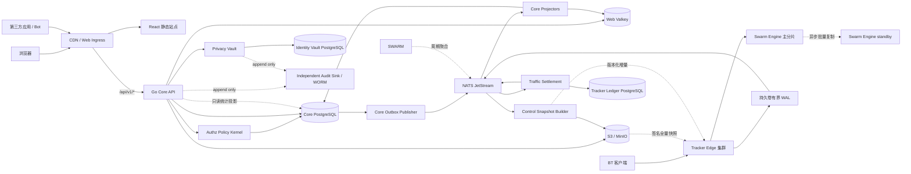
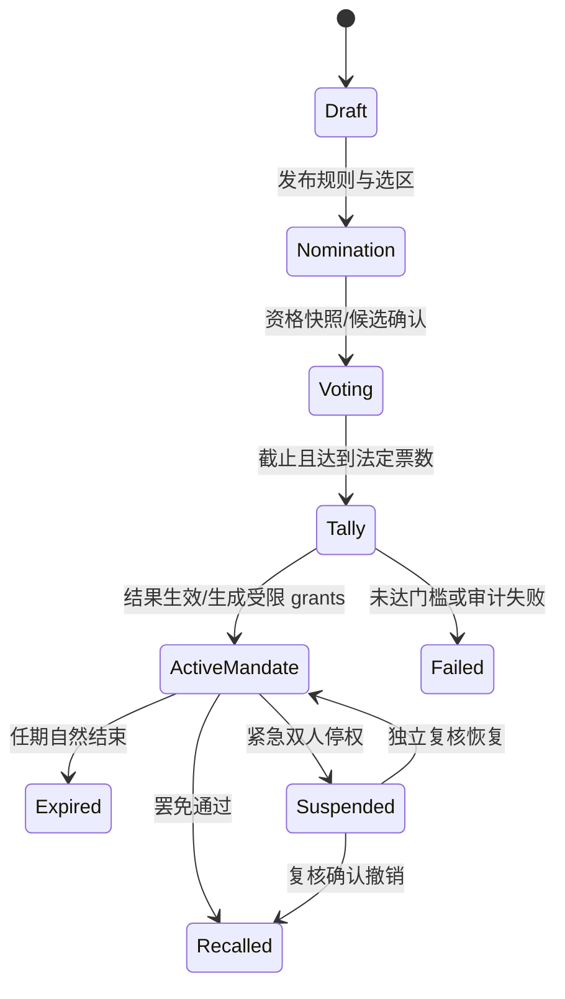
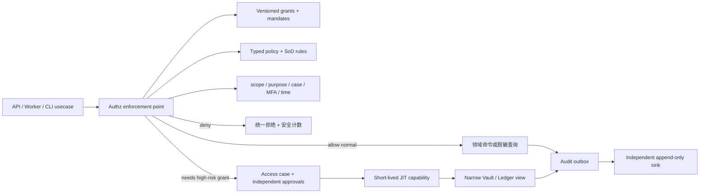
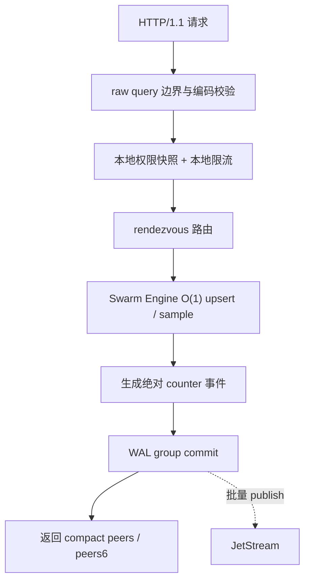

# PeerGo

> 一套从零设计的现代 Private Tracker 平台。旧 PtYes 只提供功能清单、只读数据导出和旧 `.torrent` 兼容信息，不作为新版代码、目录、API、表结构、缓存或 Tracker 架构的参考实现。
>
> 技术版本基线截至 2026-07-31：React 19.2.7、Go 1.26.5、PostgreSQL 18.4。当前仓库处于架构与迁移契约阶段，不代表下述服务已经实现。

## 结论先行

新版采用“React Web + Go 主站模块化单体 + 独立 Tracker Edge/Swarm 数据面 + 可靠异步结算”的全新架构。

1. 新版不复用旧后端、旧前端、旧 API DTO、旧 ORM model、旧任务框架或旧缓存 key。
2. 旧系统只用于确认“有哪些功能”和导出用户、种子、账目、原始 `.torrent` 文件；数据会映射到全新 schema。
3. 新 Web 与受授权第三方客户端共用主站同源的 `/api/v1` 契约；不为旧网页/API 保留永久兼容层，也不复制一套 Partner API。
4. 已经存在于用户 BT 客户端中的 `/tracker/{passkey}/announce|scrape` 路径必须长期兼容，否则用户需要重新下载种子。
5. Tracker 与网站使用不同域名、进程、节点池、容量配额和数据库；Tracker 洪峰不会占用网站资源。
6. Peer 热状态保存在专用 Swarm Engine 的分片内存中，announce 热路径不访问 PostgreSQL，也不依赖 Valkey/Redis。
7. Tracker 使用独立 Ledger PostgreSQL，但只由异步 Settlement 写入；它不保存实时 Peer 列表。
8. 上传/下载量通过持久化 WAL、JetStream 和幂等账本结算，不直接相信或累加一次客户端请求。
9. 网站只读取异步投影的 swarm 统计；统计可以短暂过期，种子页和动态圈不能因此卡住。
10. 首版全部使用 Go；Core API 统一使用 Chi，Tracker 保持原生 `net/http` 热路径。协议契约保持语言无关，只有真实压测证明 Go Swarm Engine 是瓶颈时才考虑替换为 Rust。
11. “职位、任期、角色、权限”分离：技术运维、副站长或民选代理站长都不会因为头衔自动获得全站权限。
12. 代理站长默认不能查看用户邮箱、IP、passkey、Tracker 明细或批量导出；敏感访问必须绑定案件、限时、双人批准并进入外部不可变审计。
13. 采用 monorepo，但按服务级 `go.mod` 和领域 owner 隔离；Core API/Worker/Projector 是独立部署、同一份领域代码，避免多人开发再次产生重复 service/model。

## 1. Greenfield 边界

### 1.1 旧系统允许提供的输入

- 功能目录：用于决定新版产品范围，不决定代码边界。
- 用户数据：ID、账号、密码摘要、passkey、等级、权限、封禁状态、流量、积分、VIP 和注册时间等。
- 种子数据：ID、UUID、原始 info hash、元数据、上传者、状态、促销、文件列表及原始 `.torrent` 对象。
- 关联账目：完成记录、做种时间、H&R、积分/经验/余额及可核对的历史日志。
- 旧 Tracker URL：只为已经在客户端运行的任务保持网络兼容。
- 脱敏后的真实客户端请求样本：只用于发现协议边界；正确结果由 BEP 和客户端互操作测试决定。

### 1.2 禁止从旧系统继承的内容

- 目录结构、路由组织、controller/service/repository 划分。
- GORM、Ent 或旧 model 的字段形状和关联方式。
- 旧 JSON 响应、错误码、分页格式和前端 API 调用方式。
- Redis key、缓存 TTL、队列、定时任务和流量累加方式。
- Tracker 内部流程、Peer 表示、身份预热方式和作弊规则实现。
- 启动期自动迁移、共享全局容器、跨模块直接读表等开发习惯。

`tools/legacy-import` 是旧数据进入新版的唯一通道。任何线上服务都不得 import、链接或运行旧项目包。

### 1.3 兼容的定义

兼容的是用户资产和种子身份，不是历史技术债：

- 用户无需重新注册，合法密码摘要可直接验证；旧算法只允许“登录后立即 rehash”。
- passkey 保持原值，已有客户端任务继续 announce。
- 用户累计上传/下载、积分、经验和有效权益不凭空变化。
- 种子 ID、原始 info hash 和内容文件保持一致。
- 不要求旧网页、旧 JSON API 或旧管理后台继续运行。

## 2. 2026 年活跃开源项目调研

筛选标准：最近约 12 至 18 个月仍有公开提交或发布、存在测试/文档、可核对协议能力，并且与 PT 产品或 Tracker 数据面直接相关。历史知名但长期无稳定发布的项目不作为主参考。

| 项目 | 维护证据（截至 2026-07-31） | 本项目借鉴 | 不照搬 |
|---|---|---|---|
| [UNIT3D](https://github.com/HDInnovations/UNIT3D) | 本地默认分支 head：2025-12-03 | 现代 PT 的产品覆盖、审核、H&R、用户体验、权限和测试意识 | Laravel/Livewire 的运行时和表结构不进入新版 |
| [NexusPHP](https://github.com/xiaomlove/nexusphp) | 本地默认分支 head：2026-07-30 | 中文 PT 的考核、促销、盒子、勋章、邀请和迁移语义 | 只用作功能对照，不借用其历史架构 |
| [Torrust Tracker](https://github.com/torrust/torrust-tracker) | 本地默认分支 head：2026-07-30 | HTTP/UDP/TLS、IPv4/IPv6、private/whitelist、管理面、测试和生产监控 | 不直接采用其通用持久化模型；PeerGo 需要独立经济账本和反作弊 |
| [Torrust Index](https://github.com/torrust/torrust-index) | 本地默认分支 head：2026-05-15，包含公开 ADR | Index/API/GUI/Tracker 边界、ADR、配置校验、结构化诊断 | 它不是完整私站社区产品，领域模型需自行设计 |
| [Aquatic](https://github.com/greatest-ape/aquatic) | 本地默认分支 head：2026-07-13，包含 load test/bencher | 内存 Peer 状态、协议拆分、固定成本热路径、专用压测工具 | 面向开放 Tracker，无私站身份、账目和风控 |
| [ReUnit3d Announce](https://github.com/ReUnit3d/ReUnit3d-Announce) | 本地默认分支 head：2026-03-13 | 高性能私有 announce 的实现方向和 UNIT3D 客户端场景 | 规模和成熟度较小，性能数字必须自行复测 |

上述六个项目已浅克隆到 [`references/`](./references/README.md)，检出分支、精确 commit 和更新方式以该清单为准。参考仓库是本地研究材料，不是 PeerGo 的源码依赖；根仓库不会提交这些嵌套 Git 仓库。

明确排除：Chihaya 最新稳定发布仍是 2017 年的 RC，因此不作为 2026 新系统的实现基线。Gazelle/Ocelot 的 Web/Tracker 分离在历史上有价值，但新版结论必须由仍在维护的 Torrust、Aquatic 和现代部署实践重新验证。

从这些项目得到的共同结论：

- PT 网站和 Tracker 是两种完全不同的负载，必须分故障域。
- Tracker 的 Peer 发现应该是内存数据结构问题，而不是数据库 CRUD 问题。
- 协议解析、swarm 状态、身份控制、计费结算和反作弊必须分层。
- 私站不能照搬开放 Tracker 的“全内存且无账本”，但也不能让经济账本进入 announce 热路径。
- 专门的协议 corpus、fuzz、负载发生器和公开性能条件比框架选型更重要。
- 新系统应先保持清晰的模块化单体，只有独立扩容/故障域明确的 Tracker、Worker 和结算链路才拆进程。

### 2.1 代码级审阅结论

这不是只读项目首页后的技术选型。下面结论来自本地检出代码，后续每次更新参考 commit 都要重新核对。

| 参考实现 | 代码中确认的做法 | PeerGo 决策 |
|---|---|---|
| [UNIT3D 本地代码](./references/unit3d/app/Models/Group.php) | `Group` 把 `is_owner/is_admin/is_modo/is_torrent_modo` 等职位能力做成布尔位，许多 controller/middleware 直接判断；有 model audit，但管理 controller 允许删除 audit | 借鉴丰富岗位和审计覆盖；拒绝“职位即权限”、散落鉴权和普通后台可删审计 |
| [NexusPHP 本地代码](./references/nexusphp/app/Auth/Permission.php) | 用户能力合并 class、多个 role 和 direct permission；已经区分用户基本资料、机密资料的查看/管理；但 `Staff Leader` 可在 policy 前置逻辑中全局放行 | 借鉴多角色和字段级机密权限；拒绝等级继承带来的隐式权限与超级角色 bypass |
| [Torrust Index ADR 008](./references/torrust-index/adr/008-roles-and-permissions-refactor.md) | 采用 typed `Role/Action`、默认拒绝 permission matrix、HTTP extractor、资源所有权检查和 `/me/permissions` | 借鉴 typed action catalog、默认拒绝、能力发现；扩展为多角色、scope、任期、用途、双人审批，且不设置请求路径上的万能 Admin |
| [Torrust Tracker 本地代码](./references/torrust-tracker/packages/swarm-coordination-registry/src/swarm/coordinator.rs) | 包边界清晰，协议/server/core 分层；swarm registry 使用并发索引和每 swarm coordinator；当前 peer 容器按地址排序并顺序 `take(limit)`，清理会遍历 swarm，首次加载持久完成数时可触发 DB 读取 | 借鉴契约拆分、事件和专用 benchmark；PeerGo 热路径坚持无 DB、随机/多样性抽样，并用时间轮避免全量过期扫描 |
| [Aquatic 本地代码](./references/aquatic/crates/http/src/workers/swarm/storage.rs) | HTTP socket worker 与 swarm worker 通过有界 channel mesh 分离；小 swarm 用内联数组，大 swarm 用索引结构并随机分段抽样；UDP 有分片锁和专用 load test | 借鉴每核 worker、small/large 自适应存储、背压和负载工具；不照搬开放 Tracker 的无身份/无可靠账本模型，也不保留周期全表 shrink/scan |
| [ReUnit3D 本地代码](./references/reunit3d-announce/src/queue.rs) | 启动时把用户、passkey、种子等装入内存，announce 聚合更新到进程内队列后批量写 MySQL，失败批次会回队；Peer 过期由并行全量扫描处理 | 借鉴私站校验、counter delta、批量合并与失败重试；进程内队列不能替代 WAL，端口探测不能让 announce 等待，过期不能靠全局扫描 |

综合后的原则是“学习约束，不复制框架”：PeerGo 的权限系统比这些站点更强调权力来源和隐私边界，Tracker 则组合它们的协议经验、内存结构和压测方法，再补上 PT 经济账本需要的持久事件链。

## 3. 新版产品范围

旧功能只在本节充当产品需求清单。实现顺序、领域边界和数据模型全部重新设计。

### 3.1 身份与用户

- 开放、邀请和关闭注册模式。
- 登录、退出、密码找回、邮箱验证、TOTP、恢复码和会话管理。
- 用户资料、头像、隐私、在线状态、等级、VIP、捐赠和保号。
- Passkey 查看、重置、撤销和操作审计。
- 封禁、下载限制、社交禁言、邀请限制、申诉与处理记录。
- 上传量、下载量、分享率、做种统计、H&R 和个人账目明细。

### 3.2 种子与内容发现

- 严格 bencode 解析、原始 info bytes hash 验证、private torrent 校验。
- 上传、编辑、审核、发布、软删除、恢复、举报和删除申请。
- 分类、动态属性、标签、海报、截图、MediaInfo 和外部元数据。
- 列表、详情、搜索、建议词、热词、收藏和内容版本分组。
- 文件列表、评论、投票、浏览、完成数和脱敏 swarm 概览。
- 种子/全站促销、购买促销、置顶、退款和审计。
- RSS、面向自动化工具的新 API、求种、补种和候选资源。

### 3.3 审核与考核

- 审核员申请、审核队列、优先级、模板、讨论、升级和超时。
- 上传者整改、重新提交、申诉、审核日志和奖励。
- 考核模板、自动分配、用户进度、提醒、到期动作和豁免。

### 3.4 经济与激励

- 魔力值、PT 币、经验的明确账本和余额投影。
- 做种奖励、签到、连续签到、补签卡、商城、兑换和赠送。
- 勋章购买/授予/佩戴/有效期及规则化加成。
- 红包、动态打赏、工作组资金池、赞助、支付回调和退款。
- 骰子、转盘、老虎机等游戏作为后期独立模块，不能污染核心账本。

### 3.5 动态圈与社区

- 文字、图片、关联种子、可见性和草稿。
- 关注、粉丝、屏蔽、话题、精选和置顶。
- 点赞、表情、评论、楼中楼、转发、投票、打赏和举报。
- 公告、Wiki、站内信、反馈、通知和邮件模板。
- 实时通知是增强功能；WebSocket/SSE 断开不得影响普通页面。

### 3.6 管理后台

- 用户、种子、分类、设置、客户端、Seedbox 和权限管理。
- 审核、考核、邀请、经济、勋章、工作组、赞助和支付管理。
- 动态、话题、举报、禁言、邮件和系统任务管理。
- 审计日志、IP 历史、在线用户、风险案件和系统仪表盘。
- 所有管理写操作都由服务端鉴权并写入不可变审计记录。

### 3.7 权限与社区治理

- 多角色授权、资源 scope、临时授权、代理授权、职责互斥和权限预览。
- 技术运维、副站长、民选代理站长、审核员、隐私官、安全调查员和只读审计员。
- 提名、资格校验、匿名投票、法定票数、固定任期、罢免、递补和紧急停权。
- 敏感数据访问申请、用途绑定、双人批准、WebAuthn step-up、限时会话和访问告知。
- 公开的管理行为公示、申诉和复核；秘密选票、举报人和安全调查证据必须隔离。
- 职位只赋予预先审议的权限包，任何职位不得自行扩权、删除审计或直接查询生产数据库。

### 3.8 Tracker 与流量

- HTTP/HTTPS announce、scrape 和 compact Peer 响应。
- Passkey、用户状态、种子状态和客户端策略验证。
- IPv4、IPv6、双栈 session、started/stopped/completed。
- Peer 生命周期、做种/下载人数、完成数和连接性。
- 原始与计费流量、促销、VIP、勋章和 Seedbox 规则。
- H&R、超速、重放、异常 counter、反吸血和人工复核。

## 4. 目标与非目标

### 4.1 目标

- 用全新代码和全新 schema 实现完整 PT 产品。
- 无损迁移现有用户、种子、种子文件和可核对的资产数据。
- Tracker 故障、扩容或攻击不影响 Web、动态圈和后台。
- Tracker 热路径成本有上界，不随 swarm 总大小线性增长。
- 账目可重放、可幂等、可解释、可补偿、可对账。
- API、事件、数据库和模块 owner 明确，团队开发方式统一。
- 社区治理可以授权日常管理，但无法借职位批量采集用户数据、修改账本或掩盖操作记录。
- 可以从单机 Compose 平滑扩展到多节点，而不重写领域代码。

### 4.2 非目标

- 不追求兼容旧网页或旧 JSON API。
- 不让新服务在线读取旧数据库或复用旧表。
- 不把所有业务提前拆成微服务。
- 不把 Peer 明细长期存入 PostgreSQL。
- 不为“多技术栈”而无理由加入 Rust、Kafka、Elasticsearch 或 Kubernetes。
- 不承诺没有在本项目硬件和流量模型上复测过的第三方 RPS 数字。
- 首版不启用缺少通用私站认证兼容性的 UDP announce。

## 5. 技术基线

### 5.1 Web

| 能力 | 选择 |
|---|---|
| 运行时 | React 19.2.7 + TypeScript strict |
| 应用框架 | React Router 7 Framework Mode，首版使用 SPA rendering |
| 构建 | React Router Vite plugin + Vite stable + pnpm workspace + 精确 lockfile |
| 服务端状态 | TanStack Query，query key 归 feature 所有 |
| 组件系统 | shadcn/ui + Tailwind CSS + 可访问性检查 |
| 表单与契约 | schema 校验；OpenAPI 生成 request/response 类型 |
| 测试 | Vitest、Testing Library、Playwright |

React Router Framework Mode 提供类型安全 route module、loader/action、pending UI、智能代码分割和未来按 route 选择 SSR/SSG 的能力。PeerGo 首版仍输出 SPA 静态资源并由 CDN 提供，不运行 Node SSR；这是登录后产品，不需要为了 SEO 扩大故障域。

- TanStack Query 是远端领域数据的唯一缓存；route loader 只负责会话 bootstrap、权限门禁和调用同一份 query options 做 prefetch，禁止维护第二套请求缓存。
- 公开落地页或可索引内容达到明确需求后，优先单独增加 `apps/public-web`，不把用户站、管理后台和 Go API 改造成 Next.js BFF。
- 不使用仍标记 unstable/experimental 的 React Server Components 构建链作为首版基础。
- 所有前端依赖精确锁定，由 Renovate 类工具提 PR 并通过 E2E 后升级；不同 feature 不得自行引入第二套路由、表单或状态框架。

### 5.2 Go

| 能力 | 选择 |
|---|---|
| 工具链 | Go 1.26.5 |
| Core HTTP | `chi/v5`，只存在于 transport adapter，保持 `net/http` 兼容 |
| API 生成 | OpenAPI 3.0.3 + `oapi-codegen/v2` strict server + request validator |
| Tracker HTTP | 原生 `net/http` + 专用 raw-query/bencode codec，不挂 Core middleware |
| SQL | `pgx/v5` + `sqlc`，显式 SQL 和事务 |
| migration | 版本化 SQL，由独立 migrator 执行 |
| 其他契约 | JSON Schema 2020-12（事件）+ Protobuf（内部 Tracker RPC） |
| 配置 | typed config，启动时完整校验，无隐藏默认凭据 |
| 可观测性 | OpenTelemetry、Prometheus、结构化日志和 trace ID |
| 测试 | unit、integration、race、fuzz、contract、benchmark、load |

Chi 负责路由、route group 和标准 middleware 组合，不负责业务规则。`chi.Context`、URL 参数和 HTTP DTO 必须在 transport 层转换，不能进入 usecase/domain。Gin、Echo 等框架本身并非禁止，但一个仓库只采用一套 Core HTTP 标准；替换或并存必须经过 ADR，不能由单个模块自行决定。

OpenAPI 使用 3.0.3 是有意选择：当前成熟的 `oapi-codegen` strict server 尚未正式支持 3.1。接口源文件按领域拆分，CI bundle、lint、生成 Go/TypeScript 代码并检查 breaking change；生成文件禁止手改。以后生成工具稳定支持 3.1 时再通过 ADR 升级。

### 5.3 数据与基础设施

| 数据/能力 | 选择 | 用途 |
|---|---|---|
| Core PostgreSQL 18.4 | 生产独立实例 | 用户、种子、社区、审核、经济账本和读模型 |
| Tracker Ledger PostgreSQL 18.4 | 与 Core 物理隔离 | 短期 announce inbox、session、结算、风险证据和对账 |
| Identity Vault PostgreSQL 18.4 | 至少独立 database/owner；可再独立实例 | 邮箱、恢复信息、凭据密文和敏感访问回执 |
| Web Valkey | 仅主站使用 | session、短缓存、非账目型限流 |
| Swarm Engine memory | Tracker 专用 | 活跃 Peer 和即时 swarm 计数 |
| NATS JetStream | 三节点生产集群 | 可靠控制事件、announce 事件和投影 |
| S3/MinIO | 对象存储 | `.torrent`、图片、快照、归档和迁移清单 |
| PostgreSQL FTS + `pg_trgm` | 首版搜索 | 达到明确阈值后再评估 Meilisearch/OpenSearch |
| ClickHouse | 可选后期组件 | 长期 announce/风控分析，不进入首版热路径 |

PostgreSQL schema 用于表达 Core 领域所有权，但不是安全边界；Vault 必须使用独立 database、连接身份和密钥。小规模环境可以让 Core/Vault database 位于同一物理 PostgreSQL，Tracker Ledger 在生产仍必须物理隔离。RLS 只作为纵深防御，因为 table owner、superuser 和 `BYPASSRLS` 可以绕过它，核心授权仍由第 9 节的 policy kernel 执行。

业务代码统一使用 `pgx/v5 + sqlc`，不引入 Active Record/GORM 作为第二套数据访问模式。迁移保持人工可审阅的 SQL；高吞吐 inbox 按时间分区并只保留幂等窗口，长期原始事件进入压缩对象归档，达到分析阈值后再引入 ClickHouse，不能让 PostgreSQL 永久保存每一次 announce 明细。

## 6. 总体架构



### 6.1 强制故障域

- 正式环境只有一个 canonical Web origin；页面、静态资源与 `/api/v1/*` 对外同源，Ingress 在内部将 API 路径转发给 Core API。
- Tracker 使用独立 canonical/region 域名、证书、ingress、WAF 策略和限额，不与 Web/API 共用入口或节点。
- Web session 与第三方 OAuth token 即使调用同一路径，也按 credential audience、client、scope 和 route class 使用独立限流预算；第三方流量过载先被限流，不能耗尽交互式 Web 的保留容量。
- Core、Tracker Edge、Swarm Engine、Worker、Settlement 分 deployment 和连接池。
- Tracker 不访问 Core PostgreSQL；Core API 不访问 Swarm Engine 管理面。
- Web Valkey 不与 Tracker、JetStream 或 Worker 队列共享。
- Tracker readiness 不参与 Web readiness；Web 页面永远不等待 Tracker RPC。
- Swarm 统计是带 `observed_at` 的异步读模型，允许 stale。

### 6.2 故障行为

| 故障 | Tracker | Web |
|---|---|---|
| Tracker Edge 宕机 | ingress 摘除，客户端下一次 announce 重试 | 无影响 |
| Swarm 主分片宕机 | rendezvous hash 切副本；少量 Peer 由后续 announce 重建 | 统计短暂 stale |
| JetStream 暂时不可用 | 已 fsync 事件留在 WAL，恢复后重放 | 无影响 |
| Tracker Ledger DB 不可用 | 消费积压且不 ACK，Peer 发现继续 | 流量显示延迟，其他页面正常 |
| Core DB 不可用 | Tracker 在受控期限使用最后一份签名权限快照 | Web 降级；Tracker 不级联崩溃 |
| Tracker 全站维护 | 返回短小 bencode failure/warning，客户端按 interval 重试 | 浏览、动态圈和后台继续工作 |

## 7. 目标仓库结构

```text
PeerGo/
├── .github/
│   ├── CODEOWNERS
│   └── workflows/
├── README.md
├── ownership.yaml                    # 模块、表、事件和审批 owner
├── references/README.md              # 本地研究仓库清单；实现仓库本身被忽略
├── go.work
├── Makefile
├── package.json
├── pnpm-workspace.yaml
├── apps/
│   └── web/
│       ├── app/root.tsx              # provider、document、error boundary
│       ├── app/routes.ts             # 唯一 route manifest
│       ├── app/routes/               # 薄 route module
│       ├── app/features/             # auth、torrent、social、review、economy...
│       ├── app/entities/             # 纯前端领域展示模型
│       ├── app/shared/               # UI、hooks、formatter
│       ├── app/generated/            # OpenAPI client，禁止手改
│       └── tests/
├── services/
│   ├── core/
│   │   ├── go.mod
│   │   ├── cmd/api/                  # 独立 API 二进制
│   │   ├── cmd/worker/               # 独立后台任务二进制
│   │   ├── cmd/projector/            # 独立投影二进制
│   │   ├── cmd/snapshot-builder/     # Tracker 控制快照二进制
│   │   └── internal/
│   │       ├── modules/              # identity、authz、torrent、social...
│   │       ├── generated/            # OpenAPI/sqlc 产物，禁止手改
│   │       └── platform/             # Core 内部 pg/nats/http/telemetry adapter
│   ├── privacy-vault/
│   │   ├── go.mod
│   │   ├── cmd/api/
│   │   └── internal/                 # 高敏字段、JIT 访问和脱敏视图
│   ├── tracker/
│   │   ├── go.mod
│   │   ├── cmd/tracker-edge/
│   │   ├── cmd/swarm-engine/
│   │   └── internal/
│   │       ├── protocol/httptracker/
│   │       ├── protocol/bencode/
│   │       ├── edge/
│   │       ├── routing/
│   │       ├── swarm/
│   │       ├── control/
│   │       ├── wal/
│   │       └── telemetry/
│   ├── settlement/
│   │   ├── go.mod
│   │   ├── cmd/settlement/
│   │   └── internal/
│   └── audit-sink/
│       ├── go.mod
│       ├── cmd/audit-sink/
│       └── internal/
├── contracts/
│   ├── openapi/v1/
│   │   ├── root.yaml
│   │   ├── domains/                  # 按 identity/torrent/social/admin 拆分
│   │   └── bundled/                  # CI 生成 internal/public 两种视图，禁止手改
│   ├── events/
│   │   ├── control/v1/
│   │   ├── tracker-announce/v1/
│   │   ├── traffic-settled/v1/
│   │   └── swarm-stats/v1/
│   ├── proto/swarm/v1/
│   └── tracker/
│       ├── bep-golden/
│       └── client-corpus/
├── db/
│   ├── core/migrations/
│   ├── vault/migrations/
│   └── tracker/migrations/
├── packages/
│   ├── go/primitives/
│   │   ├── go.mod                    # 唯一获准的跨服务 Go module
│   │   ├── ids/                      # 只允许稳定、无业务语义的 primitives
│   │   └── clock/
│   └── ts/config/                    # 共享 lint/tsconfig，不放领域 DTO
├── tools/
│   ├── legacy-export/               # 只读旧库
│   ├── legacy-import/               # 只写新库 staging/API
│   ├── reconcile/
│   ├── torrent-verify/
│   └── tracker-loadgen/
├── deploy/
│   ├── compose/
│   ├── kubernetes/
│   ├── ingress/
│   └── observability/
└── docs/
    ├── adr/
    ├── data-contracts/
    ├── governance/
    ├── runbooks/
    └── threat-model/
```

`legacy-export/import` 只在迁移环境构建，不进入任何生产 runtime image。

### 7.1 为什么这样更适合多人维护

- 根 `go.work` 编排服务级 module 和唯一获准的 `packages/go/primitives`；`core`、`tracker`、`settlement`、`privacy-vault` 和 `audit-sink` 各有一个 `go.mod`，不为每个小目录制造 module。
- Core API、Worker、Projector 和 Snapshot Builder 是四个独立二进制/镜像/Deployment，却复用同一个 `services/core/internal/modules`，业务规则不会复制到 `core-worker` 或通用包。
- SQL query 与 owning module 共置，例如 `modules/torrents/repository_postgres.sql`；只有必须全局排序的 migration 放在 `db/<database>/migrations`，文件名使用 `UTC timestamp + module + action`。
- OpenAPI 源契约按领域拆分以减少 merge conflict；每个 operation 声明 `x-audience`，CI 从同一源生成完整 internal bundle 与公开 public bundle。Go server interface 和第一方 TypeScript client 使用完整契约，第三方文档/SDK 只使用 public 子集。
- `packages/` 不接受 User、Torrent、Permission 等领域 model，也不设置 `utils` 大杂烩。跨领域协作只使用模块 contract、事件或明确 usecase。
- `ownership.yaml` 与 `CODEOWNERS` 同时声明模块、表、migration、API path 和事件 owner；授权、隐私、审计、结算等高风险路径要求双 owner 审查。
- CI 用依赖规则禁止模块读取其他模块的 `internal` 或 SQL，并按改动路径运行快速测试；合并前仍执行全量 contract、migration 和集成测试。

## 8. 主站领域设计

### 8.1 模块边界

| 模块 | 拥有的数据/职责 | 禁止承担 |
|---|---|---|
| `identity` | 账号与凭据生命周期、会话、验证状态、API key/passkey 轮换及 Vault 引用 | 保存可供后台读取的凭据明文、用户公开资料和流量结算 |
| `users` | 资料、隐私、等级、VIP、状态展示 | 任意修改经济或流量余额 |
| `authz` | typed action、role、grant、scope、policy decision 和授权版本 | 保存职位选举或敏感字段明文 |
| `governance` | 职位、任期、选举、罢免、代理关系和公示 | 直接赋予代码中不存在的权限或读取秘密选票 |
| `privacy` | 高敏字段、脱敏视图、访问案件、批准和 JIT session | 普通用户资料、内容审核和 Tracker 热状态 |
| `audit` | 追加式安全/管理事件、外部封存和验证链 | 提供删除/覆盖历史事件的后台接口 |
| `torrents` | 元数据、文件、对象、标签、分类、分组、上传和删除状态机 | Peer 明细和 Tracker 请求 |
| `review` | 审核队列、规则、讨论、申诉和奖励命令 | 越权直接更新 torrent 表 |
| `traffic` | 用户流量读模型、snatch、H&R 和对账结果 | 解析 announce |
| `economy` | 积分、经验、货币、交易、退款、红包、勋章和 ledger | 直接更新 users 上的浮点余额 |
| `social` | 动态、关注、话题、互动、举报和禁言 | 查询实时 Peer |
| `community` | 公告、Wiki、站内信、RSS、反馈和通知 | Tracker 状态维护 |
| `sponsor` | 活动、订单、回调、退款和审计 | 在 HTTP handler 内改余额 |
| `admin` | 后台聚合视图和经授权的业务命令入口 | 自己决定授权、跨模块直写或成为无边界代码仓库 |

### 8.2 模块统一形状

```text
modules/torrents/
├── transport_http.go       # 实现生成的 strict interface；不含业务规则
├── contract.go             # 模块公开命令/查询/DTO
├── usecase.go              # 权限、事务和用例编排
├── domain.go               # 状态机和值对象
├── repository.go           # port
├── repository_postgres.go  # pgx/sqlc adapter
├── repository_postgres.sql # sqlc 源查询，归本模块 owner
├── events.go               # outbox 事件
├── errors.go
├── usecase_test.go
└── repository_test.go
```

依赖规则：

- Chi/generated transport -> usecase -> domain；domain 不依赖 HTTP、SQL、NATS 或缓存。
- 模块不能直接访问其他模块的表，只调用公开应用接口或消费事件。
- SQL 归表 owner；不存在万能 repository、万能 service 或共享 model 包。
- 单库强一致写入使用明确事务；跨数据库只用 outbox/inbox，不伪造分布式事务。
- API、Worker 和 CLI 都调用相同 usecase，不能复制业务规则。
- 每个 usecase 在读取敏感字段或执行副作用前调用 `authz.Authorize`；HTTP middleware 只能做会话和粗粒度前置检查，不能成为唯一鉴权层。

## 9. 身份、职位、权限与社区治理

PeerGo 不使用“用户等级越高就自动拥有下级全部权限”的单轴模型，也不设计一个日常可用、可以绕过所有 policy 的超级管理员。核心原则是：治理权、内容管理权、隐私数据权、账本权和生产运维权彼此独立。

### 9.1 六个概念必须分开

| 概念 | 含义 | 示例 |
|---|---|---|
| Principal | 发起动作的身份 | 普通用户、员工账号、service account |
| Position | 面向社区展示的职位，不直接参与授权 | 技术运维、副站长、代理站长、审核员 |
| Mandate | 职位的权力来源、范围和有效期 | 任命、选举、临时代理、紧急委托 |
| Role | 经代码审查的能力包 | `community_moderator`、`release_operator` |
| Permission | 最小、稳定、可测试的 action | `torrent.review`、`user.pii.email.read` |
| Grant | 把 role 绑定到 principal 的事实 | scope、起止时间、来源 mandate、约束和撤销版本 |

“代理站长”只是 position。一次选举通过后，系统创建有固定期限的 mandate，再由 mandate 生成受限 grants；任期结束、罢免或紧急停权会自动撤销。数据库中禁止用 `is_admin=true` 表达这一过程。

权限命名使用 `resource.action[.field]`，例如：

```text
torrent.review
social.report.resolve
user.profile.basic.read
user.pii.email.read
user.security.ip.read
traffic.adjust.propose
deployment.release.execute
authz.grant.approve
```

生产角色不能包含通配 `*`。新 action 必须加入 Go typed catalog、默认拒绝矩阵、权限说明、审计级别和测试；未登记 action 不可通过字符串临时放行。

### 9.2 授权模型：RBAC 基线 + 条件与关系约束

首版在 Go `authz` 模块实现小而明确的 policy kernel，不先引入独立授权服务：

```go
Authorize(subject, action, resource, Context{
    Scope, Purpose, CaseID, MandateID, MFAAge, SourceIP, Now,
}) -> Decision{Allow, ReasonCode, PolicyVersion, DecisionID}
```

- RBAC 表达可审议的职位能力包；ABAC 限定 scope、时间、案件用途、MFA 新鲜度和数据等级；ownership/relationship 处理“本人、负责的审核队列、被分配案件”等关系。
- 决策顺序为：显式 deny/冻结 > 系统不变量 > 职责互斥 > 有效 grant > 条件约束；任一必要上下文缺失即拒绝。
- 每个 API、Worker、后台任务和 CLI 都在 usecase 边界鉴权。前端隐藏按钮、路由 middleware 和数据库 UI 都不是安全边界。
- `GET /api/v1/me/capabilities` 返回当前 scope 下可用能力和到期时间，供 Web 展示；它不返回其他人的 grant，也不能替代服务端决策。
- 普通权限可以使用短 TTL 版本化缓存；封禁、撤权和任期终止通过 outbox 事件主动失效。高敏权限在授权版本过期或依赖不可用时 fail closed。
- 当关系授权复杂到本地模型难以验证时，再通过 ADR 评估 OpenFGA/Cedar 类引擎；首版不为技术标签额外制造网络故障点。

### 9.3 职位能力与明确禁区

下表是默认基线，不是靠职位继承的等级树。一个人可以兼任多个职位，但职责互斥规则仍可能拒绝组合后的动作。

| 职位/角色 | 默认可以 | 明确不可以 |
|---|---|---|
| 站长/治理委员会 | 章程、岗位模型、重大应急和最终申诉的集体决策 | 日常直接读取 PII、删除审计、单人修改账本或秘密选票 |
| 副站长（任命） | 跨团队排期、规则发布、管理升级和受控业务配置 | 生产 shell/DB、原始 passkey/TOTP、批量用户导出、独自永久封禁 |
| 代理站长（民选） | 公告、社区活动、举报协调、内容治理、可逆的短期限制 | 邮箱/IP/Peer 明细/支付信息、权限授予、部署、账本调整、选票身份映射 |
| 技术运维 | GitOps 发布、重启、扩缩容、备份恢复演练、脱敏 metrics/logs | 用户内容管理、业务封禁、用户搜索导出、应用 secret 明文和随意 SQL |
| 内容审核/版主 | 指定分类或社区 scope 的审核、编辑、举报处理 | 其他 scope、身份机密、账本、生产基础设施 |
| 隐私官 | 审查 PII 访问理由、批准/拒绝、保留期和用户请求 | 自己批准后自己查询、内容处罚、部署或账本修改 |
| 安全调查员 | 在已批准案件中限时查看最少 IP/会话证据 | 无案件漫游搜索、导出全站 IP、修改原始证据 |
| 财务/账本复核 | 脱敏订单、退款提案、补偿复核 | Tracker Peer 行为、密码凭据、直接 `UPDATE balance` |
| 只读审计员 | 读取受控审计视图、验证完整性和出具报告 | 任意业务写入、批准自己的访问或查看无关明文 PII |
| Service account | 单一服务、单一 audience、单一动作集合 | 人类登录、交互后台、跨服务共享 token |

民选职位的默认操作必须是可逆且可申诉的。代理站长可实施的单次限制由 policy 配置并设置短上限（初始建议不超过 7 天）；永久封禁、账号删除、passkey/邮箱变更、资产补偿和权限变更必须由另一独立角色复核。

### 9.4 民选代理站长的生命周期



- 选举创建不可变的 eligibility snapshot、选区、候选条件、法定票数、计票规则、任期和权限 profile；投票开始后不能静默改规则。
- 候选人、竞选团队和负责该场选举的人不能审核自己的资格、处理针对自己的举报或参与自己的罢免裁定。
- “已投票资格”与“选票内容”分库存放。业务后台只看到参与状态和聚合结果，不提供用户到选择的查询接口；原始选票有独立密钥、短保留期和受控审计。
- 选举结果只能选择代码中已存在、已经安全评审的代理站长 profile，不能通过投票创造 PII、账本、部署或授权管理能力。
- mandate 记录 `starts_at/ends_at/source/election_id/scope/status`；grant 必须引用 mandate，过期任务和撤销事件双重保证收权。
- 社区可见脱敏后的就任、任期、管理动作、理由、撤销和申诉结果；安全调查细节、举报人和秘密选票不公开。
- 必须存在罢免、暂时停权、递补和独立申诉流程。流行度不能覆盖安全规则，安全团队也不能以“调查”为名无限期架空选举结果。

### 9.5 敏感动作的双重控制

| 动作 | 最低控制 |
|---|---|
| 单条邮箱/安全 IP 查看 | 有效案件 + 明确 purpose + 隐私官批准 + WebAuthn step-up + 最长 30 分钟 JIT session + 行数上限 |
| 跨用户搜索或批量导出 | 默认禁用；必要时 2-of-3 独立批准、DLP/水印、加密目的地、一次性导出和到期销毁 |
| passkey、密码、TOTP、恢复码 | 永不显示原值；只允许本人自助或双人批准后的 reset/revoke |
| 永久封禁/账号删除 | 提案人与批准人分离、证据和规则版本固化、由不同人员处理申诉 |
| 流量、积分、余额修正 | 只能写补偿 ledger entry，禁止改历史或直接改余额；双人复核和自动对账 |
| role/grant/policy 修改 | 不能自授、自批或扩大自己的审批权；高风险变更需要治理与安全共同批准 |
| authz/privacy/audit 代码发布 | 受保护分支、CODEOWNERS 双审、提交者不能独自批准并发布、只部署签名制品 |
| break-glass | 两枚独立硬件凭据、明确事件、最短 TTL、全程记录、自动通知和事后复盘 |

双人批准不是“任意两个管理员点同意”。批准人必须属于不同职责域、与目标和案件无利益冲突，且系统验证不能由同一自然人通过多个账号完成。

### 9.6 隐私数据隔离

数据至少分四级：

- P0 凭据：密码摘要、TOTP seed、恢复码、passkey 原值。应用只验证或轮换，任何员工界面都不展示。
- P1 直接标识：邮箱、支付身份、账号恢复材料。进入 Identity Vault，普通模块只保存 opaque `identity_id` 和掩码投影。
- P2 安全遥测：IP、Peer endpoint、设备/会话和高精度 Tracker 行为。Tracker Ledger 分区保存，后台默认只见网段、hash 和聚合。
- P3 站内资料：用户名、头像、公开动态等，仍受用户可见性与业务 scope 控制。

Identity Vault 使用独立数据库账号、网络策略、加密密钥和窄 API。不存在 `GET /users/{id}?include=everything`；调用方只能请求如“向此 identity 发送邮件”或“为已批准案件读取一个指定字段”。任何列表接口先做字段投影和行数预算，禁止管理端任意拼 SQL。

技术运维看到的是删除 token、cookie、query、完整 IP 和用户标识后的日志。确需数据库维护时，通过 JIT DB proxy 获得限时、只读或特定 migration 身份，并记录命令；日常账号没有生产数据库登录权。

### 9.7 不可变审计与公开监督

每个鉴权决策和敏感动作生成 `decision_id/event_id`，至少记录 actor、有效 role/mandate、action、scope、purpose、case、目标伪名、policy version、结果、理由、时间和 before/after hash。

- 业务事务通过 outbox 追加审计事件；独立 Audit Sink 使用只追加凭据，并流式封存到启用 Object Lock/WORM 的对象存储。
- 普通 API、站长、代理站长和运维都没有 `audit.delete`；保留期到期由合规 lifecycle 执行并留下销毁证明。
- 审计日志本身也是敏感数据。社区公示使用脱敏 transparency projection，而审计员只看到职责范围内的完整事件。
- 对批量枚举、连续拒绝、非工作时段 JIT、自己批准自己、任期结束后调用、异常导出和审计链断裂实时告警。
- 在不破坏调查的前提下，用户可以查看“谁在何时因何种用途访问过我的敏感资料”；需要延迟的案件在结案后补充告知。

### 9.8 数据模型与执行流

Core PostgreSQL 至少包含：

```text
authz.permissions, authz.roles, authz.role_permissions
authz.grants(subject_id, role_id, scope, valid_from, valid_until,
             source_type, source_id, constraints, version, revoked_at)
authz.separation_rules, authz.delegations
governance.positions, governance.mandates
governance.elections, governance.eligibility_snapshots
governance.candidates, governance.ballot_issuances, governance.encrypted_ballots
governance.results, governance.recalls, governance.appeals
privacy.access_cases, privacy.approvals, privacy.jit_sessions
audit.outbox, audit.public_projection
```

授权和敏感读取流程：



关键不变量要同时由 usecase test、policy matrix test 和数据库约束验证：任期外 grant 无效；任何人不能自授或自批；秘密选票不能关联用户查询；补偿账本不能覆盖历史；审计事件没有 update/delete 应用凭据。

## 10. API 与 Web 设计

### 10.1 新 API

正式公网地址保持最小化：

```text
https://<site-host>/                         # Web
https://<site-host>/api/v1/...              # Web 与第三方共用 JSON API
https://<site-host>/oauth/...               # OAuth 授权、换取与撤销 token
https://<site-host>/developers/...          # 应用注册、文档与授权管理
```

- 新系统从 canonical Web origin 的 `/api/v1/*` 开始，不继承旧 `/api` 或 `/api/v1` 的历史含义。Web 与第三方客户端共用这个 base URL、DTO 和 usecase，不再建立永久 `api.`、`partner.` 或 `admin-api.` 公网域名。
- 并行开发和验收阶段可以使用临时 preview hostname；正式切换后统一接管 canonical Web origin。preview 地址不写入公开 SDK、OAuth redirect 模板或 `.torrent`，也不形成长期兼容承诺。
- OpenAPI 3.0.3 是唯一源契约，按领域拆分；每个 operation 必须声明 `x-audience`（`web`、`public`、`staff` 或 `service`）。CI 生成完整 internal bundle、只含 public operation 及其可达 schema 的 public bundle、`oapi-codegen` strict Go server interface，以及对应 TypeScript/第三方 SDK。
- 同一个 operation 可以同时服务 `web` 与 `public`，但必须经过相同 usecase 授权；受众标记只控制暴露和代码生成，不能替代运行时 permission/scope 判断。
- `/api/v1/admin/*` 只接受有效 staff session、近期 WebAuthn 和 policy decision；第三方 token 即使伪造 scope 名称也必须拒绝。服务间 endpoint 不经过 canonical Web ingress，并使用独立网络身份。
- 每个 operation 必须有稳定 `operationId`、owner、permission action、credential audience、错误集合和分页/幂等语义；生成后存在未实现 handler，或 public operation 缺少 scope/限流分类时 CI 失败。
- 成功响应使用明确 resource DTO；错误使用 `application/problem+json`、稳定 code 和 `request_id`。
- Feed 使用 cursor pagination；可重复的后台报表才使用 page/size。
- UTC RFC 3339 时间、整数 bytes、定点 decimal 字符串或最小单位整数。
- 购买、退款、支付回调、管理员批量操作支持 `Idempotency-Key`。
- DTO 不等于数据库 row，API 版本不受 schema 调整牵连。
- `v1` 表示公开 HTTP 契约的主版本：兼容性新增留在 v1，字段删除、语义改变或不可兼容认证变化进入 v2，并提供公告、迁移窗口和可观测的弃用期。

Tracker 路径不属于 JSON API，不套用 cookie、JSON、compression 或通用错误 middleware。

### 10.2 认证

- Web 使用 HttpOnly、Secure、SameSite cookie 的短会话和可轮换 refresh session。
- CSRF 使用 Origin/Referer 校验和 token；敏感操作要求近期认证。
- 第三方用户授权采用 OAuth 2.0 Authorization Code + PKCE；经审核的服务端集成才允许 Client Credentials。public/native client 不分发可被提取后冒用的固定 client secret。
- Access token 短期有效并绑定 client、subject、audience 和最小 scope；refresh token 轮换并支持按应用、用户或授权记录撤销。Web session、OAuth client/token 与 Tracker passkey 三套凭据完全分离。
- `/oauth/authorize`、`/oauth/token` 和 `/oauth/revoke` 位于同一个 canonical Web origin，但使用专门协议 handler、限流和审计；不实现 Implicit 或 Resource Owner Password grant。
- 第三方 scope 使用 typed catalog，例如 `torrent:read`、`torrent:download`、`community:read`、`community:write`、`profile:read:self`；不存在可申请的 `admin:*`、`identity:read`、`tracker:raw`、`audit:read` 或 `permission:grant`。
- 同一 `/api/v1` operation 根据 credential kind、scope 和资源关系授权，但响应始终符合声明的 DTO。标记 `public` 的 operation 只能引用 public-safe schema；需要额外敏感字段时建立独立 scoped subresource，禁止根据 cookie/token 临时塞入契约外字段。OAuth token 不能继承用户的 staff elevation，也不能兑换 staff session。
- 单次请求只能选择一个 credential audience：出现 `Authorization: Bearer` 时不得再合并 cookie 身份或 staff 权限，凭据冲突直接拒绝，防止 confused deputy。
- CORS 默认只允许 canonical Web origin；确需浏览器直连的已注册应用按精确 origin allowlist 开放，禁止 wildcard 与 credential 组合。OAuth redirect URI 必须精确匹配。
- passkey lookup 可保存 HMAC 索引；迁移时保留用户看到的原 passkey。
- 普通账号与 staff elevation 使用不同 session audience；后台高风险页面要求 WebAuthn，不能只靠 TOTP。
- 管理权限使用显式 permission、scope、mandate 和 purpose，不依赖前端隐藏按钮或单一 role 数值比较。

### 10.3 第三方开放边界

- 第三方应用只看 public bundle 和公开开发者文档；不能通过猜测 `/api/v1` 路径、修改 generated client 或注册新 OAuth client 获得未列入 public allowlist 的 operation。
- 公开 DTO 采用字段白名单。邮箱、恢复材料、凭据状态、IP/endpoint、原始 Tracker 行为、内部风控特征、选票关联和完整审计记录永不进入 public bundle。
- 每个 client 有独立速率、并发、日配额、下载配额和异常熔断；交互式 Web 保留容量，第三方过载先返回标准 `429` 与 `Retry-After`。
- 应用注册、redirect URI、scope 提升和服务端凭据发放都有审核与审计；代理站长不能自行创建高权限应用，也不能批准自己控制的 client。
- Webhook 使用独立签名密钥、时间戳、重放窗口、event ID 和有界重试；Webhook payload 同样经过 public 字段投影。
- public operation 遵守发布后的兼容周期和弃用政策；仅供 Web 的 operation 允许与 Web 协调发布，但仍必须通过契约检查，不能静默破坏已部署前端。

### 10.4 前端 feature 结构

```text
app/features/torrent/
├── api/
├── model/
├── components/
├── pages/
└── tests/
```

- feature 只通过 generated client 调用 API，不散落 URL 或手写重复 DTO。
- query key、cache time 和 invalidation 归 feature 所有。
- `app/routes/` 只做 React Router route module、权限门禁和 feature page 组装，不在 loader/action 中复制领域请求函数。
- 种子详情拆成元数据、文件、评论、审核和 swarm 概览等独立查询边界。
- 动态 Feed 不请求 Tracker，也不依赖 swarm 统计成功。
- swarm 统计返回 `observed_at`、`stale` 和 `confidence`；过期时显示提示，不阻塞内容。
- 路由级 lazy load；大型后台按功能继续分包。
- 图片直传受限签名 URL，经过服务端 MIME、尺寸、恶意内容和配额检查。
- 页面必须覆盖 loading、empty、partial、stale、forbidden 和 retry 状态。

## 11. 全新数据模型与所有权

### 11.1 Core PostgreSQL

新数据库从 version 1 migration 创建，不直接挂载旧表。建议使用逻辑 schema 表达所有权：

```text
identity.users / credential_refs / sessions / tracker_passkey_hmac
authz.permissions / roles / role_permissions / grants / separation_rules
governance.positions / mandates / elections / recalls / appeals
torrents.torrents / torrent_objects / torrent_files / editions / tags
review.cases / decisions / appeals
traffic.user_totals / torrent_totals / snatches / hnr_cases
economy.accounts / ledger_entries / transactions
social.posts / comments / reactions / follows / reports
community.announcements / wiki_pages / messages
privacy.access_cases / approvals / jit_sessions
audit.outbox / public_projection
migration.runs / source_rows / id_map / discrepancies
```

Identity Vault 自己拥有 `credentials`、`direct_identifiers`、字段密钥版本和访问回执；这些表不对 Core SQL role 可见。

核心约束：

- schema 只承担命名和 ownership；SQL 使用限定名，撤销 `public` schema 的公共 `CREATE`，不能把 schema 当作隐私隔离。
- 导入用户和种子保留旧 numeric ID；新 sequence 从历史最大值之后开始。
- `info_hash_v1` 使用固定 20 bytes/`bytea` 语义并唯一约束，不用大小写不稳定的字符串做身份。
- 原始 `.torrent` 作为不可变对象保存 SHA-256、长度、storage key 和解析器版本。
- 用户流量与经济余额是不可变 ledger 的投影，不是任意 handler 可写字段。
- 金额/积分不用 `float64`；数据库使用整数最小单位或受约束 `numeric`。
- 所有业务表有明确 owner、外键、唯一约束和时间语义。
- 服务启动只检查 migration 版本，绝不执行 AutoMigrate。

### 11.2 Identity Vault PostgreSQL

高敏字段不与用户公开资料、社区内容和授权表混放。Identity Vault 使用单独 owner 和窄服务接口保存 P0/P1 数据；Core 只保存 opaque identity reference、验证状态和掩码投影。技术规模较小时可以与 Core PostgreSQL 共用物理实例，但必须使用独立 database、凭据、网络策略和备份密钥；不能只建一个 schema 就宣称隔离。规模或风险提高后可无损迁到独立实例。

Vault 数据访问只接受已签名的 `decision_id + case_id + field + subject`，验证 JIT grant 后返回最小字段。列表、任意 SQL、原始凭据读取和“导出所有用户”不是它的普通 API。

### 11.3 Tracker Ledger PostgreSQL

独立实例保存：

- 短期分区的 `event_inbox(event_id unique)` 和消费 checkpoint；只保留覆盖重投/对账窗口所需时间。
- 用户/种子/session 的绝对 counter 与已结算 delta。
- completion、snatch、做种时间和规则版本。
- 原始流量、计费流量、促销/勋章/Seedbox 修饰结果。
- 风险 signal、证据、案件、人工结论和补偿记录。
- 向 Core 投影使用的 `settlement_outbox`。

高吞吐表按时间分区，批量写入并设置保留/归档策略。Peer IP/port 不按 announce UPSERT 到关系库；压缩原始事件进入对象存储，长期风控事件可以脱敏后归档或在达到分析阈值后进入 ClickHouse。

### 11.4 Tracker 是否连接另一套数据库

是，但连接者是异步 Settlement，不是处理 announce 的 Tracker Edge/Swarm Engine。

```text
正确：announce -> 内存验证/Peer 匹配 -> WAL -> 返回
                    WAL -> JetStream -> Settlement -> Tracker Ledger DB

错误：announce -> 查用户 -> 查种子 -> upsert peer -> 更新用户 -> 返回
```

把同步 SQL 换到“另一台数据库”仍会受连接池、锁、慢查询和故障影响，不能解决超多 Peer。真正隔离必须让请求热路径没有 SQL。

## 12. Tracker 数据面设计

### 12.1 先澄清连接模型

传统 HTTP Tracker 并不与每个 Peer 保持长期连接。客户端通常按 interval 发一个很短的 announce，然后关闭或复用连接。容量指标是：

- 峰值 announce/s、scrape/s 和短时突发。
- TLS/TCP 建连、HTTP/1.1 keep-alive 和文件描述符。
- 活跃 Peer 总数、最大 swarm、过期速度和内存占用。
- 每次 Peer 更新/抽样的复杂度和内部 RPC 数。
- WAL fsync/publish 吞吐与 Settlement backlog。

### 12.2 组件职责

`Tracker Edge`：

- 终止 HTTP/HTTPS，严格解析 raw query 和 bencode。
- socket/codec 工作与 swarm 状态工作分离，通过按 info hash 路由的有界队列传递；连接洪峰不能抢占所有状态 worker。
- 使用本地不可变快照验证 passkey、用户、种子和客户端规则。
- 执行本地近似 token bucket、请求边界和滥用防护。
- 规范化 info hash，通过 rendezvous hashing 选择 Swarm owner。
- 把成功请求写入持久化 WAL，并返回最小 bencode 响应。

`Swarm Engine`：

- 只维护 Peer endpoint、状态、过期时间和即时统计。
- 不知道用户积分、促销、VIP、H&R 或数据库 row。
- 使用固定数量的 worker shard/actor，而不是为每个 swarm 创建 goroutine。
- 主分片本地内存处理，异步批量复制到一个 standby；复制不阻塞响应。

`Settlement`：

- 从绝对 counter 计算可信 delta。
- 应用 versioned 促销、VIP、勋章、Seedbox 和反作弊规则。
- 消费并保存不可变 policy snapshot；事件携带的 control sequence 必须能解析到唯一规则版本。
- 幂等写 Tracker Ledger，再通过 outbox 更新 Core 投影。

### 12.3 Swarm 分片与路由

1. Edge 将原始 `info_hash` 解析成固定 20-byte key。
2. `rendezvous(info_hash, routing_epoch)` 选择 primary 和 standby Swarm Engine。
3. 普通 swarm 只有一个逻辑 partition，请求最多一次内部 RPC。
4. 超过配置阈值的热点 swarm 被控制面提升为 4/8/16 个 virtual partition。
5. Peer 按稳定 `peer_key` 进入一个 partition；响应从有界数量 partition 并行抽样，fan-out 有硬上限。
6. 路由变化使用 version/epoch，旧 owner 在一个 announce 周期内转发或保留过渡状态，避免瞬间割裂 swarm。
7. primary 失效时 standby 接管；Peer 状态本来就是可重建的，后续 announce 会补齐。

该方案比“所有 announce 访问共享 Valkey Cluster”多了一次受控的内部路由，却消除了共享远程 KV 的容量上限、热点 key 和故障耦合。小规模部署可以让 Edge 与 Swarm Engine 同进程，保持同一契约并走本地调用。

### 12.4 内存数据结构

每个 worker shard 独占或锁分片以下结构：

```text
hash map: info_hash -> swarm
swarm.peer_index: peer_key -> dense_slot
swarm.peers: compact dense vector
expiry: hierarchical timing wheel / bounded expiry buckets
```

设计要求：

- upsert 平均 O(1)。
- 很小的 swarm 使用内联定长数组，超过阈值再升级为 `peer_index + dense vector`，避免长尾 torrent 的逐项堆分配。
- 随机返回 `numwant` 个 Peer 为期望 O(numwant)，通过随机起点/步长或有界索引抽样完成，不能按地址顺序 `take`、全量扫描或 shuffle 全 swarm。
- stopped/过期使用 swap-delete，保持 dense vector。
- 过期清理每 tick 有预算，积压交给后续 tick，不制造长暂停。
- hot swarm 与普通 swarm 的队列、CPU budget 和指标分开，单个热门 info hash 不能占满整个 shard。
- endpoint 使用紧凑定长表示，IPv4/IPv6 分开存储，避免每 Peer JSON/对象膨胀。
- 自己、已过期、非法端口和不匹配地址族在抽样阶段过滤并有补抽上限。
- 每个 worker 有有界队列；过载时快速失败/降级，禁止无界排队耗尽内存。

### 12.5 announce 热路径



热路径预算：

- 0 次 SQL。
- 0 次 Core API 调用。
- 0 次共享 Redis/Valkey 调用。
- 普通 swarm 最多 1 次内部 RPC；共置 owner 时为本地 dispatch。
- 固定大小日志和指标；不记录完整 URL/passkey/IP。
- 每阶段有 deadline、queue limit 和可观测的拒绝原因。

### 12.6 权限控制快照

Tracker 本地持有不可变、带 sequence 的数据：

```text
passkey_hmac -> user_id, enabled, download_allowed, policy_tier
info_hash -> torrent_id, enabled, size, promotion_version
client rules / seedbox rules / global interval / rule versions
```

更新流程：

1. Core 事务同时写业务表和 outbox。
2. Snapshot Builder 消费增量，并定期生成签名全量 snapshot 到对象存储。
3. Tracker 新节点先下载并验证 snapshot，再从 sequence 继续消费事件。
4. 节点原子替换条目，不在请求中查 Core。
5. 权限数据不使用短 TTL；消费短暂停顿不能误杀合法用户。
6. 快照落后超过安全阈值时退出 readiness；封禁/passkey 重置事件走高优先级 subject。

### 12.7 WAL 与事件可靠性

- 每个成功 announce 生成 UUIDv7 `event_id` 和不可变事件。
- 事件先获得 JetStream publish ACK，或追加到持久卷 WAL 并完成 group fsync，才能返回成功。
- WAL record 获得 publish ACK 后才可截断；节点重启按 event_id 重放。
- WAL 有字节数和时间双上限；逼近上限先告警和扩容，满时不能静默丢账。
- JetStream 是 at-least-once；“恰好一次效果”由数据库 unique inbox 和事务保证。
- Swarm Peer 更新可丢失重建，经济事件不可丢失，两类状态绝不共用可靠性假设。

事件最少包含：

```json
{
  "schema": "tracker.announce.v1",
  "event_id": "uuid-v7",
  "received_at": "UTC RFC3339Nano",
  "user_id": 123,
  "torrent_id": 456,
  "info_hash_v1": "40-char-hex",
  "peer_key_hash": "privacy-safe-hash",
  "network_token": "rotating-hmac-token",
  "privacy_key_epoch": 20260731,
  "client_family": "qBittorrent/libtorrent",
  "address_family": 4,
  "event": "completed",
  "uploaded": 1000000,
  "downloaded": 2000000,
  "left": 0,
  "control_sequence": 9281
}
```

普通 announce 事件不携带可供后台直接读取的原始 IP。`network_token` 用轮换 HMAC 支持短窗口去重和风控；只有 session 首次出现或 endpoint 变化时，才在独立安全事件中保存限期加密的 endpoint envelope。解密能力属于第 9 节的案件化 JIT 流程，代理站长和普通管理员不能获得。

## 13. BT 协议与客户端兼容

### 13.1 长期保留的 URL

```text
GET /tracker/{legacy-passkey}/announce
GET /tracker/{legacy-passkey}/scrape
```

旧域名继续反代这两个路径。新下载的 `.torrent` 可指向独立 Tracker 域名，但切换不能依赖用户重新下载历史任务。

Tracker 错误使用短小的 bencoded `failure reason`；非致命提示使用 `warning message`。不得返回 JSON、HTML、302 登录页或包含内部信息的 500 页面。

### 13.2 Canonical 与区域 Tracker 地址

```text
https://tracker.example.com/tracker/{passkey}/announce       # canonical
https://tracker-hk.example.com/tracker/{passkey}/announce    # 可选稳定区域别名
https://tracker-eu.example.com/tracker/{passkey}/announce    # 可选稳定区域别名
```

- Tracker 是唯一需要多个公网域名的产品数据面；Web 页面和 JSON API 不跟随 Tracker 区域拆分域名。
- canonical 地址必须长期稳定，可通过 GeoDNS/Anycast 或全局负载均衡选择健康入口；区域别名用于明确的网络优化、故障演练或用户手动选择，不能暴露 Pod、节点或短期集群名。
- 新 `.torrent` 默认写 canonical 地址。确需区域优化时，下载时按用户选择生成 `announce-list`：首 tier 放一个稳定区域别名，下一 tier 放 canonical fallback；不要把所有区域塞进同一 tier 充当负载均衡器，以免客户端重复 announce 和放大故障流量。
- 所有区域接受相同 passkey/info hash、协议限制和签名控制快照；请求热路径不跨区同步查询数据库。announce 事件携带全局唯一 event ID，Settlement 在切区、重试和重复投递时保持幂等。
- 区域入口可以独立限流、摘除和扩缩容；某一区域不可用时 BT 客户端按 tier/interval 重试，Web/API 不参与故障转移。
- scrape 与 announce 使用相同域名策略。旧 Tracker 域名和路径继续反代，直到确认历史活跃任务自然消失，而不是按 Web 版本周期强制下线。

### 13.3 announce 参数

| 参数 | 规则 |
|---|---|
| `info_hash` | 从原始 query 解析，v1 必须恰好 20 bytes；不能让普通表单解码破坏 `+`/`%XX` |
| `peer_id` | 20 bytes；日志只保存安全 hash/客户端族 |
| `port` | 1..65535 |
| `uploaded/downloaded/left` | 非负 64 位绝对 counter，不是可直接累加的 delta |
| `event` | 空、started、stopped、completed；未知值拒绝 |
| `compact` | 默认 BEP 23；兼容 0，但限制非 compact 响应大小 |
| `numwant` | 有默认值和服务端硬上限，防止响应放大 |
| `key` | 与 peer_id 一起辅助 session、双栈和重启识别 |
| `ip/ipv4/ipv6` | 默认忽略，只信连接源地址；仅受信 Seedbox/proxy 允许覆盖 |
| `stopped` | 可快速删除 endpoint，不被普通 min interval 阻断 |
| scrape | 支持重复 info_hash，有单次上限，禁止匿名 full scrape |

实现依据至少覆盖 BEP 3、7、23、27 和 48。BEP 7 不建议盲信客户端提供的额外 IP，因为可被用于反射流量。

### 13.4 IPv4、IPv6 与 Peer 选择

- IPv4 返回 compact `peers`（6 bytes/项），IPv6 返回 `peers6`（18 bytes/项）。
- 同一 `peer_id + key + info_hash` 的双栈请求对应一个计费身份、两个 endpoint。
- 无 key 客户端使用更保守的 session 启发式，不因此直接判作弊。
- 仅从明确信任的 proxy chain 读取转发头。
- 排除请求者自身；优先新鲜、connectable、地址族匹配且网段多样的 Peer。
- seeder 优先获得 leecher；leecher 获得混合候选，提高真实可连接率。
- Connectability Probe 是独立、限频的 Worker；announce 不等待端口探测。

首批黑盒测试覆盖 qBittorrent/libtorrent、Transmission、Deluge、rTorrent、BiglyBT 和 µTorrent。每类覆盖 started、regular、completed、stopped、scrape、IPv4、IPv6、双栈、counter reset 和异常 percent encoding。

### 13.5 HTTP 优先，UDP 后置

BEP 15 UDP 没有与现有 path passkey 等价的通用私站认证，BEP 41 扩展也需要逐客户端验证。因此：

- 首版只提供 HTTP/HTTPS，并完整支持 HTTP/1.1。
- 不要求 BT 客户端支持 HTTP/2 或 HTTP/3。
- UDP 只作为后续实验端点，必须先完成认证、防伪造、放大攻击和客户端矩阵。
- UDP 不能绕过权限、账本或反作弊。

## 14. 结算、反作弊与反吸血

### 14.1 Counter 结算

- Settlement 以同一可信 session 的相邻绝对 counter 计算 delta。
- counter 回退通常表示客户端重启、重新校验或重加任务：关闭旧 session 并开启新 session，不累计负值。
- completed 只在可信的 `left > 0 -> 0` 转换或首次可信 completed 时记录一次。
- 双栈、客户端重试、消息重投和重复 completed 都用幂等 key 去重。
- 做种/下载时间按两次可信 announce 的服务端时间计算，并限制单次最大可计时段。
- 结算使用事件发生时的 versioned policy；规则后来变化不改写历史证据。

### 14.2 分层风控

| 层 | 信号 | 默认动作 |
|---|---|---|
| 协议 | 缺参、超长、负数、非法编码、超大 numwant | 立即拒绝 |
| 访问 | 无效 passkey、封禁、禁用种子/客户端 | 拒绝并增加安全计数 |
| 滥用 | 高频 announce、scrape 放大、随机 hash 扫描 | token bucket、动态限流 |
| session | 双栈重复、counter 回退、重放、多客户端同种 | 去重/新 session/风险 signal |
| 物理合理性 | delta/时间速度、并发种子数、Seedbox 档位 | 计费 cap、观察，不直接永久封禁 |
| swarm 一致性 | 无可解释 leecher 却持续高上传、异常完成模式 | 降低信用、累计证据 |
| 长期行为 | 固定斜率、跨种子同步 counter、IP/客户端异常切换 | 风险评分和人工案件 |
| H&R | 完成后做种时间、单种分享率、重复逃跑 | 提醒、宽限、限制新下载、申诉 |

### 14.3 防误判

- 原始上报和计费结果分开保存，错误规则可以补偿。
- 单次家宽抖动、休眠、重校验、客户端重启或双栈不得导致永久处罚。
- Seedbox 通过已验证 IP/CIDR、用户绑定和单独档位处理。
- “当前无 leecher”可能只是投影延迟，必须结合时间窗口和历史证据。
- 新规则先 shadow，统计误报和影响，再进入 enforce。
- 自动永久封禁要求多个独立信号和跨时间窗口证据。
- 人工裁定、撤销和补偿全部进入不可变审计。

### 14.4 H&R 状态机

```text
tracking -> satisfied
tracking -> grace -> warning -> download_restricted -> satisfied/appealed
```

每个 snatch 保存用户、种子、完成时间、上传/下载量、做种时间、规则版本、宽限期和状态。限制新下载不会阻止用户继续做种修复。免费种子是否免 H&R 必须是独立规则，不能从下载折扣自动推导。

## 15. Web 与 Tracker 永不互相拖垮

### 15.1 Web 读模型

Swarm Engine 周期性发出聚合事件：

```text
torrent_id, seeders, leechers, completed, connectable_ratio,
observed_at, routing_epoch, confidence
```

Projector 写入 Core `traffic.torrent_totals` 和 Web cache。API 只读该投影，不实时查询 Tracker/Swarm Engine。

### 15.2 资源隔离

- Tracker 与 Web/API 使用独立域名、证书、ingress、WAF、连接限制和 DDoS 策略。
- 独立节点池、CPU/memory requests、autoscaling 指标和 pod disruption budget。
- 独立 PostgreSQL、凭据、连接池和备份策略。
- Tracker 事件不进入 Web 请求 goroutine；Web 通知不进入 Tracker queue。
- 动态 Feed、种子页、搜索和图片都有自己的 timeout/bulkhead。
- 首页不做跨几十个模块的同步 fan-out；使用聚合读模型和 partial response。

### 15.3 过载顺序

Tracker 过载时按价值降级：

1. 关闭高基数 debug 日志和非关键指标标签。
2. 限制 scrape 数量和非 compact 响应。
3. 缩小 numwant，但保留足够 Peer 连接性。
4. 对恶意 IP/passkey 快速拒绝。
5. Swarm worker queue 满时返回可重试 failure，而不是无限排队。
6. 经济事件无法可靠落盘时停止确认新的计费事件，绝不静默丢账。

## 16. 旧数据兼容与导入契约

### 16.1 P0 数据

| 类别 | 必须保留的语义 |
|---|---|
| 用户身份 | ID、username、email、可验证密码摘要、passkey、注册时间 |
| 用户状态 | 等级/权限映射、封禁、下载限制、邮箱验证、VIP/捐赠有效期 |
| 用户资产 | uploaded、downloaded、积分、经验、PT 币和可核对权益 |
| 种子身份 | ID、UUID、原始 info_hash、上传者、创建时间 |
| 种子内容 | 标题、大小、分类、状态、促销、标签、文件列表和对象 |
| 流量关联 | 用户-种子进度、完成时间、做种/下载时长、H&R 必要状态 |
| 审计关联 | 能影响资产或权限的 ban、交易、补偿和管理员记录 |

旧字段名和旧表关系不需要保留；每个字段必须在 `docs/data-contracts/legacy-mapping.md` 中声明源、单位、转换、默认值和验证规则。

旧权限必须作为迁移证据保存，但不能把旧 `admin/moderator/group level` 原样变成 PeerGo 的高敏 grant：

- 普通用户等级、上传/邀请等产品能力按显式映射迁移，并用旧站样本做行为对照。
- 旧 staff 职位写入 `migration.legacy_authority_snapshot`，记录来源字段和 checksum。
- 新 staff grant 由一次性 bootstrap ceremony 根据新职责矩阵逐人签发；签发者、批准者、scope 和期限进入审计。
- PII、账本、生产运维、权限授予和 audit 能力永不从旧等级自动推导。
- 切换前输出“旧能力 -> 新 permission -> 是否需要人工批准”的逐人差异报告，不能静默降权或扩权。

### 16.2 用户导入

- 导入器只连接旧库 read-only endpoint，并要求数据库快照标识。
- 保留 numeric ID；新 ID sequence 调整到 `max(imported_id)+1` 以上。
- username/email 先规范化再检测冲突，冲突不能自动覆盖。
- bcrypt/argon2 等受支持摘要原样迁移；旧弱算法由隔离 verifier 验证一次后 rehash。
- passkey 原样迁移，并建立 HMAC lookup；不得批量轮换。
- bytes/seconds 使用 64 位整数；余额使用明确 decimal/最小单位转换。
- 每行记录 source checksum、import status 和 discrepancy，重复执行结果相同。
- 密码、passkey、TOTP 和恢复信息经隔离导入通道进入 Identity Vault；迁移日志只记录 checksum 和状态，不记录明文。

### 16.3 `.torrent` 与种子导入

每个种子必须通过：

1. 旧数据库行、上传者、状态和对象路径存在。
2. 原 `.torrent` 可读取，并写入迁移清单的 SHA-256 和长度。
3. 从文件中截取原始 `info` bencode bytes；SHA-1 必须等于数据库 v1 info hash。
4. 验证 `private=1`。若旧种子缺失，不能静默补写，因为这会改变 info hash；应保留兼容、隔离或作为新种子重发。
5. 文件树和总大小与数据库/解析结果对账。
6. 对象写入新存储后重新下载抽验，并保留原始对象直到备份恢复演练完成。

`announce`/`announce-list` 位于 info 字典外，可在用户下载副本时换为新 Tracker 域名；历史客户端仍靠旧域名反代兼容。首批只承诺 v1 info hash 原样迁移，v2/hybrid 作为新版新增能力单独实施。

### 16.4 全新 schema 导入方式

```text
legacy read-only snapshot
        -> versioned export manifest (NDJSON/Parquet + object checksums)
        -> new DB migration.staging
        -> validate/normalize/map
        -> domain import usecases
        -> reconciliation report
```

- 不能让新 repository 直接适配旧表。
- 不能让线上 API 在请求中回源旧库。
- 不能让新旧系统长期双写同一业务数据。
- staging 数据只用于迁移审计，不能成为业务查询模型。
- 导入使用领域 usecase/专用 bulk port，仍需经过唯一约束和不变量。

### 16.5 对账门槛

- 用户数、种子数、状态分布和最大 ID 完全一致或有逐行解释。
- uploaded/downloaded/积分/经验/余额总和与逐用户 checksum 一致。
- 所有 info hash 唯一且与原始 info bytes 一致。
- 对象数量、字节数和 SHA-256 一致。
- orphan、冲突、无效编码、缺文件和超范围数值都有单独报告，禁止静默跳过。

## 17. 迁移与上线

### Phase 0：规格冻结

- 完成功能清单、领域词汇表、P0 数据映射和威胁模型。
- 冻结职位章程、permission catalog、职责互斥表、敏感数据分级和选举威胁模型。
- 导出旧库 schema 仅用于编写 importer，不用于设计新 schema。
- 收集主要 BT 客户端请求 corpus，并按 BEP 独立建立期望结果。
- 记录真实 announce 峰值、活跃 Peer、最大 swarm 和历史增长率，作为压测输入。

### Phase 1：Greenfield 骨架

- 创建 React、Go workspace、OpenAPI、migrator、CI 和 observability。
- 建立全新 Core/Identity Vault/Tracker 数据库和独立 Audit Sink。
- 先实现默认拒绝的 authz kernel、staff WebAuthn、grant 版本失效和不可删审计，再开放后台业务功能。
- 用 announcement/category 形成主站模块模板。
- 实现 legacy export/import 的最小幂等闭环。

### Phase 2：用户与种子主链路

- 实现 identity、users、torrents、对象存储和管理最小面。
- 演练旧权限快照导入和新 staff grant bootstrap，不自动继承旧超级权限。
- 从脱敏生产快照反复演练导入和对账。
- 建立新 Web 的注册、登录、种子列表/详情/下载。
- 旧系统仍运行，但新系统不回源、不双写。

### Phase 3：Tracker 与可靠结算

- 实现 protocol codec、Control Snapshot、Tracker Edge、Swarm Engine、WAL 和 loadgen。
- 实现 JetStream、Tracker Ledger、Settlement 和 Core traffic projector。
- 用模拟数据和真实脱敏 corpus 验证 session、流量和反作弊。
- 新 Tracker 先使用测试用户/测试种子，不接生产资产。

### Phase 4：完整产品模块

- 依次实现审核/考核、经济、动态圈、社区、治理选举、赞助和后台。
- 代理站长先在 shadow permission 模式运行，核对每个决策与审计后才开放真实写操作。
- 游戏等低优先级模块最后实现。
- 每个模块从旧系统提取数据映射，但不复制旧代码结构。

### Phase 5：最终数据同步与切换

- 先做一次在线初始导入。
- 若基础设施支持，使用受控 logical decoding/CDC 捕获最终增量；否则进入明确维护窗口做最终 snapshot。
- 冻结旧写入，导入最后增量，运行全量 checksum 和关键抽样。
- 切换 Web DNS/ingress；旧站转只读并保留回退窗口。
- Tracker 按 passkey 稳定 hash 从 1% 逐步切流；同一客户端不能在新旧 Tracker 间频繁抖动。
- 任一时刻只有一侧产生真实计费事件，禁止双计。

### Phase 6：收尾

- 达到观察期后停止旧站和旧 Tracker 写入。
- 旧库和对象进入只读归档，按合规策略保留。
- importer、映射和对账报告保留；旧运行时代码不进入新仓库。

## 18. 测试与容量验收

### 18.1 必须存在的测试

- domain state machine 和 property test。
- typed action 完整性、默认拒绝、scope/任期边界、撤权延迟、职责互斥、自授/自批和 policy matrix test。
- 选举资格快照、重复投票、秘密选票不可关联、任期自动收权、罢免和利益冲突测试。
- PII 字段投影、JIT 到期、行数限制、双人批准、break-glass 及审计不可 update/delete 测试。
- PostgreSQL migration up/down policy、约束和并发事务测试。
- OpenAPI/event/protobuf backward compatibility 检查；验证 `x-audience` 完整性、public bundle 不泄漏非公开 operation/字段，以及 Web session/OAuth/staff/service 凭据矩阵默认拒绝。
- raw query、bencode、info hash 和 torrent parser fuzz。
- 真实客户端黑盒 announce/scrape contract test，覆盖 canonical/区域地址、tier fallback、区域摘除和重复事件幂等。
- event 重复、乱序、延迟、ACK 丢失和消费者崩溃测试。
- import 从同一快照重复执行的幂等与 checksum 测试。
- Valkey、JetStream、PostgreSQL、对象存储和内部 RPC 的故障演练。
- Web E2E 验证 Tracker 整体不可用时种子页/动态圈仍可访问。

### 18.2 初始性能目标

这些是本项目验收目标，不是引用第三方 benchmark 的成绩：

- 容量取 `max(历史峰值 × 10, 10k announce/s)`，验证 3 倍短时突发。
- 至少模拟 1,000,000 活跃 Peer、热点/长尾混合 swarm 和 IPv4/IPv6。
- `numwant=50` 时 announce p99 < 100 ms，且无 SQL/Valkey 热路径调用。
- 单 Peer 内存占用必须测量并设预算，禁止只报告 RPS。
- Swarm owner 失效后可在一个 announce 周期内恢复主要连接性。
- Settlement 正常 p99 延迟 < 30 秒；积压恢复不会压垮 Core、Vault 或 Tracker Ledger PostgreSQL。
- 已持久化事件丢失为 0；重复投递产生的重复入账为 0。
- Tracker 压测期间 Web API p95、动态 Feed 错误率和 Core DB pool 不显著恶化。
- 第三方 API 达到全局/client 配额并持续产生慢请求时，交互式 Web 的保留并发、Core DB pool 和 p95 仍满足预算；系统优先对第三方返回 `429/503`，不能让同域名演变成同一过载域。
- 权限撤销到所有 Core 节点生效 p99 小于 5 秒；高敏 JIT 到期后立即 fail closed，不能依赖浏览器刷新。

报告必须包含硬件、内核、TLS、请求分布、Peer 数、swarm 分布、持续时间、GC、内存、网络和错误率。

## 19. 可观测性、安全与部署

### 19.1 Tracker 与 API 指标

- announce/s、scrape/s、按结果/客户端族/地址族统计。
- parse/auth/routing/swarm/WAL/response 各阶段延迟。
- 活跃 Peer、swarm 数、热点 partition、单 Peer bytes 和 expiry backlog。
- Edge/worker queue depth、内部 RPC timeout、owner failover 和 routing epoch。
- WAL bytes/age/fsync、publish ACK、JetStream lag/redelivery。
- Settlement batch、DB latency、inbox conflict、projection lag 和 reconciliation delta。
- Core API 按 audience/route class 统计请求率、延迟、错误、限流、并发和 DB pool 等待；观测 Web 保留容量与 public client 容量是否互相挤占。
- OAuth 记录授权/换取/刷新/撤销的结果码、异常 redirect 和 token replay 信号，但不把 token、authorization code 或 client secret 写入日志。

禁止把 passkey、user ID、完整 info hash、IP 或 peer_id 放入 Prometheus label。

授权与治理另外观测 allow/deny 比例、reason code、grant/mandate 失效延迟、JIT 创建/使用/到期、双人批准异常、审计 outbox lag 和 WORM 封存校验。指标只使用低基数 role/action 分类，不以用户、案件或选举 ID 作为 label。

### 19.2 安全

- 日志默认清除 Authorization、cookie、passkey、支付签名和完整原始 URL。
- IP、peer_id 和客户端行为按隐私等级设置访问控制、加密与保留期。
- 只信显式 allowlist 的 proxy headers；Ingress 到服务使用受控网络身份。
- Tracker parser 有长度、数量、CPU 和响应放大上限。
- 基础设施管理面和 service endpoint 不暴露公网；内部 RPC 使用 mTLS/网络策略。
- staff UI 首版位于 canonical Web origin 的 `/staff`，但使用独立短 session audience、严格 CSP、近期 WebAuthn 和仅发送给管理 API path 的 cookie；普通用户会话不能静默提升为管理会话。Cookie Path 不是安全边界，核心保护仍是服务端 policy 与 step-up；只有威胁模型证明需要时，才通过 ADR 拆分单独后台 origin。
- PII 通过 Identity Vault 的窄接口访问；生产 DB、secret、选票和 Audit Sink 使用不同身份与密钥域。
- authz/privacy/audit/settlement 代码由 CODEOWNERS 双审，构建和生产发布职责分离。
- `.torrent`、图片、压缩包和 MediaInfo 处理运行在受限 sandbox。
- 依赖锁定、SBOM、漏洞扫描、签名镜像和最小权限 secret。

### 19.3 本地与生产形态

本地 Compose：

```text
web + core-api + core-worker
privacy-vault + audit-sink
tracker-edge + swarm-engine + settlement + core-projector + core-snapshot-builder
core-postgres + vault-postgres + tracker-postgres + web-valkey + nats + minio + otel
```

生产最小拓扑：

- 一个 canonical Web origin 同时提供页面、静态资源和 `/api/v1/*`；首版不建立独立公网 API、Partner API 或 Admin API 域名。
- Ingress 按静态资源/API 路径与 credential class 设置缓存、请求体、并发和限流策略；外部地址统一不代表内部进程或容量池共用。
- Core API 至少 2 实例。
- Tracker 使用独立 canonical 域名；有跨区域需求时增加稳定 region alias。每个区域 Tracker Edge 至少 2 实例；Swarm Engine 至少 3 节点以提供 primary/standby 和重平衡空间。
- JetStream 3 节点。
- Core、Identity Vault、Tracker Ledger 是三个独立 database，分 owner、凭据、备份和 PITR；Tracker Ledger 生产强制独立物理实例，Vault 按隐私风险再独立实例。
- Settlement、Projector、Worker 分 deployment 和 concurrency。
- 对象存储开启版本、校验和和生命周期策略。

开发环境和小站可以共用物理机器；生产 Tracker 节点与 Ledger 必须和 Web/Core 分故障域。无论规模如何，逻辑进程、端口、database、凭据和资源限制都保持独立。

## 20. 开发纪律

每个 PR 必须回答：

- 修改属于哪个领域，谁拥有相关表和事件？
- 是否改变 API/event/protobuf/Tracker protocol？
- 是否影响用户 ID、passkey、余额、bytes/seconds 或 info hash？
- migration 是否显式、可重复、可审计？
- 是否新增同步跨服务调用，会扩大哪个故障域？
- 账目是否有 event ID、unique inbox、对账和补偿？
- 日志/指标是否泄露凭据、IP 或高基数身份？
- 是否覆盖重复、乱序、超时、重试、过载和权限失败？
- 是否新增 permission、扩大 scope、触及 P0/P1/P2 数据、破坏职责互斥或允许职位绕过 policy？

多人协作硬规则：

- PR 模板自动带出 `ownership.yaml` 中受影响的 module/table/API/event owner；缺少必要 owner review 不能合并。
- 已发布 migration 和事件 schema 不允许原地修改；只能追加修复 migration 或发布兼容的新 schema version。
- `contracts/**` 改动必须同时通过 lint、audience/scope policy、internal/public bundle、generated diff 和 breaking-change check；手改 generated 文件、public bundle 泄漏非公开字段或生成后工作区不干净直接失败。
- Core 模块只能 import 自己、显式公共 contract 和批准的无业务 primitives；用静态依赖检查阻止跨模块 `internal`、repository 和 SQL 引用。
- 同一问题不能在 API、Worker、CLI 分别实现规则；公共入口调用同一 usecase，权限、事务和 outbox 只保留一份。
- path-filtered CI 用于快速反馈，不替代合并前的全仓契约/迁移测试；主分支保持随时可部署。
- 本地 Compose 提供最小 fixture 和可重复 seed command，但 fixture 不复制生产用户或真实 passkey/IP。

合并门禁：

```text
format -> generated-clean -> lint -> architecture-boundary -> unit -> race
       -> OpenAPI/event bundle + breaking check -> integration -> migration dry-run
       -> tracker fuzz/golden/benchmark（相关变更）
       -> frontend test/build/e2e -> dependency/security scan
```

## 21. 首批实施顺序

1. 创建根 `go.work`、服务级 `go.mod`、React Router workspace、`ownership.yaml`、CODEOWNERS、CI 和本地 Compose。
2. 写 ADR：Framework & API Contract、Greenfield Boundary、Data Ownership、Authorization & Governance、Privacy Boundary、Tracker Hot Path、Ledger Semantics。
3. 打通 OpenAPI 3.0.3 分片、`x-audience`/scope policy、internal/public bundle、`oapi-codegen` strict Chi server、TypeScript/第三方 client 和 breaking-change 门禁。
4. 建立 Core/Vault/Tracker migration、最小 outbox/inbox 和独立 append-only Audit Sink。
5. 用 announcement/category 完成 `services/core/cmd/api + cmd/worker` 共用 usecase 的模板纵向切片。
6. 实现 typed permission catalog、默认拒绝 policy、grant/mandate、staff WebAuthn 和权限矩阵测试。
7. 实现 legacy export manifest、torrent verifier、旧权限快照和幂等 import framework。
8. 实现 identity、users、torrents 的最小纵向切片、新 Web，以及 Authorization Code + PKCE/Client Credentials 的最小第三方授权链路。
9. 实现 Tracker raw-query/bencode codec 与客户端 contract corpus。
10. 实现单机内存 Swarm Engine、small/large 存储、timing wheel、O(numwant) 抽样和 loadgen。
11. 增加 rendezvous routing、standby replication 和热点 swarm partition。
12. 接通 WAL、JetStream、Settlement、Ledger 和 Core projector。
13. 在权限和隐私控制稳定后实现选举/任期/罢免；完成生产数据迁移演练后再做其余模块和灰度。

## 22. 参考资料

### 活跃项目

- [本地参考仓库检出清单](./references/README.md)
- [UNIT3D](https://github.com/HDInnovations/UNIT3D)
- [NexusPHP](https://github.com/xiaomlove/nexusphp)
- [Torrust Tracker](https://github.com/torrust/torrust-tracker)
- [Torrust Index](https://github.com/torrust/torrust-index)
- [Aquatic](https://github.com/greatest-ape/aquatic)
- [ReUnit3d Announce](https://github.com/ReUnit3d/ReUnit3d-Announce)
- [Torrust：2026 Rust Tracker 项目维护状态综述](https://torrust.com/blog/trackers-implemented-in-rust)

### 协议与技术

- [React versions](https://react.dev/versions) 与 [React versioning policy](https://react.dev/community/versioning-policy)
- [React：Creating a React App](https://react.dev/learn/creating-a-react-app) 与 [React Router：Picking a Mode](https://reactrouter.com/start/modes)
- [Chi v5](https://github.com/go-chi/chi) 与 [oapi-codegen strict server](https://github.com/oapi-codegen/oapi-codegen)
- [Go current stable version](https://go.dev/VERSION?m=text) 与 [Go 1.26 release notes](https://go.dev/doc/go1.26)
- [PostgreSQL versioning policy](https://www.postgresql.org/support/versioning/)
- [PostgreSQL schemas](https://www.postgresql.org/docs/current/ddl-schemas.html) 与 [Row Security Policies](https://www.postgresql.org/docs/current/ddl-rowsecurity.html)
- [sqlc documentation](https://docs.sqlc.dev/en/stable/) 与 [pgx/v5](https://github.com/jackc/pgx)
- [NATS JetStream concepts](https://docs.nats.io/nats-concepts/jetstream)
- [BEP 3：BitTorrent Protocol](https://www.bittorrent.org/beps/bep_0003.html)
- [BEP 7：IPv6 Tracker Extension](https://www.bittorrent.org/beps/bep_0007.html)
- [BEP 15：UDP Tracker Protocol](https://www.bittorrent.org/beps/bep_0015.html)
- [BEP 23：Compact Peer Lists](https://www.bittorrent.org/beps/bep_0023.html)
- [BEP 27：Private Torrents](https://www.bittorrent.org/beps/bep_0027.html)
- [BEP 41：UDP Tracker Protocol Extensions](https://www.bittorrent.org/beps/bep_0041.html)
- [BEP 48：Scrape Extension](https://www.bittorrent.org/beps/bep_0048.html)

---

这份 README 是 PeerGo 的新系统契约。旧 PtYes 只能出现在导入工具、迁移映射和功能核对文档里；如果新运行时为了省事重新读取旧表、复制旧 API、共享旧缓存、按职位绕过授权或让 announce 同步写数据库，应当直接视为架构违规。
